# Aplicações e Serviços de Computação em Nuvem

_Notas de aula — ASCN · 4.º ano, 1.º semestre_

---

## Índice

1. [Motivação e objetivos](#1-motivação-e-objetivos)
2. [Modelos de Aplicação](#2-modelos-de-aplicação)
   - 2.1 [Aplicação Web simples - Modelo Clássico](#21-aplicação-web-simples---modelo-clássico)
   - 2.2 [Aplicação Web complexa](#22-aplicação-web-complexa)
3. [Desafios comuns](#3-desafios-comuns)
4. [Netflix](#4-netflix)
5. [O Motor de Consultas do Facebook: Presto](#5-o-motor-de-consultas-do-facebook-presto)
6. [HBase no Facebook](#6-hbase-no-facebook)
7. [Agile, ciclo de entrega e operações](#7-agile-ciclo-de-entrega-e-operações)
8. [Infrastructure as Code (IaC)](#8-infrastructure-as-code-iac)
9. [DevOps](#9-devops)
10. [Arquitetura Monolítica](#10-arquitetura-monolítica)
11. [Arquitetura de Microserviços](#11-arquitetura-de-microserviços)
12. [Arquiteturas distribuídas (padrões)](#12-arquiteturas-distribuídas-padrões)
    - 12.1 [Cliente-Servidor](#121-cliente-servidor)
    - 12.2 [Proxy-Server](#122-proxy-server)
    - 12.3 [Manager-Worker](#123-manager-worker)
    - 12.4 [Server-group](#124-server-group)
    - 12.5 [Bus](#125-bus)
    - 12.6 [Multi-tier](#126-multi-tier)
13. [Padrões de sistemas distribuídos](#13-padrões-de-sistemas-distribuídos)
14. [Provisioning & Deployment](#14-provisioning--deployment)
15. [Automatização de tarefas](#15-automatização-de-tarefas)
16. [Configuração e Manutenção - Soluções Modernas](#16-configuração-e-manutenção---soluções-modernas)
17. [Ansible (resumo)](#17-ansible-resumo)
    - 17.1 [Arquitetura do Ansible](#171-arquitetura-do-ansible)
    - 17.2 [Elementos principais (conceitos chave)](#172-elementos-principais-conceitos-chave)
    - 17.3 [Provisionar a Cloud com Ansible](#173-provisionar-a-cloud-com-ansible)
18. [Cloud Services (IaaS / PaaS / SaaS)](#18-cloud-services-iaas--paas--saas)
19. [OpenStack - construção de uma nuvem IaaS](#19-openstack---construção-de-uma-nuvem-iaas)
20. [Elasticidade, automação e conveniência](#20-elasticidade-automação-e-conveniência)
21. [Virtualização](#21-virtualização)
    - 21.1 [Hypervisor](#211-hypervisor)
    - 21.2 [Partilha de CPU, Memória e Armazenamento](#212-partilha-de-cpu-memória-e-armazenamento)
    - 21.3 [Gestão de rede](#213-gestão-de-rede)
    - 21.4 [Virtualização Completa vs Paravirtualização](#214-virtualização-completa-vs-paravirtualização)
22. [Containers](#22-containers)
23. [DOCKER](#23-docker)
24. [KUBERNETES](#24-kubernetes)
    - 24.1 [Componentes principais](#241-componentes-principais)
    - 24.2 [K8s Cluster](#242-k8s-cluster)
    - 24.3 [Pods](#243-pods)
    - 24.4 [Deployments](#244-deployments)
    - 24.5 [Redes e Serviços](#245-redes-e-serviços)
    - 24.6 [Quando usar VMs](#246-quando-usar-vms)
    - 24.7 [Quando usar Containers](#247-quando-usar-containers)
    - 24.8 [Containers vs VMs](#248-containers-vs-vms)
25. [Storage](#25-storage)
    - 25.1 [Meios físicos](#251-meios-físicos)
    - 25.2 [Interfaces de abstração](#252-interfaces-de-abstração)
    - 25.3 [A máquina local](#253-a-máquina-local)
    - 25.4 [Acesso remoto em rede](#254-acesso-remoto-em-rede)
    - 25.5 [Data center distribuído](#255-data-center-distribuído)
    - 25.6 [A dimensão peer-to-peer](#256-a-dimensão-peer-to-peer)
    - 25.7 [Disponibilidade: Replicação vs Erasure Coding](#257-disponibilidade-replicação-vs-erasure-coding)
    - 25.8 [Performance e Eficiência](#258-performance-e-eficiência)
    - 25.9 [Software-Defined Storage (SDS)](#259-software-defined-storage-sds)
26. [Monitorização](#26-monitorização)
    - 26.1 [A linguagem da atividade de um sistema](#261-a-linguagem-da-atividade-de-um-sistema)
    - 26.2 [Elastic Stack](#262-elastic-stack)
    - 26.3 [O Fluxo de Dados End-to-End na Elastic Stack](#263-o-fluxo-de-dados-end-to-end-na-elastic-stack)
    - 26.4 [Modelo arquitetural em camadas](#264-modelo-arquitetural-em-camadas)
    - 26.5 [Classificações e Compromissos de um Monitor](#265-classificações-e-compromissos-de-um-monitor)
27. [Benchmarking](#27-benchmarking)
    - 27.1 [O Ecossistema de Benchmarking: Os 4 Componentes de um Teste](#271-o-ecossistema-de-benchmarking-os-4-componentes-de-um-teste)
    - 27.2 [As Métricas: O que Medimos?](#272-as-métricas-o-que-medimos)
    - 27.3 [Análise dos Resultados: Mais do que Apenas Números](#273-análise-dos-resultados-mais-do-que-apenas-números)
    - 27.4 [Padrões](#274-padrões)
    - 27.5 [Erros Comuns a Evitar no Benchmarking](#275-erros-comuns-a-evitar-no-benchmarking)
28. [Apêndice — termos e definições](#28-apêndice--termos-e-definições)

---

## 1. Motivação e objetivos

Os sistemas distribuídos procuram modularidade e desacoplamento (storage, database, application server, web server). Os ganhos principais são:

- Performance e escalabilidade
- Disponibilidade e fiabilidade perante falhas de hardware/software

Separar responsabilidades facilita manutenção, testes e evolução.

---

## 2. Modelos de Aplicação

### 2.1 Aplicação Web simples - Modelo Clássico

Sistema monolítico onde todos os componentes estão integrados numa única aplicação.

Presentation Layer → Business/Application Layer → Data Layer

As três camadas fundamentais são:

• **Camada de Apresentação (Presentation Layer)**: A interface através da qual o utilizador interage com o sistema (browsers, apps móveis). O seu principal objetivo é apresentar os dados ao utilizador e recolher as suas interações.

• **Camada de Aplicação (Application Layer)**: Considerada o "cérebro" do sistema. É aqui que toda a lógica de negócio é processada. Tecnologias como o servidor web Apache ou o servidor de aplicações JBoss residem aqui.

• **Camada de Dados (Database Layer)**: Esta é a camada de armazenamento, responsável por guardar e gerir todos os dados da aplicação de forma persistente. Um exemplo comum de tecnologia para esta camada é o sistema de gestão de bases de dados MySQL.

**Vantagens**:
- **Simplicidade inicial:** fácil de entender e implementar
- **Fácil de implementar e gerir:** uma única base de código
- **Robusto:** menos pontos de falha distribuídos

**Desvantagens**:
- **Escalabilidade limitada:** difícil de escalar independentemente cada camada
- **Manutenção difícil com crescimento:** código torna-se monolítico e complexo
- **Falta de flexibilidade:** difícil de adaptar a novas tecnologias ou requisitos

**Exemplo Prático:** Num sistema de home banking, a consulta de saldo ocorre na camada de apresentação, a validação de segurança e lógica de conta na camada de aplicação, e o registo histórico na camada de dados.

### 2.2 Aplicação Web complexa
Quando lidamos com petabytes de dados, as estruturas lineares colapsam. Surgem então arquiteturas que são verdadeiros sistemas de sistemas:

• **Netflix Keystone Data Pipeline:** Um fluxo sofisticado de processamento de eventos onde o percurso é rigoroso: Event Producer -> Fronting Kafka -> Router -> Consumer Kafka -> Stream Consumers (tais como Spark, Mantis ou aplicações customizadas).

• **Facebook Presto:** Um motor de consulta SQL distribuído que se destaca pelos seus pluggable backends, permitindo interagir com fontes de dados heterogéneas como Hive, HBase e Scribe.

• **HBase:** Uma base de dados distribuída de baixa latência onde o papel do HMaster é crítico para a atribuição de regiões aos servidores, enquanto o Zookeeper coordena e monitoriza o estado dos mesmos.


---

## 3. Desafios comuns

Gerir sistemas modernos implica lidar com uma heterogeneidade extrema, onde hardware, bibliotecas e serviços devem coexistir sem fricção.

- **Deployment**: Aplicações complexas são compostas por múltiplos componentes, cada um com os seus próprios requisitos. Coordenar a implementação de todas estas peças de forma consistente e fiável num ambiente heterogéneo (que mistura diferentes tecnologias) é uma tarefa monumental.
- **Gestão e Configuração**: Cada componente de software e hardware precisa de uma configuração específica para funcionar corretamente. Gerir estas configurações manualmente em centenas ou milhares de servidores é impraticável e leva a um problema conhecido como "configuration drift". Com o tempo, pequenas alterações manuais fazem com que cada servidor se torne único e frágil — os chamados "servidores floco de neve" (snowflake servers) —, tornando o sistema imprevisível e difícil de manter.
- **Monitorização e Benchmarking**: Identificar anomalias torna-se extremamente difícil, pois um problema num componente pode causar efeitos em cascata noutras partes do sistema, mascarando a verdadeira origem da falha.

---

## 4. Netflix
A Netflix precisa de processar um fluxo contínuo e massivo de dados — ou "eventos" — gerados por milhões de utilizadores (ex: que filme viu, quando fez pausa, etc.). O **Keystone Data Pipeline** aborda diretamente o desafio da monitorização em grande escala, ao centralizar estes eventos para que possam ser analisados em tempo real.

Os seus componentes funcionam como uma linha de montagem, baseada em princípios de sistemas distribuídos:
- **Fronting Kafka**: Funciona como um sistema de **fila de mensagens** (message queue). Recebe todos os eventos e desacopla quem os produz de quem os consome. Este princípio arquitetónico permite que os sistemas escalem de forma independente e garante que nenhum dado é perdido, mesmo durante picos de tráfego.
- **Router**: A sua função é ler os metadados ou o conteúdo de cada evento e encaminhá-lo para o stream ou sistema de destino apropriado, como um sistema de indexação (**Elasticsearch**) ou um de análise de dados (**Spark**).
- **S3/EMR**: Armazenamento de longo prazo em S3 para análise de dados em larga escala (batch processing) com EMR (Elastic MapReduce).
- **Elasticsearch**: Um sistema crucial para indexar os dados à medida que fluem. Isto permite que a Netflix realize pesquisas rápidas e análises sobre os eventos quase em tempo real.
- **Consumer Kafka & Stream Consumers**: São os sistemas finais que "consomem" os dados para diferentes fins, como análise de dados em larga escala (usando **Spark**) ou para alimentar outras aplicações personalizadas.

<figure style="text-align: center;">
  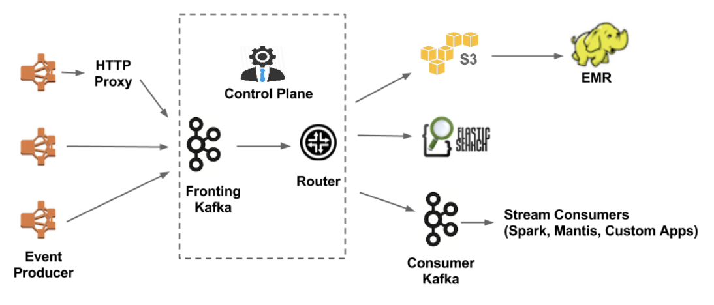
  <figcaption>Figura 1 – Netflix Data Pipeline</figcaption>
</figure>

---
## 5. O Motor de Consultas do Facebook: Presto
O desafio do Facebook era diferente: como permitir que os seus engenheiros e analistas fizessem perguntas (consultas) a petabytes de dados armazenados em sistemas diferentes e distribuídos? A sua solução, o **Presto SQL Engine**, resolve um problema fundamental de **implementação** e **gestão**: em vez de implementar uma pilha de análise para cada base de dados, um único motor de consulta acede a todas elas.

A arquitetura do Presto divide o trabalho de forma inteligente entre dois tipos de nós:

• **Coordinator:** É o cérebro da operação. Recebe uma consulta SQL, analisa-a (**Parser/Analyzer**), cria um plano de execução otimizado (**Planner**) e agenda as tarefas a serem executadas pelos workers (**Scheduler**). Para o fazer, consulta uma **Metadata API** (para interpretar a query) e uma **Data Location API** (para saber onde os dados estão fisicamente armazenados).

• **Worker:** São os "braços" da operação. Recebem as tarefas do coordenador e executam-nas, acedendo diretamente aos dados onde quer que eles estejam através de uma **Data Stream API**.

A sua característica mais poderosa é o sistema de "**Pluggable backends**", que implementa um princípio fundamental da arquitetura de dados moderna: a **separação entre computação e armazenamento**. Isto significa que o Presto, um poderoso motor de computação, pode ligar-se e consultar dados de diferentes sistemas de armazenamento (como **Hive**, **HBase** ou **Scribe**) sem precisar de os mover. Isto elimina a necessidade de migrações de dados lentas e dispendiosas.

<figure style="text-align: center;">
  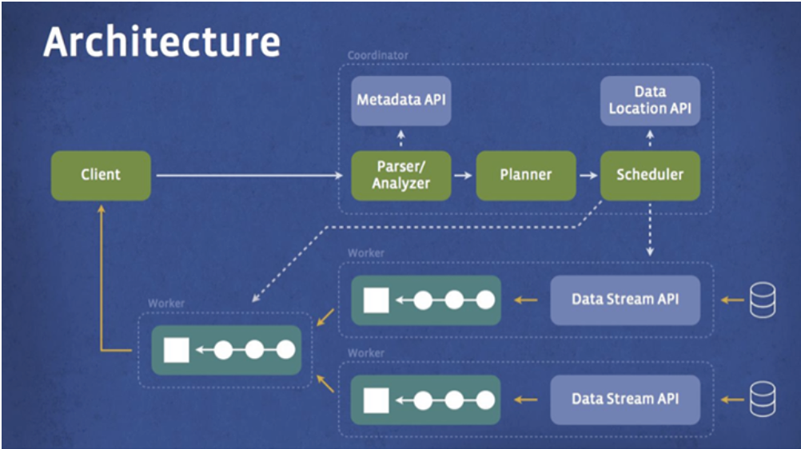
  <figcaption>Figura 2 – Presto</figcaption>
</figure>

<figure style="text-align: center;">
  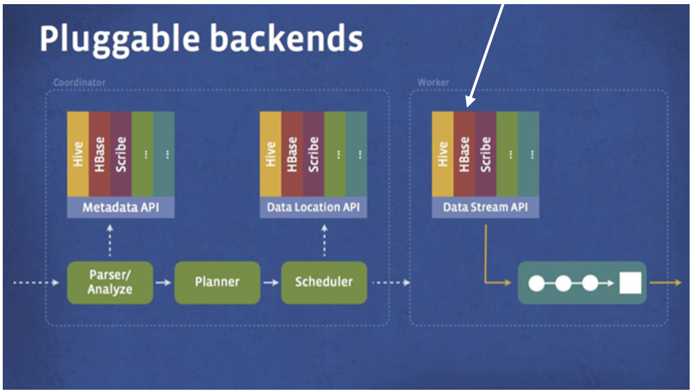
  <figcaption>Figura 3 – Pluggable backends</figcaption>
</figure>

---
## 6. HBase no Facebook

A função principal do HBase é ser uma base de dados distribuída e não-relacional (o que significa que não organiza os dados em tabelas com linhas e colunas fixas como o MySQL, oferecendo mais flexibilidade para dados em grande escala e com formatos variados). A sua arquitetura é, por si só, um sistema distribuído:

• **Client**: A aplicação que interage com o HBase para realizar operações de gestão, como criar ou apagar tabelas.

• **HMaster**: É o "mestre" que coordena o cluster. A sua principal função não é armazenar dados, mas sim atribuir "Regions" (partições de uma tabela) aos diferentes servidores que compõem o cluster.

• **Zookeeper**: Um serviço de coordenação distribuída essencial. Em qualquer sistema distribuído, os componentes precisam de uma forma fiável de concordar sobre o estado do sistema (ex: quem é o mestre, que servidores estão ativos). O Zookeeper fornece esta função crítica, garantindo a estabilidade e fiabilidade de todo o cluster.

• **Region Server**: São os servidores que efetivamente fazem o trabalho pesado. Cada um armazena e gere um conjunto de "Regions" e é responsável por servir os pedidos de leitura e escrita de dados para essas partições.

<figure style="text-align: center;">
  
  <figcaption>Figura 4 – HBase Architecture</figcaption>
</figure>

Isto demonstra que, mesmo um único componente numa arquitetura de hiperescala, é frequentemente um sistema distribuído complexo, com as suas próprias regras de coordenação, resiliência e gestão.

---

## 7. Agile, ciclo de entrega e operações

A filosofia ágil transformou a velocidade de entrega do código, mas criou um choque cultural com os modelos de operações tradicionais.

**Propriedades do Desenvolvimento Ágil**

• **Iteração:** Resposta rápida a mudanças através de ciclos curtos.

• **Repositórios Formais:** Uso de controlo de versões para Source (código fonte), Binary (binários) e Doc (documentação), garantindo um estado inequívoco e capacidade de Backtracking.

• **Automated Build and Test:** Essencial para garantir Fast Feedback aos programadores.

**O problema das Operações Manuais e os "Snowflake Servers"**

Tradicionalmente, o provisionamento é manual e a comunicação entre as fases de qualificação e produção é informal. Isto resulta no fenómeno dos **Snowflake Servers:** servidores que, devido a sucessivos ajustes manuais (por ex. executando comandos soltos no terminal) e **Configuration Drift**, quando ocorrem pequenas mudanças manuais e atualizações que não são registadas formalmente, tornam-se **únicos** e **impossíveis de replicar**. Este gargalo manual impede a escala horizontal e a agilidade do negócio.

---

## 8. Infrastructure as Code (IaC)

A IaC é a prática de tratar a infraestrutura com o mesmo rigor que o código aplicacional, utilizando scripts em vez de processos manuais:

• **Provisionamento de Hardware:** Via scripts (API/CLI), em vez de tarefas físicas de unboxing e cablagem.

• **Provisionamento de Software:** Automatizado, em vez de percorrer instaladores (setup wizards).

• **Configuração:** Definida em ficheiros, em vez de cliques manuais em painéis de controlo.

### 8.1 Benefícios do Modelo DevOps

Filosofia que une o mundo do Desenvolvimento (Dev) e das Operações (Ops). Combina a agilidade do desenvolvimento com a automatização e fiabilidade da Infraestrutura como Código (IaC).

• **Reprodutibilidade e Repetibilidade:** A infraestrutura é idêntica em qualquer ambiente (dev, qual, prod).

• **Servidores Descartáveis (Disposable):** Em vez de reparar um servidor com erro de configuração, ele é destruído e um novo é criado via script, garantindo imunidade a erros persistentes.

• **Auto-documentação e Versionamento:** O estado do sistema está refletido no código, permitindo auditoria e reversão imediata.

• **Velocidade:** Ciclos de desenvolvimento e implementação mais rápidos permitem inovar e repsonder ao mercado com maior agilidade.

• **Fiabilidade:** Automatização e testes rigorosos reduzem erros e aumentam a estabilidade dos sistemas.

• **Escalabilidade:** Infraestruturas automatizadas facilitam o crescimento e adaptação às necessidades do negócio.

• **Colaboração:** Quebra barreiras entre equipas, promovendo uma cultura de responsabilidade partilhada.

---
## 9. Fundamentos e Motivação dos Sistemas Distribuídos
Para fundamentar qualquer projeto de infraestrutura, operamos sobre três pilares essenciais:

• **Modularidade (Modularity):** Consiste no **desacoplamento de diferentes componentes ou preocupações** (concerns). Um exemplo clássico é a separação entre o armazenamento de ficheiros, a base de dados relacional e o servidor de aplicações. **Esta separação permite que cada módulo evolua e seja gerido de forma independente.**

• **Performance e Escalabilidade (Scalability):** mais servidores a realizar o trabalho devem resultar em maior velocidade de processamento e capacidade de resposta.

• **Disponibilidade e Fiabilidade (Availability/Dependability):** Partimos do axioma de que o hardware e o software falham inevitavelmente. A distribuição e/ou replicação é o mecanismo que nos permite sobreviver a essas falhas.

A relevância estratégica desta mudança reside na eliminação do "ponto único de falha". **Num sistema monolítico, a paragem de um componente dita a paragem do serviço**. Num sistema distribuído, a falha é um evento local que o sistema deve ser capaz de mascarar ou mitigar.

---

## 10. Arquitetura Monolítica

**Monólito**: todos os componentes - servidor de aplicação, base de dados, lógica de negócio - residem num único servidor.

<figure style="text-align: center;">
  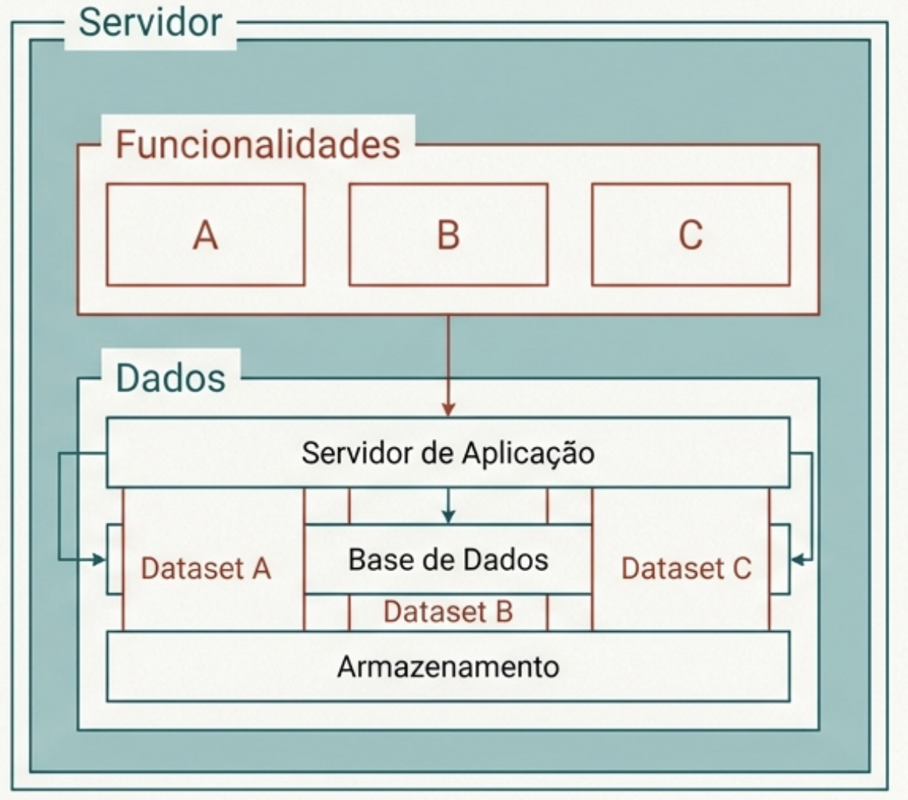
  <figcaption>Figura 5 – Monolithic Architecture</figcaption>
</figure>

### 10.1 Desafios de Escala e Resiliência
Quando o servidor atinge o seu limite ou sofre uma falha, as respostas dividem-se em duas filosofias:
1. **Scale-up (Vertical):** Aumentar os recursos da máquina (RAM, CPU). Como arquitetos, sabemos que esta solução tem um teto físico intransponível e um custo que cresce de forma não linear.
2. **Scale-out (Horizontal):** Aumentar o número de servidores. É a base da computação em nuvem, permitindo um crescimento virtualmente ilimitado.
3. **Redundância:** A implementação de servidores redundantes é a resposta direta à falha. Se o servidor principal falha, a redundância garante a continuidade.

O investimento estratégico **deve priorizar o Scale-out**, apenas a **distribuição horizontal** oferece a **elasticidade** necessária para lidar com picos de carga imprevistos distribuindo a mesma pelas diversas máquinas e garante que a falha de um nó não resulte em downtime total. Esta operacionalização é concretizada através dos **mecanismos de replicação** e **particionamento**.

---
## 11. Mecanismos de Distribuição: Replicação, Particionamento e SOA

• **Replicação:** Criação de múltiplas cópias dos mesmos dados ou funcionalidades. Este mecanismo endereça a **fiabilidade** (redundância se um servidor falhar), o **desempenho** (pedidos de leitura podem ser distribuídos entre as réplicas) e a **disponibilidade** (redundância geográfica para recuperação de desastres).

• **Particionamento (Sharding):** Divisão horizontal do servidor. Podemos particionar por dados (ex: Servidor 1 lida com o Cliente A, Servidor 2 com o Cliente B) ou por computação. É a solução para distribuir a carga de escrita e volumes massivos de informação.

• **Service-Orientation (SOA) e Microserviços:** Representam a divisão vertical do sistema. Cada serviço implementa uma funcionalidade específica e escala de forma independente.


Os sistemas modernos raramente usam apenas um destes padrões. Considere um cenário clássico que demonstra esta sinergia na prática:

**Os dados podem ser particionados (sharded) por vários servidores para fins de escalabilidade, enquanto cada partição de dados (shard) pode ser replicada para fins de fiabilidade.**

Neste cenário, dividimos a carga de dados entre múltiplos servidores (particionamento para escalar) e, ao mesmo tempo, criamos cópias de segurança de cada parte dividida (replicação para garantir que não perdemos dados se um servidor falhar).

---
## 12. Arquitetura de Microserviços
Cada funcionalidade torna-se um serviço independente que pode ser desenvolvido, implementado e escalado autonomamente.

**Desafios**:

• **Decomposição:** O dilema de "quão micro é micro?". Devemos decompor uma funcionalidade em serviços ainda menores ou o custo de comunicação entre eles superará o benefício da modularidade?

• **Consistência de Dados:** Garantir que a informação é coerente entre múltiplos serviços independentes sem sacrificar a performance.

• **Complexidade Operacional:** O deployment e os testes de sistemas distribuídos são significativamente mais exigentes do que nos modelos centralizados.

---

## 13. Arquiteturas distribuídas (padrões)

### 13.1 Cliente-Servidor
API no cliente (stub) que abstrai a comunicação via protocolo com o servidor, que detém a funcionalidade e os dados.

**O Stub:** É uma abstração de protocolo incorporada no cliente. O seu papel fundamental é tornar o **protocolo transparente** para a aplicação, providenciando uma API limpa (ex: HTTP, RPC) que esconde os detalhes da comunicação de baixo nível.


**Características:**
- Simplicidade conceptual
- Single point of failure (servidor único)
- Escalabilidade limitada

**Vantagens:**

- Arquitectura bem compreendida
- Fácil manutenção de consistência
- Simples implementação

**Desvantagens:**
- Não escalável (sem modificações)
- Não tolerante a falhas
- Servidor é bottleneck

### 13.2 Proxy-Server
O proxy atua como intermediário, abstraindo a interação com multiplos servidores. O cliente comunica com o proxy, que gere a complexidade por trás. 

**O Proxy:** Diferente do stub, o proxy atua abaixo do protocolo de comunicação para **tornar os servidores subjacentes transparentes** para o cliente. É a peça-chave para implementar **replicação** e **sharding** de forma invisível.

**Vantagens:**
- **Escalabilidade:** distribui carga entre múltiplos servidores
- **Flexibilidade:** fácil adicionar/remover servidores
- **Disponibilidade / Fiabilidade:** Implementa replicação/sharding facilmente

**Desvantagens:**
- **Fiabilidade:** O proxy torna-se um **ponto único de falha** 
- **Performance:** O proxy atua como um Ponto Único de Contenção (bottleneck); se a taxa de pedidos exceder a capacidade de processamento do proxy, o sistema sofrerá uma **degradação de throughput**, independentemente da capacidade dos servidores que estão atrás dele.

**Qual é a principal diferença entre um 'Proxy' e um 'Stub'?**
O proxy torna os servidores transparentes, enquanto o stub torna o protocolo transparente.

### 13.3 Manager-Worker
Divisão entre **metadados** (Manager) e **conteúdo/dados** (Workers). O Manager sabe onde a informação está através dos metadados; o Worker detém a informação em si.

**Casos de uso**: Sistemas de armazenamento (e.g., HDFS).

**Vantagens**:
- **Escalabilidade:** fácil adicionar mais Workers
- **Especialização:** separação de responsabilidades
- Transparência de localização
- Flexibilidade de replicação/sharding

**Desvantagens**:
- **Complexidade:** coordenação entre Manager e Workers
- **Fiabilidade:** Ponto único de falha no Manager
- **Performance:** O manager atua como um ponto único de contenção. Se as solicitações de metadados saturarem o Manager, este torna-se um gargalo de contenção que impede os clientes de chegarem aos dados nos workers, mesmo que estes tenham recursos disponíveis.

**No exemplo do HDFS, como é que o escalonamento é endereçado?**
Através da distribuição de funcionalidades entre um gestor de metadados (Manager) e múltiplos servidores de dados (Workers).

### 13.4 Server-group
**Todos os servidores são pares e podem processar pedidos**. Um protocolo de sincronização mantém o
estado consistente entre eles. Exemplo: Zookeeper.

**Vantagens**:
- **Alta disponibilidade:** falha de um servidor não afeta o serviço => não existe ponto único de falha
- **Escalabilidade:** fácil adicionar mais servidores

**Desvantagens**:
- **Complexidade:** coordenação e sincronização entre servidores
- **Performance:** quanto maior o número de servidores no grupo, maior é o custo de comunicação para manter o estado sincronizado. Este peso da sincronização cria um limite prático ao scale-out, onde a adição de mais nós pode eventualmente degradar a performance devido à **saturação da rede de coordenação**.

### 13.5 Bus
O bus atua como um mediador onde produtores e consumidores comunicam **sem conhecimento uns dos outros**.

**Vantagens**:
- **Flexibilidade:** adição ou remoção de produtores/consumidores sem alterar os componentes existentes
- **Escalabilidade:** desacoplamento permite crescimento independente

**Desvantagens**:
- **Complexidade:** gestão do bus e garantia de entrega de mensagens
- **Latência:** overhead de comunicação via bus

### 13.6 Multi-tier
Sistemas modernos operam de forma recursiva: um servidor num nível (tier) atua como cliente para o nível seguinte.
#### O Exemplo "Swap" e a Gestão de Estado
Para ilustrar esta recursividade, consideremos o exemplo de uma transação:

1. O utilizador acede via Protocolo A (Web).
2. O servidor de aplicação atua como cliente do servidor de dados.
3. Ele utiliza um Stub B (Database Driver) para comunicar via Protocolo B (SQL) com a base de dados.

Nesta estrutura, a gestão de estado segue regras rigorosas:

• **Níveis Superiores (Web):** Devem ser stateless (sem estado). Isto permite uma elasticidade imediata na nuvem.

• **Níveis Intermédios (App):** Gerem estado transiente ou em cache.

• **Níveis Inferiores (Database):** Detêm o estado **persistente**. A replicação e o particionamento aqui são mais difíceis devido à necessidade de manter a consistência dos dados que sofrem mutações constantes, ao contrário da lógica de computação pura que pode ser replicada sem estas restrições.

**Vantagens**:
- **Modularidade:** separação clara de responsabilidades
- **Escalabilidade:** cada camada pode ser escalada independentemente
- **Manutenção:** Fácil 

**Desvantagens**:
- **Complexidade:** múltiplas camadas aumentam a latência e a dificuldade de gestão

---

## 14. Provisioning & Deployment

Para dominar a **automação moderna**, é imperativo distinguir os dois pilares que suportam a disponibilidade de qualquer serviço digital:

- **Provisioning** é o ato de fornecer ou suprir recursos para utilização. No contexto de infraestrutura, isto abrange a disponibilização de Servidores, Armazenamento (Storage), Redes, Máquinas Virtuais (VMs) e a criação de Utilizadores. É a fundação física ou lógica necessária para que qualquer software possa existir.
- **Deployment** define-se como o processo técnico de instalar ou atualizar uma aplicação ou serviço num servidor já provisionado. O foco aqui é o ciclo de vida do software (ex: atualizar uma aplicação web ou configurar um serviço de rede específico).

**Desafios da gestão manual de sistemas**:
No mundo real, onde a velocidade e a consistência são cruciais, os processos manuais de provisionamento e implementação tornam-se um grande obstáculo. Vamos analisar os três desafios mais significativos.

- **Repetitivo de demorado**: Configurar um servidor ou implementar uma aplicação envolve uma série de passos que têm de ser repetidos vez após vez. Fazer isto manualmente não só consome um tempo valioso que poderia ser usado para resolver problemas mais complexos, como também se torna incrivelmente aborrecido após a primeira vez. É uma tarefa perfeita para ser entregue a uma máquina, libertando os humanos para se concentrarem na inovação.
- **Evolução constante**: A infraestrutura não é estática; ela evolui. As configurações precisam de ser ajustadas, atualizadas e corrigidas. Gerir estas alterações manualmente em vários sistemas, sem um registo claro do que foi alterado, por quem e quando, é um pesadelo. A falta de um histórico de versões torna a manutenção e a resolução de problemas um exercício de adivinhação.
- **Multi-Sistema e Heterogéneo**: A necessidade de gerir um conjunto de sistemas e executar tarefas de forma sequencial ou paralela em múltiplos hosts.
- **Propenso a erros e monótono:** Nós, humanos, cometemos erros, especialmente quando realizamos tarefas repetitivas. Um passo esquecido ou uma configuração mal inserida pode causar falhas difíceis de diagnosticar. Além disso, quando se gere múltiplos sistemas, possivelmente com hardware e sistemas operativos diferentes, garantir que todos estão configurados exatamente da mesma forma é quase impossível de fazer manualmente. Além disso, coordenar alterações em dezenas de sistemas — por vezes em paralelo, outras vezes numa sequência específica — torna-se uma tarefa logística complexa e propensa a falhas quando feita manualmente. Esta falta de consistência, conhecida como 'configuration drift', é uma das principais causas de falhas intermitentes e difíceis de diagnosticar em ambientes de produção.


Ferramentas populares:

| Ferramenta  | Linguagem    | Agente | Agent-less | SSH |
|-------------|--------------|--------|------------|-----|
| Ansible     | YAML         | Não    | Sim        | Sim |
| Chef        | Ruby         | Sim    | Suportado  | Sim |
| Puppet      | Puppet DSL   | Sim    | Suportado  | Sim |
| SaltStack   | YAML         | Sim    | Suportado  | Sim |

Ferramentas como **Chef**, **Puppet** e **SaltStack** usam primariamente um modelo baseado em agente, onde um pequeno software corre nos servidores geridos e comunica com um servidor central. No entanto, é importante notar que estas ferramentas também suportam modos de operação sem agente, oferecendo flexibilidade, embora o seu padrão mais comum envolva um. A abordagem agentless do Ansible torna-o muitas vezes mais simples para começar.

---

## 15. Automatização de tarefas

A forma clássica de automatizar tarefas é através de scripts. Embora eficazes para tarefas simples, **não escalam e são dificeis de manter**.

- **Receitas (Recipes):** Definem automatização de tarefas através de conjunto de directivas
numa linguagem específica.

Exemplo (recipe shell):

```bash
#!/bin/sh
username=deployer
apt-get -y update && apt-get -y upgrade
apt-get -y install vim-nox openntpd sudo whois aptitude
useradd -G sudo -p "password" -s /bin/bash -m $username
mkdir -p /home/$username/.ssh && chmod 700 /home/$username/.ssh
chown $username: /home/$username/.ssh
echo "public_key" >> /home/$username/.ssh/authorized_keys
chmod 600 /home/$username/.ssh/authorized_keys
chown $username: /home/$username/.ssh/authorized_keys
```

**Características**:
- **Imperativo**: descreve como fazer algo, passo a passo
- **Não idempotente**: executar o script duas vezes pode ter resultados inesperados ou causar erros
- **Frágil**: não verifica o estado atual do sistema antes de agir

---
## 16. Configuração e Manutenção - Soluções Modernas
A **Gestão de Configuração** é a metodologia que permite lidar com mudanças sistemáticas num sistema, mantendo a sua integridade ao longo de todo o ciclo de vida. Ao adotar a Infraestrutura como Código (IaC), transformamos definições de hardware e software em ficheiros de texto passíveis de serem geridos como software.

### 16.1 Propriedades e Benefícios
• **Dialeto Comum:** Uma linguagem única e partilhada para descrever toda a infraestrutura.

• **Documentação como Efeito Secundário:** O código da configuração é, na prática, o manual atualizado do sistema.

• **Rastreabilidade e Histórico:** Através de sistemas de controlo de versões (SCM), todas as mudanças são observáveis e reversíveis.

• **Previsibilidade:** Garante resultados idênticos em cada execução, independentemente de quem executa ou quando.

---

## 17. Ansible 

Ferramenta de automação open-source utilizada para gestão de configuração, deployment de aplicações, orquestração de intra-serviços e provisionamento. Uma ferramenta como o Ansible foi desenhada para ser agentless, o que significa que não precisa de ter um software especial (um agente) instalado permanentemente nos servidores que vai gerir. Em vez disso, o Ansible simplesmente conecta-se aos servidores através de SSH — um protocolo de rede seguro que já existe na maioria dos sistemas — para executar as receitas.

**Características principais**:
- **Open-source, agent-less (SSH)**: não requer instalação de agentes nos nós geridos. A comunicação é feita via SSH, utilizando recursos já existentes.
- **Configurações em playbooks (YAML)**: fáceis de ler e escrever. Linguagem declarativa.
- **Módulos para tarefas**: instalar pacotes, gerir serviços, manipular ficheiros
- **Indempotente**: Uma operação pode ser aplicada múltiplas vezes sem alterar o resultado para além da aplicação inicial. O ansible apenas efetua alterações quando o estado atual difere do desejado.


### 17.1 Arquitetura do Ansible
- **Control Node**: máquina onde o Ansible é instalado e a partir da qual as tarefas são executadas.
- **Managed Nodes**: máquinas que são geridas pelo Ansible.

### 17.2 Elementos principais (conceitos chave)
- **Inventory**: lista de hosts geridos (ex: [webservers], [database])
- **Modules**: unidades reutilizáveis de código para tarefas específicas ('apt', 'user', 'service', etc.)
- **Task**: A aplicação de um módulo com argumentos específicos para criar uma ação.
- **Playbook**: O documento YAML que orquestra a execução das tarefas e roles nos sistemas remotos.

Exemplo simples de playbook:

```yaml
- hosts: all
  vars:
    username: someuser
    shell: /bin/bash
  tasks:
    - name: create unprivileged user
      user:
        name: '{{ username }}'
        password: 'secretpasswordhash'
        shell: '{{ shell }}'
    - name: Set SSH authorized_key
      authorized_key:
        user: '{{ username }}'
        state: present
        key: "{{ lookup('file', '/home/' + someuser + '/.ssh/id_rsa.pub') }}"
```
- **Handler**: Tarefas especiais que aguardam uma notificação de mudança para serem executadas (ex: reiniciar um serviço após mudar o ficheiro de configuração).
- **Template**: Ficheiros dinâmicos que utilizam o motor Jinja2 para injetar variáveis.
- **Role**: Componente que encapsula variáveis, tarefas, ficheiros e handlers de forma organizada.
(e.g., configuração de um servidor web). Aumenta a reutilização: o mesmo role pode ser usado em vários playbooks/projetos, evitando duplicação de tarefas. Melhora a organização e manutenção: cada role foca‑se numa responsabilidade específica, tornando o código mais legível, mais fácil de testar e de evoluir. Simplifica os playbooks: o playbook passa a declarar apenas que hosts usar e que roles aplicar, funcionando como “orquestrador” de componentes já bem encapsulados.

Exemplo de uma estrutura de role:
```
my_role/
  ├── tasks/
  │   └── main.yml
  ├── handlers/
  │   └── main.yml
  ├── templates/
  │   └── config.j2
  ├── files/
  │   └── static_file.txt
  └── vars/
      └── main.yml
```


### 17.3 Provisionar a Cloud com Ansible
Ansible pode ser usado para provisionar e gerir diferentes serviços GCP, desde VMs a clusters Kubernetes.

### 17.4 Desafio do Inventário Dinâmico
Em ambientes Cloud, **os endereços IP são voláteis** e desconhecidos até ao momento da criação das instâncias. Manter um ficheiro hosts.inv estático é impossível. A solução é o **Dynamic Inventory**, onde o Ansible consulta a **API da GCP** em tempo real para descobrir quais as máquinas ativas, os seus IPs e metadados, ajustando o alvo da execução dinamicamente.

### 17.5 Segurança garantida com Ansible Vault
Permite manter dados sensíveis (palavras-passe, chaves de API) em **ficheiros encriptados**, em vez de
texto simples nos playbooks ou roles. Os ficheiros encriptados pelo Vault podem ser editados e são desencriptados de forma transparente durante a execução do playbook mediante o fornecimento de uma
palavra-passe.

---

## 18. Cloud Services (IaaS / PaaS / SaaS)

Cloud computing refere-se à **disponibilização de recursos** informáticos (computação, armazenamento, redes, etc.) como serviços on-demand pela internet, com gestão e manutenção por terceiros. O utilizador deixa de precisar de saber como tudo funciona “por baixo” — apenas consome recursos, pagando geralmente conforme o uso, com grande flexibilidade e escalabilidade. À medida que subimos na abstração, delegamos mais responsabilidades de gestão ao fornecedor.

**IaaS**: Consiste na disponibilização de recursos de hardware virtualizados, nomeadamente computação, armazenamento e redes. Os recursos são alocados consoante a procura (on demand) e num modelo pay-per-use (pagar pelo que se usa).

**Vantagens:**
- Evita custos upfront de infraestrutura
- Deployment fácil de aplicações legacy
- Escalabilidade transparente

**Desvantagens:**
- Sem controlo sobre hardware e virtualização
- Sem possibilidade de fine-tuning
- Dependência do provider

**PaaS**: Oferece um ambiente de desenvolvimento e execução. **Os recursos tornam-se transparentes para o utilizador**. A interface é tipicamente um ambiente de programação que suporta várias linguagens, ferramentas e APIs para outros serviços. A plataforma assegura que o código corre com os recursos necessários de forma transparente, suportando linguagens como Java, Python e PHP. Um exemplo proeminente é o **Google App Engine**.

**Vantagens:**
- Foco no desenvolvimento
- Escalabilidade automática
- Ferramentas poderosas já em lugar

**Desvantagens:**
- Sem controlo sobre platform
- Restrições nas tools disponíveis
- Lock-in vendor

**SaaS**: Representa o consumo de **software como serviço final**. Não existe um item de implementação gerido pelo utilizador; a aplicação está pronta a usar, como o Gmail.

**Vantagens:**
- Integração rápida
- Sem setup/maintenance
- Escalabilidade automática

**Desvantagens:**
- Sem controlo sobre software
- Dependência completa de provider
- Privacy/security dependente do provider


<figure style="text-align: center;">
  
  
  <figcaption>Figura 7 – Cloud Services</figcaption>
</figure>

<figure style="text-align: center;">
  
  <figcaption>Figura 8 – Vantagens</figcaption>
</figure>

**Riscos Universais**:
- **Dependência**: Se o fornecedor falhar, a aplicação falha. A recuperação está fora do controlo do utilizador.
- **Segurança**: A aplicação é, no máximo, tão segura quanto o fornecedor. As vulnerabilidades têm de ser corrigidas pelo fornecedor.
- **Privacidade**: O fornecedor detém os dados dos utilizadores. Risco de fugas de dados e implicações de legislação (ex.: GDPR).
- **Perda de controlo**:
  - IaaS: Sem controlo sobre o hardware e software de virtualização.
  - PaaS: Sem controlo sobre o hardware e a plataforma. Gestão e monitorização limitadas às ferramentas fornecidas.
  - SaaS: O software é de terceiros, otimizado e configurado principalmente pelo fornecedor (dependencia total)

### 18.1 Elasticidade na Cloud
É a capacidade de aumentar ou diminui recursos de acordo com a procura.

- **Em IaaS**: O utilizador pode criar ou destruir VMs conforme necessário.
- **Em PaaS**: a plataforma abstrai a gestão de infraestrutura (máquinas virtuais, load balancers, monitorização) e oferece mecanismos de auto‑scaling integrados, que criam ou removem instâncias da aplicação com base em métricas como número de pedidos, latência ou utilização de CPU, sem que o programador tenha de implementar lógica de provisionamento
- **Em SaaS**: O fornecedor gere a infraestrutura para garantir desempenho consistente, independentemente do número de utilizadores.

---

## 19. OpenStack - construção de uma nuvem IaaS

- Plataforma de cloud computing open-source que permite criar e gerir infraestruturas de cloud pública e privada (instâncias de computação). 
- Controla grandes conjuntos de recursos de computação, armazenamento e rede num data center. 
- A gestão é feita através de um dashboard ou diretamente através da sua API, oferecendo flexibilidade total.

**Componentes principais do OpenStack**:
- **Nova**: serviço de computação que gere a criação e gestão de máquinas virtuais (VMs, containers). As instâncias de computação têm armazenamento **efémero** (temporário) que é eliminado quando a instância é destruída.
- **Neutron**: serviço de rede que fornece conectividade de rede para máquinas virtuais.
- **Manila**:  File Sharing (tipo NFS entre VMs).
- **Cinder**: serviço de armazenamento **persistente em bloco** que permite a criação e gestão de volumes de armazenamento (volumes para VMs).
- **Swift**: serviço de armazenamento **persistente de objetos** que oferece armazenamento escalável e redundante.
- **Keystone**: serviço de identidade que gere autenticação e autorização para os serviços do OpenStack.
- **Glance**: serviço de imagens que permite armazenar e recuperar imagens de máquinas virtuais.
- **Horizon**: interface web que permite aos utilizadores gerir os recursos do OpenStack.
- **Telemetry**: serviço de monitorização que recolhe métricas, dados de utilização dos recursos e pode lançar mais VMs.
- **Placement**: serviço que gere a alocação de recursos de computação, armazenamento e rede para as instâncias.

<figure style="text-align: center;">
  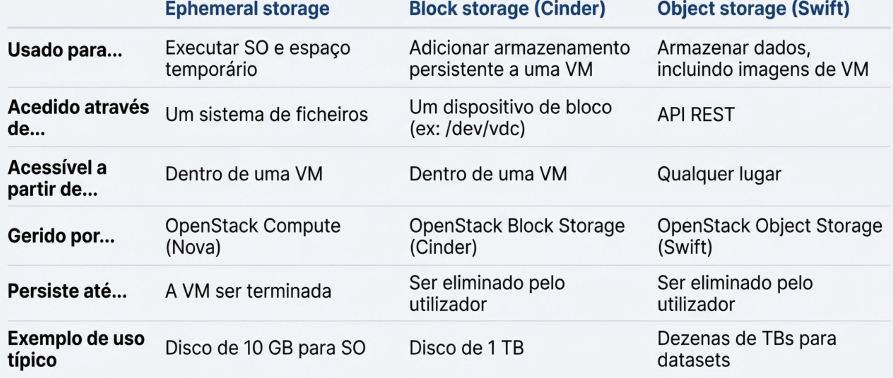
  <figcaption>Figura 9 – Comparação do tipo de Armazenamento</figcaption>
</figure>

O armazenamento em nuvem não é uma solução única; a escolha tecnológica deve ser ditada pelo ciclo de vida e pela natureza dos dados a tratar.

• **Ephemeral Storage (Nova):** Armazenamento temporário gerido pelo serviço Nova. É utilizado para o sistema operativo e ficheiros de trabalho (scratch space). O termo "efémero" indica que **os dados são eliminados permanentemente quando a instância é terminada.**

• **Block Storage (Cinder):** Volumes persistentes que funcionam como discos rígidos virtuais. Sobrevivem à eliminação das instâncias.

• **File System Services (Manila):** Permite a partilha de sistemas de ficheiros entre múltiplas instâncias.

• **Object Storage (Swift):** Baseado numa API Key-value, é ideal para dados não estruturados e alta escalabilidade.


---
## 21. Virtualização

- Técnica que permite **criar um versão de um dispositivo ou recurso baseada em software**, que na prática é uma abstração onde é criada uma camada que separa o serviço do hardware subjacente, ocultando a complexidade e a heterogeneidade dos componentes físicos e apresentando-os como entidades lógicas maleáveis. **Exemplo:** máquinas virtuais (VMs) que simulam hardware físico. Memória virtual, redes virtuais, armazenamento virtual.

### 21.1 Exemplos Práticos no Quotidiano
Para clarificar a aplicabilidade desta abstração, vejamos como ela se manifesta em diferentes domínios:

• **Máquinas Virtuais (VMs):** Execução de múltiplos sistemas operativos isolados no mesmo servidor físico.

• **Redes Virtuais:** Criação de topologias de rede independentes da cablagem física, permitindo segmentação lógica.

• **Memória Virtual:** Permite que um computador execute programas que excedem a sua RAM física, utilizando o armazenamento secundário como extensão.

• **Volumes de Armazenamento Lógico:** Como quando combinamos vários discos rígidos antigos e de pequenas dimensões para que o sistema os reconheça como um único volume de grande capacidade, ideal para uma biblioteca de media centralizada.


**Vantagens**:
- **Isolamento**: falhas numa VM não afetam outras.
- **Segurança e Fiabilidade**: Uma VM A tem total desconhecimento do que se passa na VM B, ou seja, não pode aceder aos seus recursos.
- **Eficiência / Desempenho**: melhor utilização de recursos físicos.
- **Flexibilidade**: fácil criação, destruição e migração de VMs
- **Testes e desenvolvimento**: ambientes isolados para testes
- **Abstração e Transparência**: Abstrai a heterogeneidade do hardware subjacente, fornecendo recursos virtuais unificados. A interação do utilizador é transparente - idêntica à de um recurso físico, sem necessidade de alterar comandos ou programas.

**Desvantagens**:
- **Overhead/Desempenho**: desempenho inferior ao nativo (introdução de latência por parte da camada de abstração)
- **Overprovisioning**: risco de alocar mais recursos do que o disponível (saturação dos recursos físicos). Se tentarmos alocar mais núcleos virtuais do que os núcleos físicos disponíveis e todas as VMs exigirem processamento simultâneo, ocorrerá uma saturação dos recursos e uma queda drástica na performance.

- **Complexidade**: gestão adicional
- **Segurança**: Isolamento inadequado ou privilégios administrativos podem comprometer todas VMs
- **Dependência**: Se o hardware físico falhar, todas as dezenas de VMs nele alojadas colapsam instantaneamente.

**Como é que a virtualização aborda o problema da heterogeneidade do hardware?**
- Através de uma camada de abstração (hypervisor) que traduz as instruções do SO convidado (guest) para o hardware físico, permitindo que o mesmo SO convidado funcione em diferentes hardwares físicos sem modificação.

### 21.2 Hypervisor
A eficácia de uma VM reside na sua **arquitetura em camadas**. Ao contrário do modelo tradicional, onde o Sistema Operativo (SO) detém o controlo total do hardware, aqui **introduzimos uma camada de mediação que permite a coexistência de vários Sistemas Operativos Convidados (Guest OS) no mesmo Anfitrião (Host)** - Hypervisor. Ele é responsável pelo controlo de baixo nível e pela mediação rigorosa entre as VMs e os recursos físicos.

- Fornece uma interface que mimetiza o hardware para o Guest OS, gerindo quatro componentes críticos: CPU, RAM, Disco (Armazenamento Persistente) e Rede. Exemplos de referência incluem o Xen, KVM, VMware e VirtualBox.

<figure style="text-align: center;">
  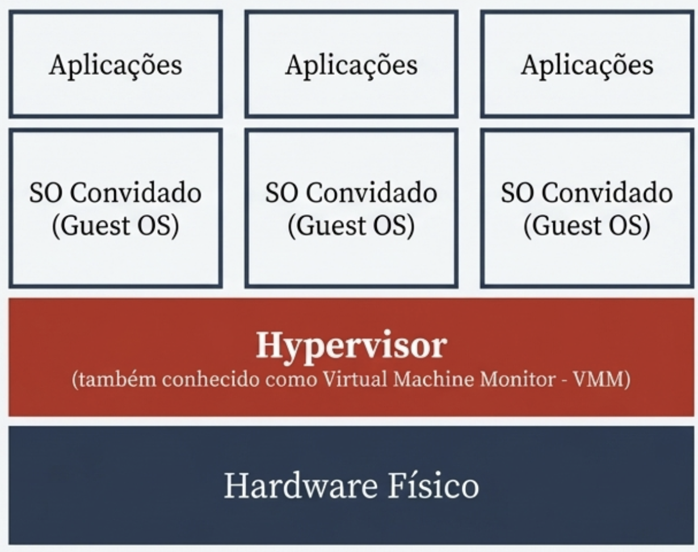
  <figcaption>Figura 10 – Hypervisor</figcaption>
</figure>

**Tipos de Hypervisors**:
- **Type 1 (bare-metal)**: Instalado diretamente no hardware (ex: VMware ESX). É um SO minimalista otimizado para performance, ideal para centros de dados => **Desempenho máximo**.
- **Type 2 (hosted)**: Corre sobre um SO convencional (ex: VirtualBox, KVM). É mais versátil para desenvolvimento, embora dependa do SO anfitrião para gerir recursos, o que introduz latência. Note-se que muitos destes requerem a instalação de módulos de kernel específicos no SO anfitrião para funcionar corretamente => **Flexibilidade máxima**. 

### 21.3 Partilha de CPU, Memória e Armazenamento
- **Gestão de CPU (Time Slicing)**: o Hypervisor utiliza fatias de tempo (time slicing) para partilhar o tempo de CPU físico entre as várias VMs. **Nota**: A sobrecarga de contexto entre VMs é maior do que entre processos num SO (overcommiting) => baixo desempenho.
- **RAM e Armazenamento**: Cada VM aloca uma porção específica da RAM e armazenamento persistente (SSD, HDD) do host. O armazenamento pode ser alocado conforme necessário (thin provisioning) ou pré-alocado (thick provisioning).

### 21.4 Gestão de rede
**Alternativas**:
- **Host-only:** A VM partilha o namespace de rede do Host, tendo acesso apenas a este.
- **NAT:** A VM acede ao exterior mascarada pelo IP do Host (identidade de rede única).
- **Bridge:** A VM atua como um nó independente na rede física, com o seu próprio endereço IP atribuído.

### 21.5 Virtualização Completa vs Paravirtualização
- **Virtualização Completa**: O SO convidado é totalmente abstraído do hardware físico (não é modificado). Nenhuma modificação é necessária no SO convidado (exemplo VirtualBox, VMware).
  - Vantagem: maior **portabilidade** e **compatibilidade** com uma vasta gama de SOs convidados. Sem modificações OS => maior compatibilidade
  - Desvantagem: maior overhead de desempenho devido à emulação completa do hardware.
- **Paravirtualização**: Requer modificações/hooks no SO convidado para contornar a tradução de instruções dispendiosas (exemplo Xen).
  - Vantagem: melhor desempenho de CPU e I/O devido à comunicação direta com o hypervisor.
  - Desvantagem: O SO convidado deve ser modificado, o que prejudica a **manutenção** e a **portabilidade**.

---
## 22. Containers
Containers são ambientes virtuais **leves** e **portáteis** que empacotam uma aplicação, as suas dependências e recursos (CPU, memória, armazenamento), permitindo execução consistente em diferentes ambientes. Ao contrário das VMs, os containers partilham o mesmo kernel do SO hospedeiro, tornando-os **mais eficientes em termos de recursos**.

Um container, no contexto de computação, é como uma "caixa" virtual que guarda tudo o que uma aplicação precisa para funcionar: o código, as bibliotecas, arquivos de configuração e dependências necessárias. Imagine literalmente uma caixa de transporte (como as usadas em navios): você coloca a mercadoria dentro, fecha, e pode levar para qualquer lugar sem se preocupar se lá tem espaço, luz ou outras condições, porque tudo necessário já está dentro da caixa. São **ambientes isolados** que tornam aplicações **independentes do sistema onde estão**, facilitando o transporte e execução.

**Casos de Uso:**
- Executar diferentes versões isoladas do mesmo software/aplicação (e.g., database) em ambiente OS/Kernel partilhado
- Portabilidade/migração entre servidores
- Packaging fácil de software, aplicações e dependências

**Vantagens dos containers**:
- **Isolamento e Consistência**: permitem executar versões diferentes e isoladas do mesmo software num kernel partilhado, garantindo que o ambiento é o mesmo em todo o lado.
- **Portabilidade**: Uma aplicação encapsulada num contentor pode ser movida facilmente entre diferentes servidores ou ambientes. Um programador pode construir e testar um contentor no seu computador portátil e, de seguida, implementar exatamente o mesmo artefacto num servidor de produção na nuvem, com a garantia de que o comportamento será idêntico.
- **Eficiência**:  Os contentores resolvem o desafio de gerir dependências ao empacotar uma aplicação com todo o seu ambiente de execução (código, bibliotecas, ficheiros de configuração). Isto simplifica a distribuição e a implementação, pois tudo o que é necessário para a aplicação correr está contido numa única unidade.

<figure style="text-align: center;">
  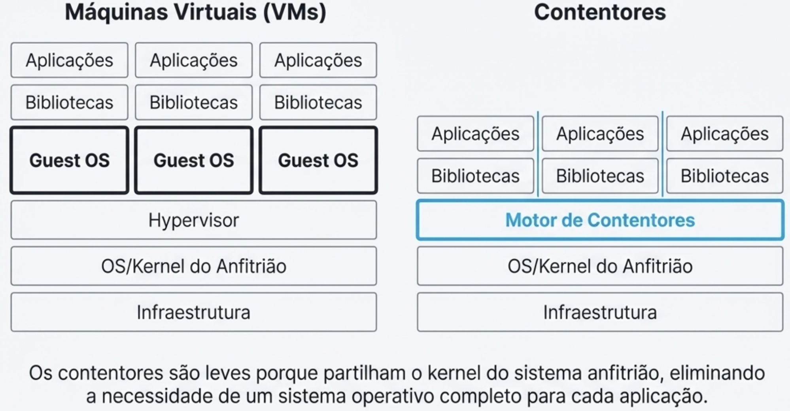
  <figcaption>Figura 11 – Containers vs VMs</figcaption>
</figure>

**Types de containers**:
- **Contentores de SO (ex: LXC):** Este tipo de contentor foi desenhado para executar múltiplos processos e simular um sistema operativo "leve". O seu objetivo é fornecer um ambiente que se assemelha a uma VM tradicional, mas sem a sobrecarga do hypervisor, sendo ideal para executar um conjunto de serviços interdependentes num único ambiente isolado.
- **Contentores de Aplicação (ex: Docker):** Focados na implementação de aplicações, estes contentores são **desenhados para executar um único processo ou aplicação**. Cada aplicação é vista como uma entidade independente, o que se alinha perfeitamente com arquiteturas de microsserviços, onde **cada serviço é empacotado e implementado no seu próprio contentor.**

### 22.1 Building blocks dos containers:
- **Namespaces (Isolamento):** são uma funcionalidade do kernel que permite **particionar recursos** de forma que um **grupo de processos veja um conjunto isolado desses recursos**. A sua principal importância é **permitir o isolamento de recursos entre diferentes contentores**, fazendo com que cada um acredite que tem o seu próprio ambiente exclusivo.
- **Control groups (gestão de recursos):** são a funcionalidade do kernel que **permite alocar e limitar os recursos de hardware** entre grupos de processos. Na prática, isto é usado para, por exemplo, limitar a quantidade de recursos que cada contentor pode consumir (ex: definir um máximo de 2 núcleos de CPU ou 1 GB de RAM), garantindo que um contentor não monopoliza os recursos do anfitrião.
- **SELinux/AppArmor:** atua como uma **camada de segurança** que complementa o isolamento fornecido pelos `Namespaces`. O seu papel é crucial para reforçar a segurança do sistema, aplicando políticas de controlo de acesso obrigatório que **impedem que um processo dentro de um contentor possa aceder a recursos não autorizados no sistema anfitrião ou em outros contentores**.

**A portabilidade e a facilidade de empacotamento de software são vantagens chave dos contentores. Porquê?**

Porque os contentores encapsulam a aplicação e todas as suas dependências num único pacote, garantindo que a aplicação funciona de forma consistente em qualquer ambiente que suporte contentores. Isto elimina problemas relacionados com diferenças de configuração, bibliotecas ou versões de software entre ambientes de desenvolvimento, teste e produção.

---
## 23. DOCKER
Docker é a **plataforma de contentores** mais conhecida e utilizada, que simplificou radicalmente o processo de criar, distribuir e executar aplicações em contentores. Transformou o contentor numa unidade de trabalho padrão para programadores e administradores de sistemas.
### 23.1 Componentes
- **Docker daemon**: serviço que gere containers, imagens, redes e volumes.
- **Docker CLI**: interface de linha de comandos para interagir com o daemon.
- **Docker Registry**: Funciona como um repositório para armazenar e distribuir Imagens Docker. 
- **Docker Objects**: 
  - **Imagens**: ficheiro imutável / inalterável (read-only) que serve de template. Contém tudo o que é necessário para executar uma aplicação (código, runtime, bibliotecas, variáveis de ambiente, configurações).
  - **Containers**: instância executável de uma imagem. Múltiplos contentores podem ser criados a partir da mesma imagem. O sistema de ficheiros de um contenedor é efémero por defeito (persistência via volumes).
- **Volumes**: armazenamento persistente para containers. Ou seja, ao eliminar um container, os dados armazenados num volume permanecem intactos.
- **Networks**: permitem comunicação entre containers e com o exterior. O container é visto como mais um nó na rede.

<figure style="text-align: center;">
  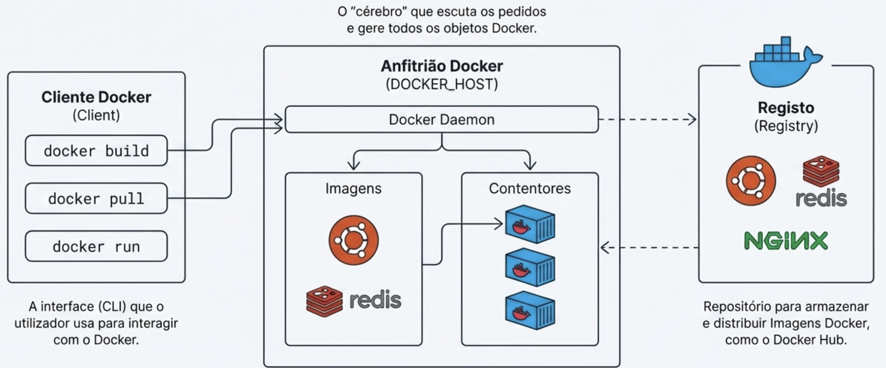
  <figcaption>Figura 12 – Docker Architecture</figcaption>
</figure>

Executar uma aplicação num container é simples. Mas as aplicações modernas, compostas por múltiplos microserviços, exigem orquestração para gerir a complexidade.

Em operação, o fluxo é intuitivo: o utilizador interage com o `Client` através de comandos, que são enviados para o `Daemon`. O `Daemon`, por sua vez, executa as operações, como criar um contentor a partir de uma imagem local ou, se necessário, descarregar essa imagem de um `Registry`.

**No Docker, qual é a principal diferença entre um 'volume' e um 'bind mount' para persistir dados?**

- **Volume**: É um diretório especial no sistema anfitrião, cuja gestão é totalmente controlada pelo Docker. A sua principal vantagem é ser acessível apenas por contentores, oferecendo um melhor isolamento e portabilidade dos dados. Volumes são independentes do ciclo de vida dos containers, o que significa que os dados persistem mesmo que o container seja eliminado. São a opção recomendada para persistência de dados, pois oferecem melhor desempenho e funcionalidades adicionais, como backups e migrações.
- **Bind Mount**: Permite montar um diretório genérico do host num contentor. **Este diretório pode ser acedido e modificado por qualquer contentor ou processo com permissões no anfitrião**. Isto permite que o container aceda diretamente a ficheiros no host, mas a gestão dos dados é feita pelo utilizador. Bind mounts são úteis para desenvolvimento e testes, mas podem introduzir problemas de **segurança** e **portabilidade**.

### 23.2 Redes Docker

Para que os contentores possam comunicar entre si e com o exterior, o Docker fornece um sistema de rede configurável. Os dois modos de rede mais comuns são:

• **Host:** Neste modo, o contentor partilha o `namespace` de rede do anfitrião. Isto significa que os serviços a correr no contentor são expostos na rede como se fossem executados diretamente pelo anfitrião, partilhando as suas portas (por exemplo, um servidor web no contentor usaria a porta 80 do anfitrião).

• **Bridge:** Este é o modo de rede padrão. **O Docker cria uma rede virtual privada** no interior do anfitrião. Cada contentor ligado a esta rede **recebe o seu próprio endereço IP interno**, permitindo a comunicação entre eles. Para expor um serviço ao exterior, é necessário mapear explicitamente uma porta do contentor para uma porta do anfitrião.

Esta arquitetura é excecionalmente poderosa para aplicações individuais, mas à medida que os sistemas evoluem para dezenas ou centenas de contentores distribuídos,**a gestão manual torna-se impraticável**. Este desafio de escala abre a porta à próxima camada de abstração: a orquestração de contentores, liderada pelo Kubernetes.

**Desafios**:
- Como é que garantimos o número certo de réplicas de cada serviço?
- Como é que recuperamos de uma falha?
- Como fazemos o balanceamento de carga entre múltiplas instâncias?
- Como é que os serviços se descobrem uns aos outros?

Surge o kubernetes.

---

## 24. KUBERNETES
Kubernetes é uma plataforma de orquestração de código aberto que automatiza a **implementação**, o **escalonamento** e a **gestão** de aplicações em contentores.

Features interessantes:
- **Network management**: Facilita a comunicação entre contentores através de mecanismos como a **descoberta de serviços (service discovery)** e o **balanceamento de carga (load balancing)**, garantindo que os pedidos são distribuídos de forma eficiente entre as instâncias de uma aplicação.
- **Scheduling**: decide de forma inteligente e automática em que nós do cluster deve executar os contentores.
- **Modular Service Orchestration**: permite definir serviços, deployments e políticas de escalabilidade.
- **Self-healing**: reinicia containers falhados, substitui e reprograma containers quando os nós falham.
- **Scaling (Scale-out)**: ajusta automaticamente o número de réplicas de containers conforme a procura.
- **Storage orchestration**: monta automaticamente sistemas de armazenamento, como volumes locais ou serviços de cloud.
- **Automated rollouts and rollbacks**: atualiza aplicações sem tempo de inatividade e reverte para versões anteriores se necessário.

**No modelo de armazenamento do Kubernetes, o que representa um `PersistentVolumeClaim` (PVC)?**

Um `PersistentVolumeClaim` (PVC) no Kubernetes é uma solicitação de armazenamento persistente feita por um utilizador ou aplicação. Ele atua como uma abstração que **permite aos pods requisitar espaço de armazenamento sem precisar conhecer os detalhes do armazenamento subjacente**. O PVC especifica a quantidade de armazenamento necessária e as características desejadas (como o tipo de acesso), e o Kubernetes liga esse pedido a um `PersistentVolume` (PV) disponível que satisfaz esses requisitos. Desta forma, o PVC facilita a gestão do armazenamento persistente, **permitindo que os pods mantenham dados mesmo após serem reiniciados ou movidos para outros nós no cluster.**

**Qual objeto do Kubernetes deve ser utilizado para injetar dados de configuração não sensíveis, como variáveis de ambiente ou argumentos de linha de comandos, num Pod?**

O objeto do Kubernetes que deve ser utilizado para injetar dados de configuração não sensíveis num Pod é o **ConfigMap**. O ConfigMap permite armazenar pares chave-valor que podem ser montados como arquivos ou expostos como variáveis de ambiente dentro dos containers do Pod, facilitando a gestão de configurações sem a necessidade de reconstruir as imagens dos containers.

O secret é usado para dados sensíveis e são armazenados de forma mais segura.

### 24.1 Componentes principais:
- **Control Plane**: gere o estado do cluster (API server, scheduler, controller manager).
  - **API Server**: interface principal para interagir com o cluster.
  - **etcd**: base de dados chave-valor que armazena o estado/configuração do cluster.
  - **Scheduler**: atribui pods a nós com base em recursos disponíveis.
  - **Controller Manager**: gere controladores que mantêm o estado desejado do cluster.
- **Nodes**: máquinas que executam containers (kubelet, kube-proxy).
  - **Kubelet**: agente que corre em cada nó, garantindo que os containers estão a correr conforme especificado.
  - **Kube-proxy**: gere a rede para os pods, permitindo comunicação dentro e fora do cluster.

<figure style="text-align: center;">
  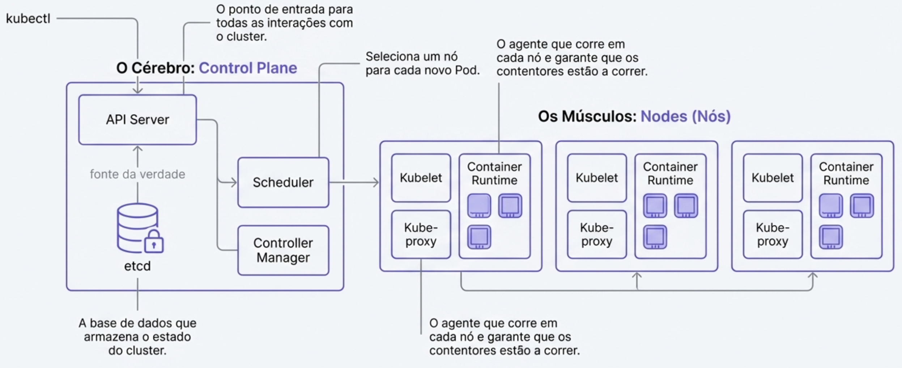
  <figcaption>Figura 13 – Kubernetes Architecture</figcaption>
</figure>

### 24.2 K8s Cluster
É um grupo de máquinas (físicas ou virtuais) que executam aplicações em containers geridas pelo Kubernetes. Consiste num Control Plane e vários Nodes.

### 24.3 Pods
- Unidade de computação mais pequena e simples que se pode criar e gerir no Kubernetes. 
- Representa um ou mais containers que são implementados juntos no mesmo nó, partilhando recursos de armazenamento e rede.

### 24.4 Deployments
- Objeto de alto nível que gere um conjunto de pods idênticos (réplicas).
- O utilizador define um estado desejado (ex: "quero 3 réplicas"). O Deployment trabalha para garantir que o estado atual do cluster corresponde ao desejado.
- Gere um ReplicaSet, que por sua vez mantém o número de pods desejados.

### 24.5 Redes e Serviços
Cada pod tem o seu próprio IP. No entanto os pods são mortais, ou seja, podem ser destruídos e recriados com um novo IP. Como é que as aplicações comunicam com eles de forma viável?

**Objetos Serviço (Service)**:
- **ClusterIP**: Expõe o serviço num IP interno ao cluster (padrão).
- **NodePort**: Expõe o serviço numa porta estática em cada nó.
- **LoadBalancer** : Expõe o serviço externamente usando um balanceador de carga da cloud.

**Se pretender expor uma aplicação que corre em vários Pods para que seja acessível apenas por outras aplicações dentro do mesmo cluster Kubernetes, que tipo de 'Service' seria mais apropriado?**

O tipo de 'Service' mais apropriado para expor uma aplicação apenas para outras aplicações dentro do mesmo cluster Kubernetes seria o **ClusterIP**. Este tipo de serviço atribui um endereço IP interno ao cluster, permitindo que os pods comuniquem entre si sem expor o serviço ao exterior do cluster.

### 24.6 Quando usar VMs
Quando é necessária a virtualização completa de um servidor ou quando o isolamento de segurança máximo é a principal prioridade. Ideal para correr SOs completamente diferentes.

### 24.7 Quando usar Containers
Quando o objetivo é gerir ambientes com aplicações heterogéneas, focando-se na portabilidade, rapidez e eficiência de recursos.

### 24.8 Containers vs VMs

Embora tanto os contentores como as máquinas virtuais (VMs) ofereçam ambientes isolados, representam duas abordagens de virtualização com arquiteturas e propósitos distintos. 

A principal diferença arquitetónica reside na sua "leveza": os contentores **não requerem a virtualização completa** de CPU, RAM, rede e armazenamento, ao contrário das VMs, que **emulam um sistema de hardware completo**. Esta distinção resulta em diferenças significativas de desempenho, eficiência e velocidade de arranque.


<figure style="text-align: center;">
  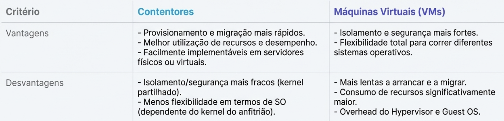
  <figcaption>Figura 14 – Containers vs VMs</figcaption>
</figure>

Nos contentores, o **Motor** (Engine) desempenha um papel central. É o componente responsável por **isolar** e **configurar** os recursos do anfitrião (como CPU, RAM e disco), garantindo que cada contentor opera dentro dos limites que lhe foram alocados. Crucialmente, **cada contentor partilha o hardware e o kernel com o sistema anfitrião**, eliminando a sobrecarga de executar um sistema operativo completo para cada instância.

Uma vantagem chave dos contentores sobre as VMs é a 'melhor utilização de recursos'. Isto acontece principalmente porque:
- **Partilha do Kernel**: Os contentores partilham o mesmo kernel do sistema operativo hospedeiro, eliminando a necessidade de cada contentor ter o seu próprio sistema operativo completo. Isto reduz significativamente a sobrecarga de recursos.
- **Leveza**: Os contentores são mais leves e rápidos de iniciar do que as VMs, permitindo uma utilização mais eficiente da CPU e memória.
- **Empacotamento**: Os contentores empacotam apenas a aplicação e as suas dependências, evitando a duplicação de recursos que ocorre com VMs.


### 24.9 Disponibilidade
A alta disponibilidade (HA) em Kubernetes é alcançada através de várias estratégias que garantem que as aplicações e serviços permanecem acessíveis mesmo em caso de falhas. Algumas das principais estratégias incluem:
- **Replicação de Pods**: Utilizando Deployments e ReplicaSets para garantir que múltiplas réplicas de um pod estão sempre em execução. Para dados persistentes é importante usar Persistent Volumes com políticas de replicação para manter o sincronismo dos dados.
- **Auto-healing**: O Kubernetes monitoriza o estado dos pods e reinicia automaticamente aqueles que falham ou são terminados.
- **Distribuição de Carga**: Utilizando Load Balancer por exemplo para distribuir o tráfego entre múltiplas réplicas de pods, garantindo que a carga é equilibrada e que nenhum pod fica sobrecarregado.

### 24.10 Secrets
Os Kubernetes Secrets são objetos API para armazenar dados sensíveis (palavras-passe, tokens, chaves API) de forma segura e centralizada, evitando colocá-los diretamente em imagens de containers ou manifests YAML
- Armazenam dados em base64 no etcd (não criptografado por default)
---
## 25. Storage

Num cenário onde os dados alimentam sistemas críticos de Bases de Dados, Analytics e Machine Learning, a persistência e a disponibilidade deixaram de ser requisitos técnicos para se tornarem imperativos estratégicos. Sem uma base de armazenamento robusta, a integridade operacional de qualquer serviço digital é comprometida, dado que a computação moderna é, na sua essência, um ciclo contínuo de retenção e recuperação de informação.

É a pedra angular das infraestruturas de dados modernas e um fator crítico para o desempenho.
É essencial para assegurar a persistência e a disponibilidade dos dados.
Um armazenamento lento resulta em aplicações e serviços lentos. O desempenho é crucial.

<figure style="text-align: center;">
  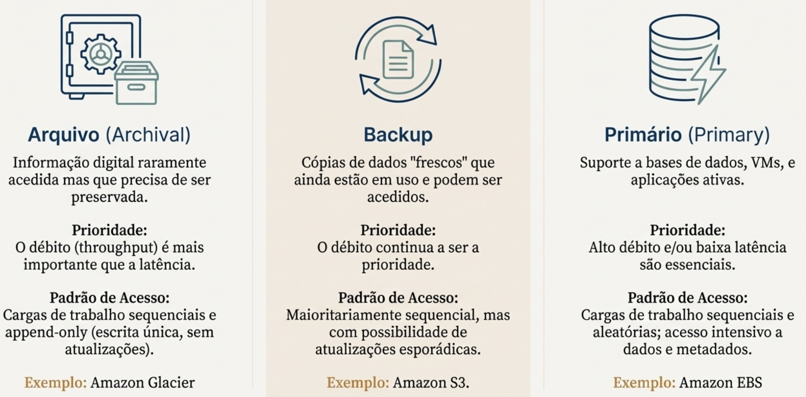
  <figcaption>Figura 15 – Storage types</figcaption>
</figure>

### 25.1 A Relação Crítica entre Desempenho e Latência
A eficiência de uma aplicação é diretamente proporcional à performance da sua camada de armazenamento. Conforme explorado na disciplina, os pontos críticos desta relação incluem:

• **Impacto Direto na Experiência do Utilizador:** Latências elevadas no armazenamento traduzem-se inevitavelmente em aplicações lentas e serviços ineficientes.

• **Persistência e Disponibilidade:** O sistema deve garantir que os dados sobrevivam a falhas de hardware e permaneçam acessíveis sob demanda.

• **Alimentação de Workloads de IA:** Tecnologias de Machine Learning e Deep Learning exigem fluxos de dados constantes e massivos; qualquer atraso na entrega de dados resulta em subutilização de recursos computacionais dispendiosos.

**O Problema:**

Cada componente oferece uma combinação rígida de funcionalidades. No entanto, a combinação ideal de funcionalidades (e.g., caching, encriptação, compressão) varia drasticamente com as necessidades de cada aplicação.

**A solução:** SDS (Software-Defined Storage)

### 25.2 Meios físicos
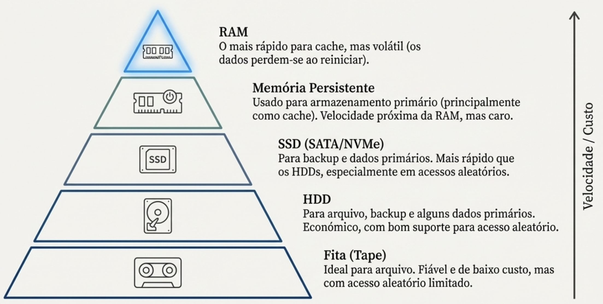

**Por que razão os SSDs são considerados superiores aos HDDs para cargas de trabalho com muitos acessos aleatórios?**

Os SSDs (Solid State Drives) são considerados superiores aos HDDs (Hard Disk Drives) para cargas de trabalho com muitos acessos aleatórios devido à sua arquitetura baseada em memória flash, que permite tempos de acesso muito mais rápidos. Ao contrário dos HDDs, que dependem de componentes mecânicos (discos giratórios e cabeças de leitura/escrita) para localizar e acessar dados, os SSDs não têm partes móveis. Isso resulta em latências significativamente menores e maior velocidade de leitura/escrita, especialmente em operações aleatórias onde os dados não estão localizados em sequência. Portanto, para aplicações que exigem acesso rápido a pequenos blocos de dados distribuídos por todo o armazenamento, os SSDs oferecem um desempenho muito superior em comparação com os HDDs.

**A principal desvantagem da RAM quando usada como meio de armazenamento é a sua:**

A principal desvantagem da RAM quando usada como meio de armazenamento é a sua volatilidade. A RAM perde todos os dados armazenados quando a energia é desligada, o que significa que não pode ser usada para armazenamento persistente de dados. Além disso, a RAM é geralmente mais cara por gigabyte em comparação com outros meios de armazenamento, como HDDs ou SSDs, o que limita a sua capacidade de armazenamento em larga escala.

### 25.3 Interfaces de abstração
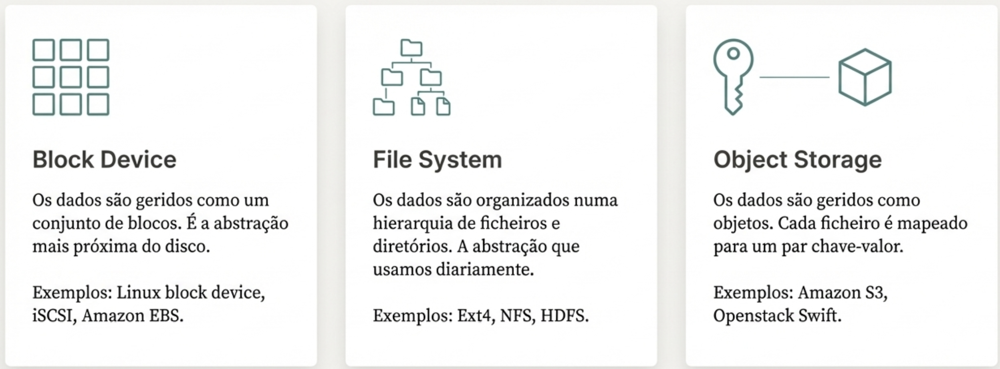

**Um utilizador quer armazenar terabytes de dados não estruturados, como vídeos e imagens, numa cloud OpenStack. Qual é o tipo de armazenamento mais adequado e porquê?**

O armazenamento de objetos (SWIFT) é o mais adequado para este cenário. Isto porque o armazenamento de objetos é **otimizado para dados não estruturados** e oferece **escalabilidade massiva**, permitindo armazenar grandes volumes de dados de forma eficiente. Além disso, o Swift fornece alta disponibilidade e durabilidade dos dados através de replicação automática, o que é crucial para dados importantes como vídeos e imagens. A sua arquitetura distribuída também facilita a gestão e o acesso aos dados em ambientes de cloud, tornando-o ideal para aplicações que requerem acesso frequente a grandes quantidades de dados não estruturados.

**Qual das seguintes interfaces de armazenamento é mais adequada para um serviço como o Amazon S3, onde cada ficheiro é mapeado para um par chave-valor?**

A interface de armazenamento mais adequada para um serviço como o Amazon S3, onde cada ficheiro é mapeado para um par chave-valor, é a **interface de armazenamento de objetos**. Esta interface permite armazenar dados como objetos individuais, cada um identificado por uma chave única, facilitando o acesso e a gestão dos dados em larga escala.

### 25.4 Escopo e Topologia: Do Local ao Altamente Distribuído

O caminho do I/O torna-se mais complexo à medida que a infraestrutura escala de uma máquina local para sistemas globais.

**Modelos de Implementação**

• **Local Storage:** O SO media pedidos via chamadas de sistema (POSIX). O VFS oferece a interface comum e o Page Cache acelera acessos via RAM. **Ver 25.5**

• **Remote Storage (NFS/iSCSI):** Arquitetura Cliente-Servidor onde os pedidos de I/O são intercetados e enviados via rede para um servidor remoto. **Ver 25.6**

• **Distributed Storage (Data Center):** Centenas de nós onde se separa a gestão de Metadados (nós especializados) do armazenamento de conteúdo (Data Nodes), como no Ceph e HDFS. Otimizado para stable churn. **Ver 25.7**

• **Highly Distributed (Peer-to-Peer):** Milhões de nós sem especialização (ex: Napster, Gnutella, CFS, DataFlasks). Ideal para IoT massivo, mas enfrenta dificuldades em manter a consistência devido ao elevado Churn. **Ver 25.8**

**Glossário de Termos Chave**

• **VFS (Virtual File System):** Camada de abstração do kernel que uniformiza a interação com diferentes sistemas de ficheiros.

• **Metadados:** Informação descritiva sobre os dados (localização, permissões, dono).

• **Sharding:** Fragmentação de dados entre múltiplos nós para garantir escalabilidade.

• **Churn:** O ritmo de entrada e saída (falhas ou desligamentos) de nós no sistema, fator crítico na estabilidade de redes P2P.

### 25.5 A máquina local
- O SO medeia os pedidos de I/O entre a aplicação e o hardware de armazenamento. Utiliza caches para melhorar o desempenho.
- As aplicações interagem com o sistema de ficheiros através de uma interface comum, o VFS (Virtual File System).
- A **Page Cache** do SO mantém dados frequentemente acedidos na RAM para acelerar leituras/escritas futuras.

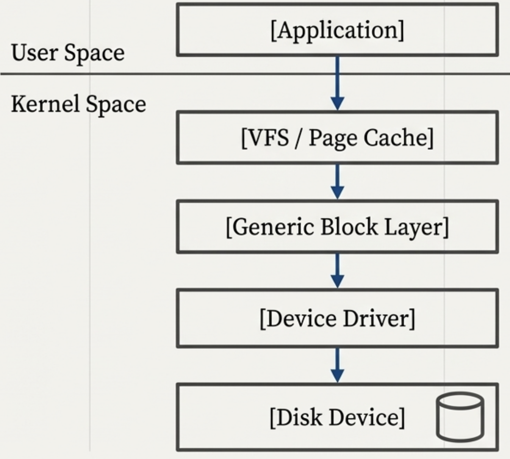

### 25.6 Acesso remoto em rede
- O armazenamento é fornecido através da rede usando protocolos como NFS, SMB/CIFS, iSCSI, Fibre Channel e adotando uma arquitetura cliente-servidor.
- No cliente os pedidos de I/O são intercetados e enviados pela rede. No servidor um componente recebe os pedidos e armazenaos no disco local

**Num sistema de armazenamento remoto cliente-servidor, como o NFS, como é que um pedido de I/O de uma aplicação chega ao disco do servidor?**

Num sistema de armazenamento remoto cliente-servidor como o NFS, o processo de um pedido de I/O de uma aplicação até ao disco do servidor envolve várias etapas:
1. A aplicação no cliente faz um pedido de I/O (leitura ou escrita) ao sistema de ficheiros NFS montado localmente.
2. O cliente NFS intercepta este pedido e o NFS client envia uma solicitação RPC (Remote Procedure Call) através da rede para o servidor NFS.
3. O servidor NFS recebe a solicitação RPC e processa o pedido de I/O.
4. O servidor NFS interage com o sistema de ficheiros local para ler ou escrever os dados no disco.
5. Após completar a operação, o servidor NFS envia uma resposta RPC de volta ao cliente NFS.
6. O cliente NFS recebe a resposta e a entrega à aplicação, completando assim o ciclo de I/O.

### 25.7 Data center distribuído
- Escalabilidade de dezenas e centenas de nós (servidores).
- Design manager-worker otimizado para churn estável
- Separação de dados e metadados
- Exemplos: HDFS, Ceph, Amazon S3, Google Cloud Storage

**Numa arquitetura de armazenamento distribuído típica de um data center (ex: HDFS, Ceph), como é gerida a falha de nós?**

Numa arquitetura de armazenamento distribuído, a falha de nós é gerida através de mecanismos de replicação e tolerância a falhas. Os dados são divididos em blocos ou objetos e replicados em múltiplos nós do cluster. Quando um nó falha, o sistema detecta a falha através de monitorização contínua e redireciona os pedidos de I/O para as réplicas dos dados armazenadas em outros nós. Além disso, o sistema pode iniciar automaticamente a reconstrução dos dados perdidos, criando novas réplicas em nós saudáveis para manter o nível desejado de redundância e disponibilidade dos dados. Este processo garante que os dados permanecem acessíveis mesmo na presença de falhas de hardware.

### 25.8 A dimensão peer-to-peer
- Escala massiva: milhares a milhões de nós.
- Design peer-to-peer otimizado para churn elevado.
- Sem nós especializados: dados e metadados são distribuídos entre todos os nós.
- Exemplos: Gnutella, DataFlasks

**Qual é um dos principais desafios de um sistema de armazenamento altamente distribuído (peer-to-peer)?**

Um dos principais desafios de um sistema de armazenamento altamente distribuído (peer-to-peer) é a gestão do churn elevado, que se refere à frequência com que os nós entram e saem da rede. Este churn pode causar inconsistências nos dados, dificultar a localização e recuperação de informações, e aumentar a complexidade da manutenção da integridade e disponibilidade dos dados. Para mitigar estes desafios, os sistemas peer-to-peer implementam mecanismos robustos de replicação, verificação de integridade e algoritmos de consenso para garantir que os dados permanecem acessíveis e consistentes, mesmo com a dinâmica constante dos nós na rede.

**Numa arquitetura de armazenamento distribuído com separação de metadados e dados, qual é o fluxo típico de operações para um cliente aceder a um ficheiro?**

Numa arquitetura de armazenamento distribuído com separação de metadados e dados, o fluxo típico de operações para um cliente aceder a um ficheiro envolve os seguintes passos:
1. O cliente envia um pedido ao servidor de metadados para localizar o ficheiro desejado.
2. O servidor de metadados responde com a localização dos blocos de dados que compõem o ficheiro, incluindo os nós onde esses blocos estão armazenados.
3. O cliente então envia pedidos diretamente aos nós de dados para recuperar os blocos necessários.
4. Os nós de dados respondem com os blocos solicitados.
5. O cliente reagrupa os blocos para reconstruir o ficheiro completo e o disponibiliza para a aplicação.

### 25.9 Disponibilidade: Replicação vs Erasure Coding
- **RAID:** Redundância local através da replicação ou fragmentação de dados em múltiplos discos no mesmo servidor.
- **Replicação**: múltiplas cópias completas dos dados são armazenadas em diferentes nós (servidores). Simples e rápido, mas **consome mais espaço**.
- **Erasure Coding**: os dados são divididos em k fragmentos, codificados com m blocos de paridade redundantes resultando num menor overhead de armazenamento para um nível de tolerância a falhas semelhante ao da replicação. Mais eficiente em termos de espaço, mas com **maior sobrecarga computacional**.

### 25.8 Performance e Eficiência
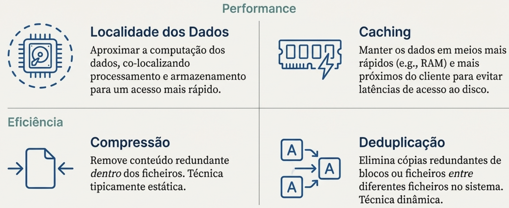
### 25.9 Software-Defined Storage (SDS)
Software-Defined Storage (armazenamento definido por software) transforma a stack de I/O rígida numa infrastrutura flexível, programável e inteligente. Ao mover a complexidade dos componentes fixos para um plano de controlo central, o SDS permite que o armazenamento se adapte dinamicamente às necessidades de cada aplicação.

- **Separação dos planos:** A separação entre fluxos de controlo e dados permite que a infraestrutura seja totalmente programável através de Control Applications. Isto permite que o armazenamento se adapte dinamicamente se o workload envolve ficheiros pequenos, dados sensíveis ou requisitos de alto débito.
- **Flexibilidade:** Novas funcionalidades podem ser adicionadas programaticamente ao plano de dados.
- **Inteligência:** O plano de controlo tem visibilidade global e pode otimizar o desempenho com base nas necessidades das aplicações.

### 25.10 Componentes SDS

**Plano de Dados:** 
Organizado num design em camadas ou "Stages". Estes estágios podem ser encadeados para formar um pipeline de I/O modular, aplicando funcionalidades como cifragem ou compressão conforme o fluxo de dados atravessa o sistema. 
- **Vantagem:** Pode ser estendido com novas funcionalidades de forma programática.

**No Software-Defined Storage (SDS), o que são 'stages' no contexto do 'Data Plane'?**
No contexto do 'Data Plane' em Software-Defined Storage (SDS), 'stages' referem-se a camadas ou componentes distintos no caminho do fluxo de I/O que executam funções específicas de processamento de dados. Cada stage pode implementar uma funcionalidade diferente, como caching, compressão, encriptação, deduplicação, entre outras. Estes stages são organizados de forma modular, permitindo que o sistema SDS seja programável e extensível, adaptando-se às necessidades específicas das aplicações ao longo do tempo.

**Plano de Controlo:**
- O "cérebro" do sistema com visibilidade global. É responsável por configurar e ajustar os estágios do Data Plane para garantir políticas de Qualidade de Serviço (QoS), como priorização de tráfego ou equidade no acesso aos recursos.

---
## 26. Monitorização
É o pilar fundamental que sustenta a **fiabilidade** e o **desempenho** de qualquer arquitetura distribuída. Sem visibilidade plena, a infraestrutura torna-se uma "caixa negra", impossibilitando o diagnóstico de falhas e o cumprimento de requisitos operacionais.

Um princípio inegociável na engenharia de sistemas é o `Overhead`. O ato de monitorizar consome recursos (CPU, RAM, I/O) que, de outra forma, pertenceriam à aplicação.

Um monitor mal configurado **pode "roubar" ciclos de CPU e espaço em cache**, alterando o comportamento do sistema que tenta medir. É o clássico "Efeito Observador": se a ferramenta de medição for demasiado pesada, **os dados recolhidos deixam de representar o estado real do sistema**.

Não confunda o Design do Monitor com o seu Âmbito. Um monitor pode ter um design centralizado (executado num único nó) mas possuir um âmbito de cluster (recolhendo dados de centenas de nós distribuídos). Manter esta distinção é vital para o escalonamento da sua solução.

**Qual é a principal diferença entre o âmbito de distribuição ('distribution scope') e o design de distribuição ('distributed design') de um monitor?**

O âmbito de distribuição ('distribution scope') refere-se à extensão geográfica ou organizacional do sistema de monitorização, ou seja, se o monitoramento é realizado localmente (num único servidor ou data center) ou distribuído (em múltiplos servidores, data centers ou regiões geográficas). Já o design de distribuição ('distributed design') diz respeito à arquitetura interna do sistema de monitorização, incluindo como os componentes do sistema são distribuídos e interagem entre si para coletar, processar e armazenar dados de monitorização. Em resumo, o âmbito de distribuição foca-se na escala e localização do monitoramento, enquanto o design de distribuição foca-se na estrutura e funcionamento interno do sistema de monitorização.

### 26.1 Conceitos
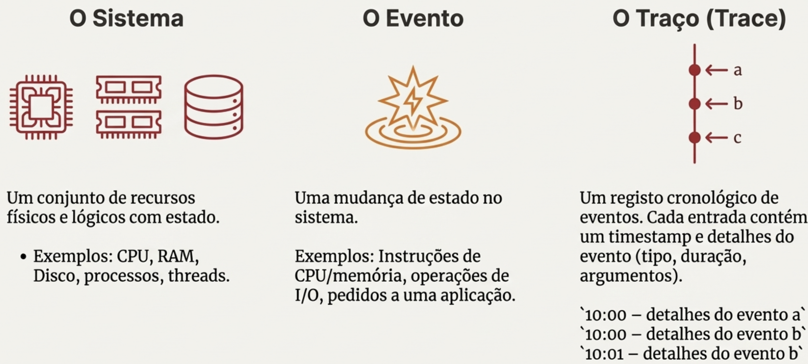

- **Sistema:** O conjunto de recursos físicos e lógicos em observação. Inclui CPU, RAM, discos, memória virtual, processos e threads.

- **Monitor:** O componente ou serviço dedicado a observar ativamente a atividade de um sistema.

- **Estado:** Reflete o estado de um recurso num instante específico.
    - Exemplo Prático: A taxa de ocupação da RAM (ex: 75%) ou o número de threads ativos num servidor num dado segundo.

- **Evento:** Qualquer mudança de estado ou atividade no sistema.
    - Exemplo Prático: Um pedido de I/O, uma instrução de memória ou uma requisição HTTP recebida pela aplicação.

- **Trace (Rasto):** O registo cronológico (log) de uma sequência de eventos.
    - Rigor Técnico: Um trace não é apenas uma lista; cada entrada deve conter um timestamp preciso e metadados detalhados (tipo de evento, duração e argumentos).
    - Exemplo Prático: 10:00:00.005 – Pedido_API_v1; Duração: 45ms; Args: {user_id: 101, endpoint: "/login"}.
    
O Fluxo Lógico: Um `Evento` altera o `Estado` do sistema, e o `Monitor` captura essa transição, registando-a num `Trace`. Compreender estes blocos é o primeiro passo para analisar as dimensões de detalhe que discutiremos a seguir.

### 26.2 Arquiteturas e Compromissos de um Monitor
| Estratégia | Gatilho de Observação | Trade-offs | Impacto no Negócio |
|------------|----------------------|-------------|--------------------|
| Event-driven | Acionado por cada evento individual. | **Máxima Precisão:** Observa todos os eventos, mas gera elevado overhead. | Ideal para auditoria e logs críticos; alto custo de armazenamento. |
| Sampling | Acionado para um subconjunto (ex: cada 10ms ou 100 eventos).| **Alto Desempenho:** Baixo impacto no sistema, sacrificando detalhe. | Risco de perder "bursts" (picos) de atividade curtos e críticos.|


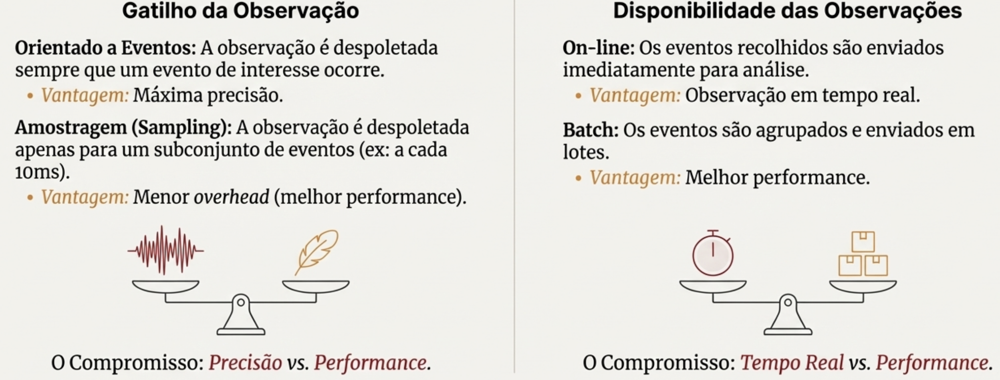

A monitorização pode ser combinada com a atuação para aplicar ações automáticas no sistema, criando um ciclo de controlo.

**On-line vs. Batch:** O processamento On-line oferece visibilidade em tempo real (essencial para alarmística), enquanto o Batch (lote) privilegia a eficiência de processamento e a poupança de recursos, sendo ideal para relatórios históricos.

**Hardware vs. Software:** Monitores de Hardware oferecem precisão cirúrgica e alta resolução com quase zero overhead no processador host. Já os de Software, embora consumam recursos, ganham pela sua flexibilidade e facilidade de extensão.

**Políticas de Atuação e Orquestração**
A monitorização moderna evoluiu da observação passiva para o paradigma de Self-healing (auto-correção). Integrar a monitorização com a atuação permite que o sistema responda autonomamente a incidentes através de um ciclo fechado:
- **Política (Policy):** Especifica as ações a aplicar com base em condições. Exemplo: 'Quando o CPU de um servidor está acima de um limiar, migrar algumas VMs para outro servidor.' 
- **Orquestrador (Orchestrator):** Define a melhor estratégia para aplicar as políticas. Exemplo: Escolhe quais VMs migrar e para que servidor. 
- **Atuador (Actuator):** Executa a estratégia definida pelo orquestrador. Exemplo: Executa a migração da VM para o novo servidor.

**Qual é a principal desvantagem da monitorização 'event-driven' em comparação com a monitorização por 'sampling'?**

A principal desvantagem da monitorização 'event-driven' em comparação com a monitorização por 'sampling' é que a monitorização 'event-driven' pode gerar uma quantidade excessiva de dados e alertas (overhead adicional), especialmente em sistemas altamente dinâmicos ou com muitos eventos. Isso pode levar a uma sobrecarga de informação, dificultando a identificação de problemas reais e aumentando o risco de "alert fatigue" (fadiga de alertas) entre os operadores. Em contraste, a monitorização por 'sampling' captura dados em intervalos regulares, o que pode resultar numa visão mais gerenciável e menos ruidosa do sistema, embora possa perder eventos críticos que ocorrem entre as amostras.

### 26.3 Modelo arquitetural em camadas
Uma arquitetura robusta deve ser modular, gerindo o fluxo de dados desde o bit bruto até à decisão executiva.

Uma abordagem arquitetónica em camadas para a monitorização é estrategicamente importante, pois fornece um enquadramento claro para compreender como os dados fluem desde a sua origem até à sua visualização final. 

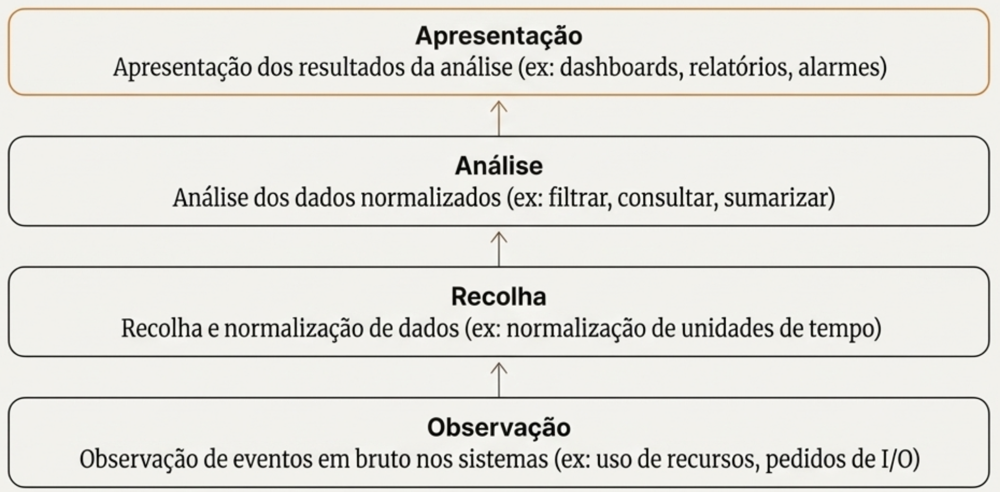

1. **Observação**: Esta é a camada inicial, onde os eventos brutos são observados nos sistemas. A sua função é capturar a atividade do sistema no seu nível mais fundamental, como a utilização de recursos (CPU, RAM), pedidos de I/O e outras operações de baixo nível.
  - **Observação passiva:** O monitor observa passivamente o sistema sem necessidade de instrumentar os recursos. Ex: um network sniffer que analise o tráfego de rede.
  - **Instrumentação:** O hardware, SO ou aplicações são modificados (instrumentados) para expor a informação relevante. Ex: Contadores de hardware, strace.
  - **Sondagem (probing):** O monitor interage ativamente com o sistema, sondando-o (probes) para recolher métricas. Ex: o comando ping para medir a latência de rede.
2. **Recolha (Collection)**: O objetivo desta camada é recolher os dados observados, **normalizá-los para garantir consistência** (por exemplo, converter diferentes unidades de tempo para um padrão comum) e, em alguns casos, fornecer **armazenamento temporário para os eventos recolhidos antes de serem enviados** para análise. A camada Collection solicita ativamente os dados à camada de Observação.
- Modelos PUSH: Os agentes de recolha enviam ativamente os dados para um sistema centralizado.
- Modelos PULL: O sistema centralizado solicita periodicamente os dados aos agentes de recol
3. **Análise**: A camada de análise tem dois objetivos principais: primeiro, **o armazenamento e indexação eficientes e fiáveis dos dados recolhidos**; segundo, o processamento eficiente desses dados através de consultas, agregações e outras formas de análise para extrair informações significativas. Exemplos: Bases de dados de séries temporais (time-series) ou orientadas a documentos.
4. **Apresentação**: Onde o dado se torna informação através de dashboards, relatórios e alarmes.

### 26.4 Elastic Stack
A Elastic Stack é uma poderosa suite de produtos de código aberto da Elastic, projetada para a tarefa abrangente de ingerir, pesquisar, analisar e visualizar dados em tempo real a partir de qualquer fonte ou formato. A sua arquitetura coesa torna-a uma ferramenta de importância estratégica para as modernas operações de monitorização e observabilidade de TI, permitindo que as organizações transformem volumes massivos de dados brutos em insights acionáveis.

As capacidades centrais da stack podem ser resumidas da seguinte forma:
- **Ingestão de dados:** Capacidade de recolher dados de qualquer fonte e em qualquer formato.
- **Pesquisa e análise:** Um motor de pesquisa e análise distribuído, baseado em JSON, para processamento de dados eficiente.
- **Visualização e exploração:** Ferramentas para explorar dados e criar visualizações e dashboards interativos.

**Componentes principais**:
- **Beats**: Os Beats são shippers de dados leves, projetados para observar, recolher e enviar dados para o Logstash para enriquecimento avançado ou diretamente para o Elasticsearch para uma indexação mais rápida e eficiente. Dada a sua função, os Beats operam principalmente nas camadas de Observação e Recolha da arquitetura de monitorização. Exemplos de Beats incluem:
  - Auditbeat: Recolha de dados de auditoria do sistema.
  - Metricbeat: Recolha de CPU/RAM.
  - Heartbeat: Monitorização de disponibilidade via uptime probing.
  - Filebeat: Recolha e encaminhamento de ficheiros de log.
  - Packetbeat: Dados de rede.
- **Logstash**: O motor de processamento que filtra, transforma e normaliza dados de diversas fontes antes de os enviar para um destino como o Elasticsearch. 
- **Elasticsearch**: O Elasticsearch é o coração da Elastic Stack. Trata-se de um motor de pesquisa e análise distribuído, baseado em JSON, construído para velocidade e escalabilidade. As suas principais finalidades são indexar, pesquisar e analisar grandes volumes de dados com fiabilidade. 
- **Kibana**: É a interface para exploração de dados e gestão do stack.

### 26.5 O Fluxo de Dados End-to-End na Elastic Stack
1. **Geração e Envio (Beats):** O processo começa com os Beats, que são instalados nas máquinas de origem (servidores, contentores, etc.). Estes agentes leves observam e recolhem diferentes tipos de dados—como logs, métricas e dados de rede—e enviam-nos para o próximo estágio do pipeline.
2. **Processamento e Enriquecimento (Logstash)**: O Logstash recebe os dados dos Beats (ou de outras fontes). Aqui, os dados são processados: podem ser analisados para extrair campos estruturados, filtrados para remover informações irrelevantes, e transformados para normalizar formatos. Este passo é vital para garantir que os dados estão limpos e estruturados antes de serem armazenados. Em configurações mais simples, os Beats podem enviar dados diretamente para o Elasticsearch, contornando o Logstash—uma abordagem que otimiza a performance e reduz a complexidade e os custos de infraestrutura quando não são necessárias transformações de dados complexas.
3. **Indexação e Análise (Elasticsearch):** Os dados processados são enviados para o Elasticsearch. O Elasticsearch indexa os dados, o que os torna pesquisáveis quase em tempo real. Uma vez indexados, os dados estão disponíveis para serem consultados através de pesquisas complexas e análises agregadas.
4. **Visualização e Interação (Kibana):** Finalmente, o Kibana conecta-se à instância do Elasticsearch para aceder aos dados indexados. Os utilizadores podem então usar a interface intuitiva do Kibana para explorar os dados, criar uma variedade de visualizações em tempo real (como gráficos de barras, mapas e tabelas), construir dashboards abrangentes e configurar alertas.

--- 
## 27. Benchmarking
É uma ferramenta crítica para a **validação de design**, **revisão de código** e **garantia de eficiência** em ambientes de produção. Ele constitui o pilar empírico que permite a um engenheiro tomar decisões baseadas em dados e não em suposições.

Benchmarking é a resposta a três questões críticas:
1. A implementação do sistema é eficiente? 
2. Os recursos (físicos e lógicos) estão a ser usados eficazmente?
3. O ambiente é suficiente para a tarefa?

• **Recursos Físicos:** Representam as "ferramentas de trabalho" tangíveis do sistema. Incluem a Unidade Central de Processamento (CPU), a memória RAM, os dispositivos de armazenamento (disco) e a interface de rede.

• **Recursos Lógicos:** Funcionam como as "regras de organização" que gerem o fluxo de trabalho e o acesso. Exemplos comuns incluem os mecanismos de bloqueio (locks) para controlo de concorrência e as caches para otimização de acesso a dados.

 Sem métricas precisas, é impossível determinar se o sistema está a operar no seu potencial máximo ou se a saturação iminente de um recurso (seja ele físico ou lógico) irá comprometer a estabilidade do serviço.

**O Sistema Sob Teste (System Under Test - SUT):** Este é o "objeto" do nosso estudo. Pode ser um serviço web, um sistema de ficheiros, uma base de dados ou qualquer outro componente de software cujo desempenho queremos avaliar.

### 27.1 Metodologias de Carga de Trabalho (Workload): Traces vs. Sintético
**A Carga de Trabalho (Workload):** Representa o conjunto de pedidos que são enviados ao SUT para simular a sua utilização. Uma boa carga de trabalho deve ser representativa do uso que se espera que o sistema tenha na realidade. Existem duas abordagens principais para o fazer:
  - **Traços reais (Real Traces):** Consistem em registos de pedidos reais, extraídos de um sistema em produção. <br> *Vantagem:* Extrema fidelidade; utiliza pedidos reais extraídos de sistemas em operação. <br> *Desvantagem:* Difíceis de obter e extremamente complexos de escalar (ex: como transformar um trace de 100 pedidos em milhões sem perder o realismo estatístico?).
  - **Cargas sintéticas (Synthetic Workloads):** Consistem em pedidos gerados artificialmente para imitar comportamentos específicos. Estes pedidos seguem distribuições estatísticas conhecidas (e.g., sequencial, uniforme, zipf, Poisson) para simular diferentes padrões de utilização. <br> *Vantagem:* Elevada flexibilidade; permite parametrizar o tipo de pedido, tamanho e paralelismo. <br> *Desvantagem:* Podem não capturar todas as subtilezas de um padrão de uso real. Exige modelos matemáticos rigorosos para simular comportamentos reais (ex: Distribuições de Poisson, Zipf ou Uniforme).

**O Ambiente (Environment):** É o palco onde tudo acontece, englobando todo o hardware e software que suporta a execução do SUT. Testar um sistema numa configuração irrealista pode levar a conclusões completamente erradas. Por isso, é fundamental caracterizar e documentar detalhadamente todos os seus componentes, garantindo a reprodutibilidade da experiência:
- **Hardware:** Tipo de CPU, quantidade de RAM, tipo de armazenamento (HDD, SSD), configuração de rede (latência, largura de banda).
- **Software:** Versão do sistema operativo, bibliotecas, dependências, configurações específicas.

### 27.2 Métricas de Performance: Response Time e Throughput
**As Métricas (Metrics):** São os indicadores quantitativos que recolhemos para medir e avaliar o comportamento do SUT. As métricas podem abranger desempenho, eficiência, fiabilidade, entre outros aspetos.


As duas métricas de desempenho mais fundamentais e universalmente utilizadas são o tempo de resposta e o débito.
- **Tempo de Resposta  / Latência (Response Time - RT):** O intervalo de tempo entre o pedido do utilizador e a resposta do sistema. À medida que a carga aumenta, o RT tende a crescer de forma exponencial após atingir o ponto de saturação.
- **Débito (Throughput):** É a taxa a que os pedidos são servidos pelo sistema, medida em operações por unidade de tempo. Tipicamente, medimos o débito de operações bem-sucedidas (e.g., pedidos por segundo), mas é igualmente importante medir a taxa de erros ou de pedidos rejeitados, pois estes também refletem o comportamento do sistema sob carga.

À medida que a carga (o número de pedidos a chegar) aumenta, o débito tende a aumentar até atingir um ponto de saturação, conhecido como a capacidade nominal do sistema. A partir desse ponto, se a carga continuar a aumentar, o sistema fica sobrecarregado, o débito começa a diminuir e o tempo de resposta, que já vinha a aumentar, dispara.

A visão "RT = 1 / Throughput" é ingénua e só ocorre quando o sistema processa exatamente um pedido de cada vez com 100% de ocupação.

Com base nesta relação, podemos identificar três fases distintas no comportamento de um sistema sob carga:
1. **Idle (Ocioso):** O sistema tem capacidade de sobra. Os pedidos são processados quase imediatamente.
2. **Near capacity (Perto da capacidade):** O sistema começa a ficar ocupado. Os pedidos podem ter de esperar um pouco antes de serem processados. O débito e o tempo de resposta aumentam em simultâneo.
3. **Overload (Sobrecarga):** Os recursos estão saturados. O sistema já não consegue acompanhar o ritmo dos pedidos, o débito começa a cair e o tempo de resposta aumenta drasticamente.
Além do desempenho, existem outras métricas importantes que nos dão uma visão completa do sistema, como a utilização de recursos (CPU, RAM), a eficiência (e.g., rácio débito/utilização), a fiabilidade (número de erros) e a disponibilidade (uptime).

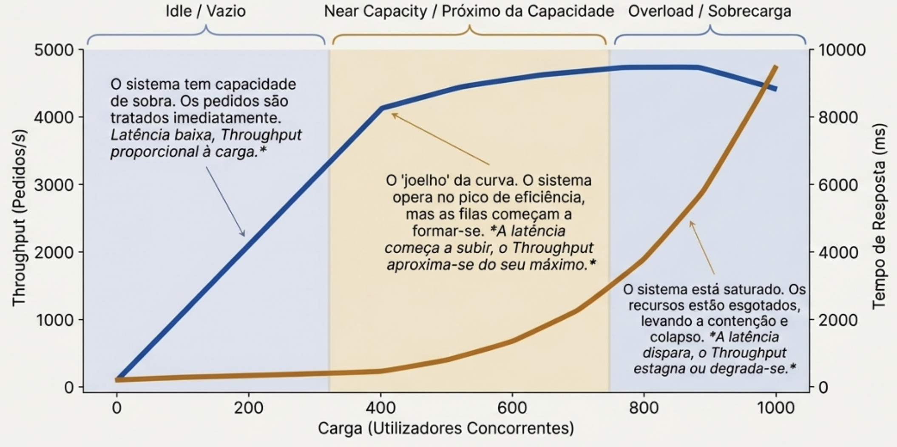

Idealmente, gostaríamos de otimizar um sistema para aumentar o débito e, ao mesmo tempo, diminuir o tempo de resposta. No entanto, na prática, isto é muito difícil de alcançar. A maioria das otimizações envolve um trade-off entre estas duas métricas. Por exemplo, agrupar vários pedidos num lote (batching) geralmente melhora o débito (processamos mais coisas de uma vez), mas fá-lo à custa de um maior tempo de resposta para cada pedido individual, que tem de esperar que o lote seja formado.

### 27.3 Análise dos Resultados: Mais do que Apenas Números

Um dos maiores erros na análise de desempenho é confiar cegamente em resumos estatísticos simples, como a média. A razão é simples: podem ser extraordinariamente enganadores. Imaginem dois testes diferentes: um com um desempenho perfeitamente estável e outro que começa muito lento e vai melhorando (um warm-up). É perfeitamente possível que ambos produzam exatamente a mesma média e o mesmo desvio padrão, apesar de representarem comportamentos do sistema completamente distintos. Sem uma inspeção visual, tiraríamos conclusões erradas.

Por isso, é fundamental:
1. **Repetir as experiências:** Executar cada teste várias vezes ajuda a garantir que os resultados são consistentes e a identificar valores atípicos (outliers).
2. **Visualizar os dados:** Antes de calcular qualquer resumo, devemos sempre visualizar as amostras que recolhemos. As representações visuais são a melhor ferramenta para compreender o comportamento do sistema.
  - **Gráficos temporais (Time-series plots):** Mostram a evolução de uma métrica ao longo do tempo. Permitem observar a estabilidade do sistema e detetar fenómenos importantes como o "aquecimento" de caches (warm-ups) no início de um teste ou uma degradação gradual do desempenho (e.g., devido a uma fuga de memória).
  - **Histogramas e ECDF (Empirical Cumulative Distribution Function):** Mostram a distribuição de frequência dos resultados. São extremamente úteis para observar a mediana (o valor do meio), os percentis e a forma geral da distribuição. A ECDF, em particular, é excelente para verificar se o sistema cumpre Acordos de Nível de Serviço (SLAs), como "95% dos pedidos devem ser respondidos em menos de 200 ms", mostra a distribuição cumulativa.

### 27.4 Padrões
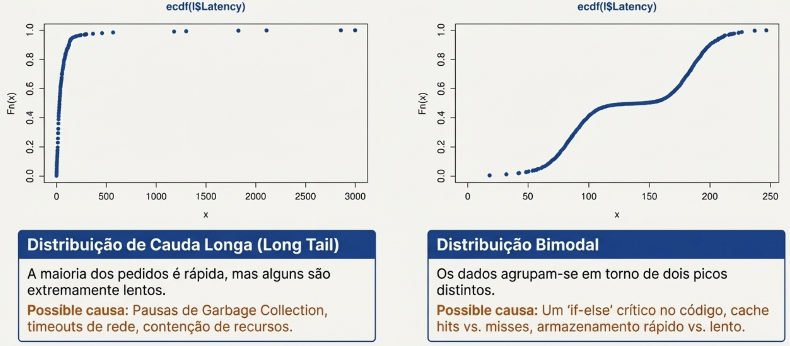
### 27.5 Erros Comuns a Evitar no Benchmarking
Para garantir que o nosso trabalho de benchmarking é útil e credível, devemos estar atentos a algumas armadilhas comuns.
- **Falta de objetivos claros:** Definir testes para provar uma ideia e não para descobrir a verdade.
- **Abordagem não sistemática:** A reprodutibilidade é a chave da credibilidade. Se não documentarmos meticulosamente a carga de trabalho, o ambiente e as configurações, os nossos resultados perdem todo o valor.
- **Cargas de trabalho e métricas irrealistas:** Usar uma carga de trabalho que não representa a utilização real do sistema ou focar-se em métricas irrelevantes levará a conclusões erradas e a otimizações inúteis. É igualmente importante evitar ser tendencioso. Uma análise científica honesta não tem receio de mostrar tanto os pontos fortes como as fraquezas do sistema.
- **Análise e apresentação incorretas:** Resumir os dados sem primeiro os inspecionar visualmente é um erro grave. Como vimos, a média pode ser muito enganadora. É preciso compreender a distribuição dos dados antes de tirar conclusões.

---

## 28. Apêndice — termos e definições

1. <a id="snowflake-servers"></a>**Snowflake servers**: servidores únicos, difíceis de gerir e reproduzir.
2. <a id="configuration-drift"></a>**Configuration drift**: deriva de configuração, onde sistemas que deveriam ser idênticos divergem ao longo do tempo devido a mudanças manuais ou inconsistentes.
3. <a id="devops"></a>**DevOps**: cultura e práticas que unem desenvolvimento de software (Dev) e operações de TI (Ops) para melhorar a colaboração e eficiência na entrega de software.
4. <a id="cicd"></a>**CI/CD**: Integração Contínua (CI) e Entrega Contínua (CD) são práticas que automatizam a integração de código e a entrega de software, permitindo lançamentos mais rápidos e frequentes.
5. <a id="iac"></a>**IaC**: Infraestrutura como Código (IaC) é a prática de gerenciar e provisionar infraestrutura de TI através de código, permitindo automação e consistência.
6. <a id="immutable-infrastructure"></a>**Immutable Infrastructure**: Infraestrutura imutável é um modelo onde os servidores são substituídos em vez de atualizados, garantindo consistência e facilidade de rollback.
7. <a id="microservices"></a>**Microservices**: arquitetura de software onde aplicações são compostas por pequenos serviços independentes que se comunicam entre si, facilitando escalabilidade e manutenção.
8. <a id="containers"></a>**Containers**: containers são unidades leves e portáteis que empacotam uma aplicação e suas dependências, permitindo execução consistente em diferentes ambientes.
9. <a id="orquestracao-containers"></a>**Orquestração de Containers**: orquestração de containers é o processo de gerenciar a implantação, escalabilidade e operação de containers, frequentemente utilizando ferramentas como Kubernetes.
10. <a id="serverless-computing"></a>**Serverless Computing**: computação sem servidor é um modelo onde o provedor de nuvem gerencia a infraestrutura, permitindo que os desenvolvedores se concentrem no código sem se preocupar com servidores.
11. <a id="cloud-native"></a>**Cloud Native**: aplicações nativas da nuvem são projetadas para aproveitar ao máximo os serviços e características da computação em nuvem, como escalabilidade e resiliência.
12. <a id="stub"></a>**Stub**: um stub é um objeto que simula o comportamento de um componente real em um sistema, permitindo testes e desenvolvimento sem depender da implementação completa do componente.
13. <a id="consensus-protocols"></a>**Bus**: um barramento é um sistema de comunicação que permite que diferentes partes de um sistema distribuído se comuniquem entre si, facilitando a troca de mensagens e dados. Garante flexibilidade e escalabilidade.
14. <a id="consensus-protocols"></a>**Kafka**: Kafka é uma plataforma de streaming distribuída que permite a publicação, assinatura, armazenamento e processamento de fluxos de dados em tempo real.
15. <a id="consensus-protocols"></a>**Provisioning**: Ato de providenciar recursos.
16. <a id="consensus-protocols"></a>**Deployment**: Ato de disponibilizar um serviço ou aplicação.
17. <a id="churn"></a>**Churn**: Em termos gerais, churn é a taxa a que elementos “saem” de um conjunto ao longo do tempo. No contexto de negócio/serviços (SaaS, telecomunicações, apps), churn é a percentagem de clientes ou utilizadores que deixam de usar ou cancelar o serviço num certo período (mês, trimestre, ano).
Em sistemas distribuídos, fala‑se também de churn como a taxa de renovação de nós: a velocidade a que nós entram e saem de um sistema peer‑to‑peer ou distribuído (joins, leaves, falhas)

---

## Perguntas
**Q1:A complexidade da replicação de um serviço multi-camada não varia de acordo com o componente alvo (p.ex., servidor web, servidor aplicacional, base de dados) a replicar. Indique e justifique se concorda ou não com esta afirmação.**

Não concordo com esta afirmação. A complexidade da replicação de um serviço multi-camada varia significativamente de acordo com o componente alvo a replicar. Cada componente (servidor web, servidor aplicacional, base de dados) tem características, requisitos e desafios específicos que influenciam a complexidade da replicação. Por exemplo, a replicação de uma base de dados pode envolver a sincronização de dados em tempo real, garantindo a consistência e integridade dos dados, o que pode ser mais complexo do que replicar um servidor web, que pode simplesmente envolver a duplicação de conteúdo estático. Além disso, diferentes componentes podem ter diferentes mecanismos de replicação, protocolos e ferramentas associadas, o que também contribui para a variação na complexidade da replicação.

**Q2: As infraestruturas de computação em nuvem promovem uma utilização eficiente de recursos computacionais, de rede e armazenamento através da utilização de virtualização. Descreva, e justifique, duas vantagens e duas desvantagens da utilização desta tecnologia.**

Vantagens:
1. **Eficiência na Utilização de Recursos:** A virtualização permite a criação de múltiplas máquinas virtuais (VMs) em um único servidor físico, otimizando o uso dos recursos computacionais. Isso resulta em melhor aproveitamento do hardware, reduzindo custos operacionais e aumentando a flexibilidade na alocação de recursos conforme a demanda.
2. **Isolamento e Segurança:** Cada VM opera de forma isolada, o que significa que problemas ou falhas em uma VM não afetam as outras. Isso aumenta a segurança, pois diferentes aplicações podem ser executadas em VMs separadas, minimizando o risco de interferência ou comprometimento entre elas.

Desvantagens:
1. **Sobrecarga de Desempenho:** A virtualização introduz uma camada adicional entre o hardware físico e o sistema operacional, o que pode resultar em uma sobrecarga de desempenho. Isso pode levar a uma redução na eficiência, especialmente em aplicações que exigem alto desempenho ou baixa latência.
2. **Complexidade de Gestão:** A gestão de ambientes virtualizados pode ser complexa, exigindo ferramentas e conhecimentos especializados. A administração de múltiplas VMs, redes virtuais e armazenamento pode aumentar a carga de trabalho dos administradores de sistemas, além de introduzir potenciais pontos de falha adicionais.

**Q3: Nas aulas práticas recorreu às ferramentas ElasticSearch, Kibana e MetricBeat para observar a utilização de recursos de diferentes máquinas virtuais. Indique qual a função de cada uma destas ferramentas num ambiente de monitorização.**

- **ElasticSearch:** É um motor de busca e análise distribuído que armazena, indexa e permite a consulta eficiente dos dados recolhidos. No ambiente de monitorização, o ElasticSearch serve como o repositório central onde todos os dados de métricas e logs são armazenados e processados para análise posterior.
- **Kibana:** É uma ferramenta de visualização que se conecta ao ElasticSearch para apresentar os dados de forma gráfica e interativa. No ambiente de monitorização, o Kibana permite aos utilizadores criar dashboards, gráficos e relatórios para visualizar a utilização de recursos e identificar tendências ou anomalias.
- **MetricBeat:** É um agente leve que recolhe métricas de sistemas e serviços e as envia para o ElasticSearch. No ambiente de monitorização, o MetricBeat é responsável por coletar dados em tempo real sobre a utilização de recursos (CPU, memória, disco, rede) das máquinas virtuais, fornecendo informações essenciais para análise e visualização.

**Q4: Imagine que a Universidade do Minho lhe atribui a responsabilidade de instalar a aplicação WikiJS para servir todos os alunos da universidade. No entanto, antes do processo de instalação, o gestor financeiro da universidade pergunta-lhe quais os recursos computacionais que prevê serem necessários para esta instalação. Que estratégia(s) pode aplicar para responder a esta pergunta e ter um elevado grau de confiança que a aplicação será capaz de responder à carga computacional imposta em produção?**

Para responder à pergunta do gestor financeiro com um elevado grau de confiança, posso aplicar as seguintes estratégias:
1. **Benchmarking e Testes de Carga:** Realizar testes de carga utilizando ferramentas como JMeter ou Locust para simular o tráfego esperado na aplicação WikiJS. Isso permitirá-me medir o desempenho da aplicação sob diferentes níveis de carga e identificar os recursos computacionais necessários (CPU, memória, armazenamento) para garantir que a aplicação pode lidar com o número esperado de utilizadores simultâneos.
2. **Análise de Requisitos e Dimensionamento:** Analisar os requisitos técnicos da aplicação WikiJS, incluindo a documentação oficial e casos de uso semelhantes em outras instituições. Com base nesses dados, posso dimensionar os recursos necessários, considerando fatores como o número de utilizadores, o volume de conteúdo a ser armazenado e a frequência de acesso. Esta análise ajudará a estimar os recursos computacionais necessários para a instalação em produção.

**Q5: Durante o semestre foram utilizados diferentes componentes de software, tais como o Swap, Ghost, MySQL, e Redis, que podiam ser configurados e instalados seguindo uma arquitetura distribuída. Indique uma vantagem e um desafio a ter em conta quando se pretende seguir uma instalação distribuída para um dado componente de software. Justifique a sua resposta.**

Vantagem:
- **Escalabilidade:** Uma instalação distribuída permite que o componente de software seja escalado horizontalmente, adicionando mais nós conforme a demanda aumenta.  

Desafio:
- **Complexidade de Gestão:** A gestão de uma arquitetura distribuída pode ser complexa, exigindo ferramentas e conhecimentos especializados para monitorar, configurar e manter os diferentes nós. A coordenação entre os componentes distribuídos pode introduzir desafios adicionais, como a necessidade de garantir a consistência dos dados e a resolução de falhas em diferentes partes do sistema.

**Q6: Embora ambas sejam consideradas tecnologias de virtualização, máquinas virtuais e containers adequam-se a diferentes tipos de aplicações e serviços. Indique um tipo de aplicação ou serviço onde é mais apropriada a utilização de containers. Justifique a sua resposta.**

Um tipo de aplicação onde é mais apropriada a utilização de containers é uma aplicação baseada em microserviços. A razão para isso é que os containers são leves, portáteis e permitem a rápida implantação e escalabilidade de serviços independentes. Cada microserviço pode ser empacotado em um container separado, facilitando o desenvolvimento, teste e implantação contínua. Além disso, os containers compartilham o mesmo kernel do sistema operativo, o que reduz a sobrecarga em comparação com máquinas virtuais completas, tornando-os ideais para ambientes onde a eficiência de recursos e a agilidade são cruciais.

**Q7: Imagine que tem de escolher as melhores configurações para um sistema de armazenamento que tem como principais propósitos garantir alta disponibilidade e, simultaneamente, reduzir o espaço ocupado pelos dados persistidos. Das funcionalidades tipicamente suportadas por sistemas de armazenamento que estudou, quais é que sugeria? Justifique a sua resposta.**

Para garantir alta disponibilidade e reduzir o espaço ocupado pelos dados persistidos, sugeriria as seguintes funcionalidades:
1. **Replicação de Dados:** Implementar a replicação de dados em múltiplos nós ou data centers para garantir alta disponibilidade. Em caso de falha de um nó, os dados ainda estarão acessíveis a partir de outros nós replicados, minimizando o tempo de inatividade.
2. **Deduplicação de Dados:** Utilizar a deduplicação para eliminar dados redundantes, reduzindo significativamente o espaço de armazenamento necessário. Esta funcionalidade é especialmente útil em ambientes onde muitos dados semelhantes são armazenados, como backups ou arquivos de usuários.

**Q8: Os engenheiros informáticos responsáveis por gerir aplicações em ambientes Kubernetes recorrem muitas vezes a ferramentas de monitorização. Indique uma das razões pela qual as Kubernetes são frequentemente combinadas com ferramentas de monitorização. Justifique a sua resposta. Indique uma vantagem de, ao ambiente com Kubernetes e monitorização, acrescentar também uma ferramenta de avaliação experimental (benchmark). Justifique a sua resposta.**

Uma das razões pelas quais as Kubernetes são frequentemente combinadas com ferramentas de monitorização é a necessidade de acompanhar o desempenho e a saúde dos clusters e das aplicações em execução. Kubernetes gerencia automaticamente a escalabilidade e a resiliência das aplicações, mas sem monitorização adequada, os engenheiros podem não ter visibilidade suficiente sobre o estado dos pods, nós e serviços, o que pode levar a problemas de desempenho ou falhas não detectadas.

Uma vantagem de acrescentar uma ferramenta de avaliação experimental (benchmark) ao ambiente com Kubernetes e monitorização é a capacidade de testar e validar o desempenho das aplicações sob diferentes cargas de trabalho. Isso permite identificar gargalos, otimizar recursos e garantir que as aplicações podem atender aos requisitos de desempenho esperados em produção.

**Q9: Tecnologias como Ansible, máquinas virtuais e containers permitem simplificar a gestão de aplicações e serviços. No entanto, a sua utilização está normalmente associada a propósitos distintos. Concorda com esta afirmação? Justifique a sua resposta dando exemplos concretos de cenários de utilização para cada uma das tecnologias.**

Concordo com esta afirmação. Cada uma dessas tecnologias tem propósitos distintos e é mais adequada para diferentes cenários de utilização.
- **Ansible:** É uma ferramenta de automação de configuração e gestão de infraestrutura. É ideal para cenários onde é necessário configurar e gerir múltiplos servidores ou ambientes de forma consistente e automatizada. Por exemplo, pode ser usado para automatizar a instalação e configuração de software em servidores físicos ou virtuais, garantindo que todos os nós estejam configurados de acordo com as políticas definidas.
- **Máquinas Virtuais (VMs):** Criadas por hipervisores, emulam hardware completo (SO convidado + kernel próprio) para isolamento forte e execução de apps. São mais adequadas para cenários onde é necessário isolamento completo entre diferentes ambientes ou aplicações. Por exemplo, uma empresa pode usar VMs para hospedar diferentes sistemas operativos ou aplicações que requerem ambientes específicos, garantindo que cada VM funcione de forma independente.
- **Containers:** Usam o kernel do host para empacotar apps leves e portáteis (apenas runtime + dependências), com overhead mínimo e arranque rápido. São ideais para cenários onde a portabilidade e a eficiência de recursos são cruciais. Por exemplo, uma aplicação baseada em microserviços pode ser empacotada em diferentes containers para facilitar a implantação rápida e escalável em diferentes ambientes, como desenvolvimento, teste e produção.

**Q10: Assuma um serviço, composto por uma aplicação web e uma base de dados, que tipicamente é instalado num único servidor (p.ex., Swap, Moonshot). A sua tarefa é dotar este serviço de alta disponibilidade. Discuta que mecanismos da tecnologia Kubernetes podem ajudar nesta tarefa e se esses mecanismos são suficientes, por si só, para obter alta disponibilidade do serviço em questão. Justifique a sua resposta.**

Para dotar o serviço composto por uma aplicação web e uma base de dados de alta disponibilidade utilizando Kubernetes, podemos recorrer a vários mecanismos oferecidos pela plataforma:
1. **Deployments e ReplicaSets:** Podemos usar Deployments para gerir a aplicação web, garantindo que múltiplas réplicas estejam sempre em execução. Se uma réplica falhar, o Kubernetes automaticamente cria uma nova para manter o número desejado de réplicas.
2. **StatefulSets:** Para a base de dados, podemos usar StatefulSets, que são adequados para aplicações com estado. Eles garantem que cada instância da base de dados tenha um identificador persistente e armazenamento estável, facilitando a recuperação em caso de falhas.
3. **Services e Load Balancing:** Podemos configurar serviços Kubernetes para expor a aplicação web e a base de dados, utilizando balanceamento de carga para distribuir o tráfego entre as réplicas, melhorando a disponibilidade.
4. **Probes de Saúde (Liveness e Readiness Probes):** Podemos configurar probes de saúde para monitorizar o estado das aplicações e reiniciar automaticamente os pods que não estejam a funcionar corretamente. No entanto, esses mecanismos, por si só, podem não ser suficientes para garantir alta disponibilidade completa. É importante considerar outros fatores, como a replicação de dados entre múltiplas zonas de disponibilidade, backups regulares da base de dados e estratégias de recuperação de desastres para garantir que o serviço permaneça disponível mesmo em caso de falhas graves.

**Q11: As arquitecturas de sistemas de armazenamento adequadas para infraestruturas de computação em nuvem ou ambientes peer-to-peer totalmente descentralizados têm desafios distinctos. Indique dois destes desafios e discuta de que forma os mesmos têm impacto na arquitectura dos sistemas de armazenamento. Justifique a sua resposta.**

1. **Consistência de Dados:** Em ambientes distribuídos, garantir a consistência dos dados entre múltiplos nós é um desafio significativo. Em sistemas de armazenamento em nuvem, onde os dados podem ser replicados em diferentes regiões geográficas, é crucial implementar mecanismos de consenso para assegurar que todas as réplicas dos dados estejam sincronizadas. Isso impacta a arquitetura do sistema, exigindo a inclusão de camadas adicionais para gerenciar a replicação e a sincronização dos dados, o que pode aumentar a complexidade e a latência das operações de escrita.
2. **Tolerância a Falhas:** Em ambientes peer-to-peer totalmente descentralizados, a tolerância a falhas é um desafio crítico, pois os nós podem entrar e sair da rede a qualquer momento. Isso requer que o sistema de armazenamento seja projetado para lidar com a perda de nós sem comprometer a disponibilidade dos dados. A arquitetura deve incluir mecanismos de replicação e recuperação automática, bem como estratégias de distribuição de dados para garantir que os dados permaneçam acessíveis mesmo quando vários nós falham.

**Q12: A errada configuração da camada de observação de um serviço de monitorização pode ter um impacto negativo no desempenho do sistema a ser observado. Concorda com esta afirmação? Justifique a sua resposta dando exemplos concretos de configurações.**

Concordo com esta afirmação. A configuração inadequada da camada de observação de um serviço de monitorização pode introduzir overhead significativo no desempenho do sistema a ser monitorizado. Por exemplo, se a frequência de recolha de métricas for demasiado alta, o agente de monitorização pode consumir uma quantidade excessiva de recursos do sistema, afetando negativamente o desempenho das aplicações em execução. Outro exemplo é a recolha de métricas desnecessárias ou excessivamente detalhadas, que podem gerar grandes volumes de dados para serem processados e armazenados, aumentando a latência. Além disso, a utilização de sondas ativas (probing) muito frequentes pode sobrecarregar a rede e os serviços monitorizados, levando a degradação do desempenho geral.

**Q13: Uma arquitetura distribuída do tipo BUS permite uma maior flexibilidade na comunicação entre diferentes aplicações. Descreva, por suas palavras, em que consiste esta arquitetura e justifique se concorda com a afirmação anterior.**

A arquitetura distribuída do tipo BUS é um modelo de comunicação onde diferentes componentes ou aplicações se conectam a um barramento comum (bus) para trocar mensagens e dados. Neste modelo, o barramento atua como um intermediário que facilita a comunicação entre os diversos serviços, permitindo que eles se comuniquem de forma assíncrona e desacoplada. Cada aplicação pode publicar mensagens no barramento ou subscrever-se para receber mensagens de interesse, promovendo uma maior flexibilidade na integração de diferentes sistemas. Concordo com a afirmação anterior, pois a arquitetura BUS permite que novas aplicações sejam adicionadas ou removidas facilmente sem afetar os componentes existentes, facilitando a escalabilidade e a evolução do sistema ao longo do tempo.

**Q14: No guião das aulas práticas dedicado à ferramenta Ansible foram criados diferentes roles para facilitar a instalação automática da aplicação Swap. Qual a função dos roles num playbook Ansible? De que forma os roles contribuem para um melhor aprovisionamento de aplicações? Justifique a sua resposta.**

Os roles num playbook Ansible são uma forma de organizar e reutilizar conjuntos de tarefas, variáveis, arquivos e templates relacionados a uma funcionalidade específica. Cada role encapsula uma parte do processo de configuração ou instalação, permitindo que seja facilmente incluída em diferentes playbooks conforme necessário. Os roles contribuem para um melhor aprovisionamento de aplicações ao promoverem a modularidade e a reutilização de código, facilitando a manutenção e a atualização das configurações. Além disso, os roles permitem uma melhor organização do código, tornando-o mais legível e compreensível, o que é especialmente útil em ambientes complexos onde múltiplas aplicações e serviços precisam ser geridos de forma eficiente.

**Q15: Diga o que entende por elasticidade de um serviço a correr num ambiente de computação em nuvem. Em que medida é que uma arquitetura PaaS contribui para a atingir? Justifique a sua resposta.**

Elasticidade de um serviço refere-se à capacidade do serviço de ajustar automaticamente os recursos computacionais conforme a demanda varia. Isso significa que o serviço pode escalar para cima (adicionar mais recursos) durante períodos de alta demanda e escalar para baixo (reduzir recursos) quando a demanda diminui, otimizando o uso dos recursos e os custos operacionais. Uma arquitetura PaaS contribui significativamente para atingir a elasticidade, pois fornece uma plataforma gerenciada que automatiza o provisionamento, a escalabilidade e a gestão dos recursos. Com PaaS, os desenvolvedores podem focar-se no desenvolvimento da aplicação sem se preocupar com a infraestrutura subjacente, permitindo que o serviço se adapte rapidamente às mudanças na carga de trabalho.

**Q16: Para replicar o servidor aplicacional da aplicação Laravel.io, utilizada no trabalho prático, não basta apenas criar vários pods Kubernetes deste servidor. Indique se concorda com a afirmação anterior, justificando a sua resposta.**

Concordo com a afirmação anterior. Replicar apenas os pods Kubernetes do servidor aplicacional não é suficiente para garantir a replicação completa e o funcionamento adequado da aplicação Laravel.io. Isso ocorre porque a aplicação provavelmente depende de outros componentes, como a base de dados, sistema de cache (por exemplo, Redis) e armazenamento de arquivos, que também precisam ser replicados e configurados corretamente para garantir a consistência e a disponibilidade dos dados. Além disso, é necessário configurar o balanceamento de carga para distribuir o tráfego entre os pods replicados e garantir que as sessões dos utilizadores sejam geridas adequadamente. Portanto, uma abordagem holística que inclua todos os componentes da aplicação é essencial para uma replicação eficaz e funcional.

**Q17: A computação em nuvem oferece uma utilização eficiente de recursos de hardware (p.ex., CPU, RAM, disco) através da partilha destes recursos entre multiplas aplicações (multi-tenancy). Indique uma implicação positiva e uma implicação negativa provenientes desta partilha de recursos. Justifique a sua resposta.**

Implicação positiva:
- **Eficiência de Recursos:** A partilha de recursos entre múltiplas aplicações permite uma utilização mais eficiente do hardware disponível, reduzindo o desperdício e os custos operacionais. 

Implicação negativa:
- **Isolamento e Segurança:** A partilha de recursos pode levar a desafios relacionados ao isolamento e segurança entre diferentes aplicações ou inquilinos (tenants). Se uma aplicação maliciosa ou vulnerável conseguir explorar falhas no isolamento, pode comprometer a segurança dos dados e operações de outras aplicações que partilham os mesmos recursos. Isso exige a implementação de medidas rigorosas de segurança e isolamento para mitigar esses riscos.
- **Overprovisionamento:** A partilha de recursos pode levar a situações de overprovisionamento, onde múltiplas aplicações competem pelos mesmos recursos, resultando em degradação do desempenho para todas as aplicações envolvidas.

**Q18: O componente Docker Daemon é responsável por gerir imagens, containers e redes num ambiente virtualizado. Indique qual a diferença entre uma imagem e um container na plataforma Docker.**

Uma imagem Docker é um arquivo imutável que contém o código, as bibliotecas, as dependências e as configurações necessárias para executar uma aplicação. É uma espécie de "modelo" ou "blueprint" que define como um container deve ser construído. As imagens são criadas a partir de um arquivo Dockerfile e podem ser armazenadas em repositórios, como o Docker Hub, para serem reutilizadas.

Um container Docker, por outro lado, é uma instância em execução de uma imagem. Ele representa um ambiente isolado onde a aplicação é executada com todos os seus recursos e dependências conforme definidos na imagem. Enquanto a imagem é estática, o container é dinâmico e pode ser iniciado, parado, movido e excluído conforme necessário.

**Q19: Em vários sistemas de armazenamento distribuídos, a gestão de dados (i.e., conteúdo) e metadados (p.ex., localização, tamanho, permissões) de ficheiros é feita por componentes diferentes. Ainda, na maioria dos casos, estes componentes são instalados em conjuntos de servidores distintos. Explique a vantagem de considerar componentes independentes para a gestão de dados e metadados. Justifique a sua resposta.**

A vantagem de considerar componentes independentes para a gestão de dados e metadados em sistemas de armazenamento distribuídos reside na especialização e otimização de cada componente para suas funções específicas. A gestão de dados envolve operações intensivas de leitura e escrita, enquanto a gestão de metadados requer operações rápidas de consulta e atualização. Ao separar esses componentes, é possível otimizar cada um deles para suas tarefas específicas, melhorando o desempenho geral do sistema. Além disso, a separação permite uma maior escalabilidade, pois os componentes de metadados podem ser dimensionados independentemente dos componentes de dados, atendendo às necessidades específicas de cada um. Isso também facilita a manutenção e a evolução do sistema, permitindo atualizações ou melhorias em um componente sem afetar o outro.

**Q20: Dê dois exemplos de métricas, para além do débito e latência no processamento de pedidos, que possam ser úteis ao avaliar experimentalmente um dado sistema. Justifique a relevância das métricas escolhidas.**
1. **Utilização de Recursos (CPU, Memória, Disco):** Esta métrica é crucial para entender quão eficientemente o sistema está a utilizar os recursos disponíveis. Uma alta utilização de CPU ou memória pode indicar gargalos que afetam o desempenho, enquanto uma baixa utilização pode sugerir que os recursos estão subutilizados. Monitorizar a utilização ajuda a identificar áreas para otimização e a garantir que o sistema pode escalar adequadamente conforme a carga aumenta.
2. **Taxa de Erros:** Esta métrica mede a frequência de falhas ou erros no processamento de pedidos. É relevante porque um sistema pode ter um bom desempenho em termos de débito e latência, mas se estiver a falhar frequentemente, a experiência do utilizador será negativa. Monitorizar a taxa de erros ajuda a identificar problemas de confiabilidade e estabilidade, permitindo que sejam tomadas medidas corretivas para melhorar a robustez do sistema.

**Q21: Explique por que é importante repetir várias vezes uma experiência de benchmarking antes de analisar os resultados obtidos. Justifique a sua resposta.**

Repetir várias vezes uma experiência de benchmarking é importante para garantir a confiabilidade e a validade dos resultados obtidos. A repetição ajuda a mitigar o impacto de variáveis externas e flutuações que podem afetar o desempenho do sistema, como cargas de trabalho temporárias, interferências de outros processos ou condições ambientais. Ao executar múltiplas iterações, é possível obter uma média mais representativa do desempenho do sistema, identificar tendências consistentes e detectar valores atípicos (outliers) que podem distorcer a análise. Além disso, a repetição permite avaliar a estabilidade do sistema ao longo do tempo, garantindo que os resultados são robustos e não dependem de condições específicas de uma única execução.

**Q22: Indique duas técnicas de visualização de dados que possam ser úteis para analisar os resultados de um benchmark. Justifique a relevância de cada técnica.**

1. **Gráficos de Séries Temporais (Time-Series Plots):** Esta técnica é relevante porque permite visualizar a evolução de métricas ao longo do tempo, facilitando a identificação de tendências, picos e variações no desempenho do sistema durante o benchmark. É especialmente útil para observar comportamentos dinâmicos e entender como o sistema responde a diferentes cargas de trabalho ao longo do tempo.

2. **Histogramas e ECDF (Empirical Cumulative Distribution Function):** Histogramas são úteis para visualizar a distribuição de frequências das métricas coletadas, permitindo identificar padrões como a simetria ou assimetria dos dados. A ECDF é particularmente relevante porque mostra a proporção acumulada de observações abaixo de um determinado valor, o que é útil para avaliar a performance em termos percentuais. Por exemplo, ao analisar a latência, a ECDF pode indicar que 95% dos pedidos são processados em menos de um certo tempo, fornecendo insights valiosos sobre a experiência do utilizador.

**Q23: Qual é a principal motivação para a 'Availability' (Disponibilidade) em sistemas distribuídos?**
Garantir que o sistema continua a funcionar mesmo na presença de falhas de componentes, assegurando que os serviços estão sempre acessíveis aos utilizadores.

---

_Fim — notas organizadas para estudo e referência rápida._
