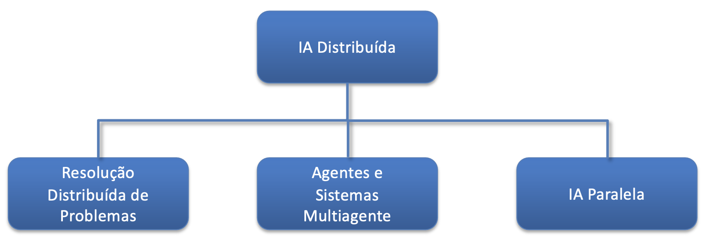

# Agentes e Sistemas Multiagente

## Inteligência Artificial Distribuída
A Inteligência Artificial Distribuída (IAD) é um subcampo da inteligência artificial que se concentra no estudo e desenvolvimento de sistemas compostos por múltiplos agentes autônomos que interagem entre si para alcançar objetivos individuais ou coletivos. Esses agentes podem ser programas de software, robôs ou qualquer entidade capaz de perceber seu ambiente, tomar decisões e agir de forma independente.

> “Ramo da Inteligência Artificial que estuda a resolução de problemas através de sistemas computacionais distribuídos”.



## Agentes
Um agente é uma entidade que interage num sistema, percebendo o ambiente através de sensores e agindo sobre esse ambiente através de atuadores. Os agentes podem variar em complexidade, desde simples programas que respondem a estímulos específicos até sistemas sofisticados capazes de aprendizado e adaptação.

> “Um agente corporiza um sistema computacional capaz de revelar uma ação autónoma e flexível,
desenvolvido num determinado universo de discurso. A flexibilidade do agente está relacionada
com as suas capacidades de reação, iniciativa, aprendizagem e socialização.”

Quando construímos um agente, queremos (simplesmente) um sistema que possa escolher a ação adequada a ser executada, normalmente num certo domínio. Ou seja, não temos que resolver todos os problemas de IA para construir um agente útil!

**Sensores**:
- Câmeras
- Microfones
- Sensores de temperatura
- Sensores de movimento

**Atuadores**:
- Motores
- Alto-falantes
- Luzes
- Braços robóticos

**Propriedades dos Agentes:**
- **Veracidade**: Um agente exibe veracidade quando não fornece, de forma intencional, informação falsa;
- **Racionalidade**: um agente racional não aceita realizar tarefas que avalie impossíveis de executar, contraditórias com os seus princípios ou quando não são compensados em termos do risco, custo ou esforço;
- **Benevolencia**: um agente benevolente adota como seus os objetivos de terceiros, desde que estes não entrem em conflito com os seus princípios de natureza ética e/ou deontológica, o que significa que não realizarão todas as tarefas que lhes sejam atribuídas;
- **Emotividade**: certas características próprias do ser humano têm vindo a migrar e a estabelecer-se como parte constituinte dos agentes.
- **Credibilidade**: capacidade do agente de criar uma suspensão de “descrença”, levando o utilizador a aceitar temporariamente que o agente está “vivo” ou que é um “personagem real”.
- **Personalidade**: capacidade do agente de se comportar de forma individual, o que torna o agente distinguível de seus pares.

## 3. Agentic AI
Agentes autonomos com LLMs integrados para realizar tarefas complexas. Comunicam, planeiam e executam tarefas. Estes agentes combinam autonomia com capacidades avançadas de raciocinio em linguagem natural. Simplificam a coordenação entre agentes. É estabelecida uma ponte entre o ser humano e a colaboração com IA.

### 3.1 Frameworks Populares
- Microsoft AutoGen
- Crew AI
- LangChain Agents
- Manus

| MAS clássicos (SPADE) | Agentic AI (AutoGen) |
|----------------|----------------|
| Raciocinio simbólico | Raciocinio generativo |
|Protocolos de mensagens (FIFA-ACL) | Linguagem natural |
| Behaviours e Templates | LLMs e Prompts |
| Coordenação através de regras | Coordenação através de linguagem natural |

### 3.2 AutoGen da Microsoft
- Criação de agentes com LLMs integrados com roles e goals.
- Sistema cooperativo de múltiplos agentes via linguagem natural.
- Executam código e interagem com APIs das LLMs.

#### 3.2.1. Arquitetura
Dois tipos principais de agentes:
- **Assistant Agents**: Role inteligente com LLM.
- **UserProxyAgents**: Executa código e simula um utilizador.

*Opcionalmente podemos ter um orquestrador*.

#### 3.2.2. Configuração do nosso LLM
```python
import json
import os
from datetime import datetime
import autogen

config_list = [{
    "model": os.getenv("LLM_MODEL", "gemma3:1b"),
    "api_key": os.getenv("OPENAI_API_KEY", "ollama_key"),
    "base_url": os.getenv("OPENAI_API_BASE", "http://localhost:11434/v1")
}]

LLM_KW = {"config_list": config_list, "timeout": 120, "temperature": 0.2}
```

#### 3.2.3. Assistant Agent
```python
from autogen.agent import AssistantAgent
from autogen.message import SystemMessage
from autogen.llm import LLM

ideator = AssistantAgent(
    name="Ideator",
    system_message=SystemMessage(
        content="You are an innovative ideator who generates creative ideas."
    ),
    llm_config=LLM_KW,
)

engineer = AssistantAgent(
    name="Engineer",
    system_message=SystemMessage(
        content="You are a skilled engineer who transforms ideas into practical solutions."
    ),
    llm_config=LLM_KW,
)
```

#### 3.2.4. User Proxy Agent
```python
from autogen.agent import UserProxyAgent
from autogen.message import SystemMessage

user_proxy = UserProxyAgent(
    name="User",
    code_execution_config = False, # Não permite execução de código
    human_input_mode = "NEVER", # Utilizador não interfere após a mensagem inicial
    llm_config=LLM_KW,
)
```

#### 3.2.5. Group Chats (Orquestrador)
```python
from autogen.group_chat import GroupChat
from autogen.group_chat_manager import GroupChatManager

groupchat = GroupChat(
    agents=[ideator, engineer, user_proxy, marketer, evaluator],
    messages = [], # nenhuma mensagem inicial
    max_rounds = 6, # damos mais rounds que o numero de agentes para garantir que todos participam
    speaker_selection_method = "round_robin"
)

manager = GroupChatManager(
    groupchat = groupchat,
    name = "Manager",
    llm_config = LLM_KW,
)
```

#### 3.2.6. Iniciar a Conversa
```python
user_proxy.initiate_chat(
    manager,
    message="Proponham e avaliem uma ideia de produto inovador."
)
```