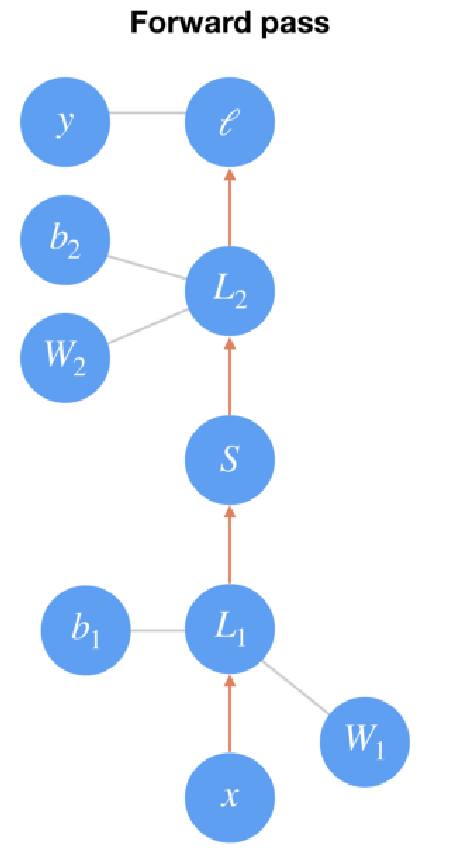
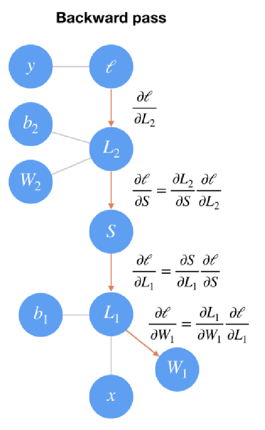

# Dados e Aprendizagem Automática
---
 
## Índice

- [1. Conceitos](#1-conceitos)
    - [1.1 Ciência de Dados](#11-ciência-de-dados)
    - [1.2 Overfitting](#12-overfitting)
    - [2. Aprendizagem Automática (Machine Learning)](#2-aprendizagem-automática-machine-learning)
        - [2.1 Aprendizagem Simbólica](#21-aprendizagem-simbólica)
        - [2.2 Aprendizagem não simbólica](#22-aprendizagem-não-simbólica)
        - [2.3 Aprendizagem supervisionada](#23-aprendizagem-supervisionada)
            - [2.4 Regressão Linear Simples](#24-regressão-linear-simples)
            - [2.5 Regressão Linear Multipla](#25-regressão-linear-multipla)
            - [2.6 Regressão Logística](#26-regressão-logística)
            - [2.7 Decision Trees](#27-decision-trees)
                - [Classification Tree - Atributos Discretos](#271-classification-tree---atributos-discretos)
                - [Classification Tree - Atributos Contínuos](#272-classification-tree---atributos-contínuos)
                - [Regression Tree Simples](#273-regression-tree-simples)
                - [Regression Tree Múltipla](#274-regression-tree-múltipla)
- [Aprendizagem não supervisionada](#aprendizagem-não-supervisionada)
- [Aprendizagem por reforço](#aprendizagem-por-reforço)
- [Metodologias](#metodologias)
- [Data Exploration and Preparation](#data-exploration-and-preparation)
    - [Data Preparation](#data-preparation)
    - [Data quality](#data-quality)
    - [Data exploration](#data-exploration)
        - [Leitura de CSV](#leitura-de-csv)

## 1. Conceitos

---

### 1.1 Ciência de Dados
- Área cientifica que estuda os dados e como extrair conhecimento e significado dos mesmos.
- Analisa conjuntos de dados.
- O produto final é geralmente apresentações e relatórios;
- Um cientista de dados (data scientist) é um investigador que aplica as suas competências para elaborar uma metodologia de investigação e trabalha com a teoria por detrás dos algoritmos

### 1.2 Overfitting
Quando um modelo aprende demasiado bem os dados de treino, incluindo o ruído e as variações aleatórias, perdendo a capacidade de generalizar para novos dados.

**Soluções**:
- Reduzir o número de features;
- Aumentar a quantidade de dados de treino;
- Selecionar atributos consoante o contexto do problema;
- Utilizar técnicas de regularização (L1, L2): Manter todos os atributos, mas penalizar os coeficientes elevados, diminuindo a significancia dos mesmos;

---

### 2. Aprendizagem Automática (Machine Learning)
- Área que aborda as ferramentas e técnicas de construção de modelos que podem aprender por si próprios através da utilização de dados sem serem explicitamente programados.

- Utiliza dados

- O produto final é geralmente um artefacto de
software

- Um engenheiro de aprendizagem automática (Data Engineer) constrói modelos.

---

### 2.1 Aprendizagem Simbólica
- Baseada em regras lógicas e conhecimento explícito.

Ex: árvores de decisão, raciocinio baseado em casos.

---

### 2.2 Aprendizagem não simbólica
- Baseada em padrões e dados, como redes neuronais.

Ex: redes neuronais, segmentação de imagem, clustering.

---

### 2.3 Aprendizagem supervisionada
Paradigma em que os casos que se usam para aprender incluem informação acerca dos resultados pretendidos, sendo possível estabelecer uma relação entre os valores pretendidos e os valores produzidos pelo sistema. Diz-se supervisionada porque este mapeamento é acompanhado por um algoritmo que compara os valores produzidos com os valores pretendidos, e corrige o sistema de modo a que este produza resultados mais próximos dos pretendidos.

São divididos em:
- **Classificação**: prever categorias (ex.: spam vs. não spam).
- **Regressão**: prever valores contínuos (ex.: preço de casas).

---

#### 2.4 Regressão Linear Simples
É usada tanto para classificação como para regressão. O objetivo é encontrar a linha que melhor se ajusta aos dados, minimizando a soma dos erros quadráticos (diferença entre os valores previstos e os valores reais). Esta linha é representada pela equação:
\[y = mx + b\]

Ou seja, uma função afim. É usada para prever valores de y com base em valores de x.

---

#### 2.5 Regressão Linear Multipla
É uma extensão da regressão linear simples que permite prever o valor de uma variável dependente (y) com base em múltiplas variáveis independentes (x1, x2, ..., xn). A equação geral da regressão linear múltipla é:
\[y = b0 + b1*x1 + b2*x2 + ... + bn*xn\]
Onde:
- y é a variável dependente que queremos prever;
- x1, x2, ..., xn são as variáveis independentes que influenciam y;
- b0 é a interceção com o eixo das ordenadas (valor de y quando todas as xi são 0);
- b1, b2, ..., bn são os coeficientes que representam o impacto de cada variável independente em y.

**Erro Quadrático Médio (Mean Squared Error - MSE)**: é uma métrica usada para avaliar a performance de um modelo de regressão. Calcula a média dos quadrados das diferenças entre os valores previstos pelo modelo e os valores reais. A fórmula do MSE é:
\[MSE = \frac{1}{n} \sum_{i=1}^{n} (y_i - \hat{y}_i)^2\]
Onde:
- n é o número total de observações;
- \(y_i\) é o valor real da i-ésima observação;
- \(\hat{y}_i\) é o valor previsto pelo modelo para a i-ésima observação.

Quando menor for este valor, melhor será o desempenho do modelo.

---

#### 2.6 Regressão Logística
É usada para **problemas de classificação binária**. O objetivo é prever a probabilidade de uma observação pertencer a uma das duas classes. A função logística (sigmoid) é usada para mapear qualquer valor real para o intervalo entre 0 e 1. A equação da regressão logística é:
\[P(y=1|X) = \frac{1}{1 + e^{-(b0 + b1*x1 + b2*x2 + ... + bn*xn)}}\]
Onde:
- P(y=1|X) é a probabilidade de a variável dependente y ser 1 dado o conjunto de variáveis independentes X;
- x1, x2, ..., xn são as variáveis independentes;
- b0 é a interceção com o eixo das ordenadas;
- b1, b2, ..., bn são os coeficientes que representam o impacto de cada variável independente em y.

**Estimação de Parâmetros**
- Least Squares Method for Linear Regression: minimiza a soma dos erros quadráticos.
- Gradient Descent: método iterativo que ajusta os parâmetros na direção do gradiente negativo da função de custo. 

---
#### 2.7 Decision Trees
- Estrutura em forma de árvore onde cada nó interno representa uma decisão baseada num atributo, cada ramo representa o resultado dessa decisão, e cada folha representa uma classe ou valor final.
- Utilizadas para tarefas de **classificação** e **regressão**.

**<a style="color: green;">Vantagens:</a>**
- Configuração simples;
- Requerem menos data preparation dos dados;
- Não é preciso normalização nem escalamento dos dados;
- Missing values não afetam o modelo;
- Intuitivas e fáceis de interpretar;

**<a style="color: red;">Desvantagens:</a>**
- Propensas a overfitting, especialmente com árvores profundas.
- Sensíveis a pequenas variações nos dados, o que pode levar a árvores muito diferentes.
- Demoram muito tempo a treinar com grandes conjuntos de dados.
- Inadequado para problemas que envolvem muitas iterações ou variáveis contínuas.

**Gini**: medida de impureza usada para decidir onde dividir os dados. Calculada como:
\[Gini = 1 - \sum_{i=1}^{C} p_i^2\]
Onde \(p_i\) é a proporção de instâncias da classe i no nó.

```python
from sklearn.tree import DecisionTreeClassifier
from sklearn.model_selection import GridSearchCV, ParameterGrid
import numpy as np

full_tree = DecisionTreeClassifier(random_state=2020)
full_tree.fit(X_train, y_train)

print("Profundidade da árvore:", full_tree.get_depth())
print("Número de nós na árvore:", full_tree.get_n_leaves())
print("Train Accuracy:", full_tree.score(X_train, y_train))

```

**Pré-pruning**: técnica usada para reduzir o tamanho da árvore e evitar overfitting, removendo ramos que não contribuem significativamente para a precisão do modelo.
- min_samples_split: número mínimo de amostras necessárias para dividir um nó.

```python
min_samples_split_grid_search = GridSearchCV(
    estimator  = DecisionTreeClassifier(random_state=2020),
    param_grid = ParameterGrid({'min_samples_split': [[min_samples_split] for min_samples_split in np.arange(EPS, 1, 0.025)]}),
    cv=5,
    scoring='accuracy'
)
```

- min_samples_leaf: número mínimo de amostras necessárias para ser uma folha.

```python
min_samples_leaf_grid_search = GridSearchCV(
    estimator  = DecisionTreeClassifier(random_state=2020),
    param_grid = ParameterGrid({'min_samples_leaf': [[min_samples_leaf] for min_samples_leaf in np.arange(EPS, 0.5, 0.025)]}),
    cv=5,
    scoring='accuracy'
)
```

**Post-pruning**: técnica que envolve a construção completa da árvore e, em seguida, a remoção de ramos que não melhoram a performance do modelo em um conjunto de validação.
- Atribuir uma profundidade máxima à árvore.

```python
max_depth_grid_search = GridSearchCV(
    estimator  = DecisionTreeClassifier(random_state=2020),
    param_grid = ParameterGrid({'max_depth': [[max_depth] for max_depth in range(1, max_depth + 1)]}),
    cv=5,
    scoring='accuracy'
)
```

**Cost complexity pruning**: técnica que penaliza a complexidade da árvore durante o processo de construção, equilibrando a precisão do modelo com a simplicidade da árvore. É calculado da seguinte forrma:
\[R_\alpha(T) = R(T) + \alpha \cdot |T|\]
Onde:
- \(R_\alpha(T)\) é o custo total da árvore T com penalização;
- \(R(T)\) é o erro de classificação da árvore T;
- \(\alpha\) é o parâmetro de complexidade que controla a penalização, **quanto maior for \(\alpha\), maior a penalização e menor será o tamanho da árvore**;
- \(|T|\) é o número de folhas na árvore T.

Ou ainda,
\[R_\alpha(T) = SSR + \alpha |T|\]

Em python:

```python
ccp_alphas = full_tree.cost_complexity_pruning_path(X_train, y_train)[ccp_alphas] # cost_complexity_pruning_path retorna os valores efetivos de alpha e o número total de folhas para cada valor de alpha
ccp_alphas_grid_search = GridSearchCV(
    estimator  = DecisionTreeClassifier(random_state=42),
    param_grid = ParameterGrid({'ccp_alpha': [[ccp_alpha] for ccp_alpha in ccp_alphas]}),
    scoring='accuracy'
)
```

##### 2.7.2 Classification Tree - Atributos Discretos
1. Para cada valor do atributo, dividir os dados em subsets;
2. Calcular a métrica (Gini, Entropia) para cada subset;
3. Calcular a métrica ponderada para o atributo;
4. Repetir para todos os atributos;
5. Selecionar o atributo que maximiza a métrica escolhida = menor Gini.

##### 2.7.2 Classification Tree - Atributos Contínuos
1. Ordenar os valores do atributo;
2. Calcular pontos de corte entre valores consecutivos a partir da média;
3. Avaliar cada ponto de corte usando uma métrica (Gini, Entropia);
4. Selecionar o ponto de corte que maximiza a métrica escolhida = menor Gini.

##### 2.7.3 Regression Tree Simples
1. Para cada valor do atributo, dividir os dados em subsets;
2. Calcular a variância para cada subset;
3. Calcular a variância ponderada para o atributo;
4. Repetir para todos os atributos;
5. Selecionar o atributo que minimiza a variância ponderada.

##### 2.7.4 Regression Tree Múltipla
1. Calcular o mínimo da soma dos quadrados dos erros (SSE) para cada atributo;
2. Selecionar o atributo e o threshold que minimiza o SSE, ou seja, aquele que tiver menor erro.

---

#### 2.8 Random Forest
- Conjunto de árvores de decisão, onde cada árvore é treinada com um subconjunto aleatório dos dados e das features.
- A previsão final é feita através da **média (regressão)** ou **votação (classificação)** das previsões de todas as árvores na floresta.

**Metodologia**:
1. Construir uma decision tree para cada subconjunto aleatório de dados e features;
2. Repetir o processo para um número definido de árvores;
3. Agregar as previsões de todas as árvores para obter a previsão final usando Out-of-Bag (OOB) samples para validação.
4. Repetir o processo para um número definido de árvores;

Em python:

```python
from sklearn.ensemble import RandomForestClassifier
rfc = RandomForestClassifier(n_estimators=100, max_depth=5, random_state=42)
rfc.fit(X_train, y_train)
```

---
#### 2.9 Gradient Boosting
- Técnica de ensemble que constrói modelos preditivos fortes através da combinação de vários modelos fracos (weak learners), geralmente árvores de decisão rasas.
- Cada novo modelo é treinado para corrigir os erros do modelo anterior, focando-se nas instâncias que foram mal classificadas. São atribuidos pesos maiores a essas instâncias, de modo a que o novo modelo aprenda a classificá-las corretamente.

Em python:

```python
from sklearn.ensemble import GradientBoostingClassifier
gbc = GradientBoostingClassifier(n_estimators=100, learning_rate=0.1, max_depth=3, random_state=42)
gbc.fit(X_train, y_train)
```

#### 2.10 XGBoost
- Implementação otimizada de gradient boosting que é eficiente em termos de tempo e memória.
Em python:

```python
import xgboost as xgb
xgb_model = xgb.XGBClassifier(n_estimators=100, learning_rate=0.1, max_depth=3, random_state=42)
xgb_model.fit(X_train, y_train)
```

#### 2.11 Redes Neuronais
- Modelos inspirados na estrutura do cérebro humano, compostos por camadas de neurónios artificiais.
- Utilizadas para tarefas complexas como reconhecimento de imagem, processamento de linguagem natural, etc.

Uma rede neuronal típica é composta por:
- Camada de entrada: recebe os dados iniciais/input;
- Camadas ocultas: processam os dados através de pesos (ativação) e funções de ativação (output);
- Camada de saída: produz a previsão final.

Exemplo por passos:
1. Recebe múltiplas entradas: X₁, X₂, X₃, ... Normalmente nº de nós = nº de features
2. Cada entrada tem um "peso" W associado (número que define importância)
3. Multiplica: X₁×W₁ + X₂×W₂ + X₃×W₃ + ... (bias b)
4. Passa pela "função de ativação" f()
5. Produz a saída

Imagine que você quer decidir se vai à praia:
- Entrada 1 (Temperatura): 25°C → Peso W₁ = 2

- Entrada 2 (Fim de semana): Sim → Peso W₂ = 3

**Cálculo:** (25 × 2) + (1 × 3) = 53
**Passa função ativação:** Se resultado > 30 → "Sim, vou!" | Se < 30 → "Não vou"


Cada camada é formada por nós (neurónios) que estão interconectados. Cada conexão tem um peso associado que é ajustado durante o processo de treino para minimizar o erro na previsão.

O conhecimento é armazenado nas conexões entre os neurónios, representadas por pesos. 

Existem diversas funções de ativação, por exemplo:
- **Identidade (Linear):** \(f(x) = x\)
- **Binária (Step):**
    \[
    f(x)=
    \begin{cases}
    1, & x \ge 0 \\
    0, & x < 0
    \end{cases}
    \]
- **Logística (Sigmoid):** \(f(x) = \dfrac{1}{1 + e^{-x}}\)
- **Tangente Hiperbólica (Tanh):** \(f(x) = \tanh(x) = \dfrac{e^{x} - e^{-x}}{e^{x} + e^{-x}}\)
- **ReLU (Rectified Linear Unit):** \(f(x) = \max(0, x)\)
- **PReLU (Parametric ReLU):**
    \[
    f(x)=
    \begin{cases}
    x, & x \ge 0 \\
    \alpha x, & x < 0
    \end{cases}
    \quad (\alpha > 0)
    \]
- **Exponential Linear Unit (ELU):**
    \[
    f(x)=
    \begin{cases}
    x, & x \ge 0 \\
    \alpha (e^{x} - 1), & x < 0
    \end{cases}
    \quad (\alpha > 0)
    \]
- **Softplus:** \(f(x) = \ln(1 + e^{x})\)

##### Arquiteturas comuns de redes neurais:
- **Perceptron Multicamadas (MLP - Multi-Layer Perceptron):**
    - Rede neural feedforward com múltiplas camadas ocultas. Tipo mais simples de rede neural onde a informação flui numa única direção, da camada de entrada para a camada de saída, passando pelas camadas ocultas (camadas intermediárias). 
- **Redes Neurais Convolucionais (CNN - Convolutional Neural Networks):**
    - Especialmente eficazes para processamento de imagens e reconhecimento de padrões espaciais.
- **Redes Neurais Recorrentes (RNN - Recurrent Neural Networks):**
    - Projetadas para dados sequenciais, como séries temporais e processamento de linguagem natural.
- **Redes Neurais Generativas Adversariais (GAN - Generative Adversarial Networks):**
    - Compostas por duas redes (gerador e discriminador) que competem entre si para gerar dados realistas.

##### Problemas de Classificação:
Temos de converter o output do modelo (valor numérico) numa classe. Para isso, temos duas hipóteses:
- **One-hot encoding**: criar uma coluna para cada classe, atribuindo 1 à coluna correspondente à classe prevista e 0 às restantes.
- **Softmax function**: converte os outputs numéricos em probabilidades para cada classe. A classe com a maior probabilidade é selecionada como a previsão final. Fórmula:
\[P(y=i|X) = \frac{e^{z_i}}{\sum_{j=1}^{K} e^{z_j}}\]
Onde:
- \(P(y=i|X)\) é a probabilidade da classe i dado o input X;
- \(z_i\) é o output do modelo para a classe i;
- K é o número total de classes.

##### Backpropagation
**Fase 1 - Forward pass:** os dados de entrada são propagados através da rede para gerar uma previsão. Analisar imagem de baixo para cima:
1. Dados entram na rede. O input x passa pela tranformação linear L1 com peso W1 e bias b1: L1 = W1*x + b1
2. O output passa pela função de ativação sigmoid S e ainda outra transformação linear L2 com peso W2 e bias b2: L2 = W2*S(L1) + b2
3. Calcula-se a saída (previsão)
4. Calcula-se o erro (diferença entre previsão e realidade). É calculado o erro através da função loss L que será para mediar a previsão. O objetivo é minimizar este erro.

Exemplo:
- Entrada: [25, 1]  (Temperatura, é fim de semana?)
- Saída prevista: 0.7 (70% probabilidade de ir à praia)
- Saída real: 1.0 (foi mesmo à praia)
- Erro: 1.0 - 0.7 = 0.3



**Fase 2 - Backward pass:** o erro é propagado de volta através da rede para ajustar os pesos. Analisar imagem de cima para baixo:
1. O erro volta para trás na rede. Para ajustar os pesos usando gradiente descendente, o gradiente do erro é propagado para trás (fim para inicio) através da rede.
2. Calcula-se como cada peso contribuiu para o erro. Cada operação apresenta um gradiente (derivada parcial) que indica como o erro muda em relação a cada peso (entre os inputs e os outputs).
3. Ajusta-se os pesos na direção certa (diminui erro) utilizando uma taxa de aprendizagem `alpha` (learning reate). Ao propagar o gradiente para trás, o gradiente anterior é multiplicado pelo gradiente da operação atual (regra da cadeia). Matemáticamente:
\[\frac{\partial l}{\partial W_1} = \frac{\partial L_1}{\partial W_1} \cdot \frac{\partial S}{\partial L_1} \cdot \frac{\partial L_2}{\partial S} \cdot \frac{\partial l}{\partial L_2}\]

4. Usa-se a "taxa de aprendizagem" (learning rate) para não ajustar muito.



Fórmula:
\[w_{new} = w_{old} - \eta \cdot \frac{\partial E}{\partial w}\]
Onde:
- \(w_{new}\) é o novo peso;
- \(w_{old}\) é o peso antigo;
- \(\eta\) é a taxa de aprendizagem;
- \(\frac{\partial E}{\partial w}\) é o gradiente do erro em relação ao peso.

**Medidas para reduzir overfitting em redes neurais:**
- Regularização L1 e L2: adicionam penalizações aos pesos na função de perda.
- Adicionar mais casos de treino.
- Reduzir a complexidade da rede (menos camadas/neuronios).
- Dropout: desativar aleatoriamente neurónios durante o treino.

---

### Aprendizagem não supervisionada
Paradigma em que os casos que se usam para aprender não incluem informação acerca dos resultados pretendidos, sendo necessário estabelecer relações entre os casos de modo a descobrir padrões ou estruturas subjacentes.

São divididos em:
- **Clustering**: agrupar dados semelhantes (ex.: segmentação de clientes).
- **Redução de dimensionalidade**: simplificar dados mantendo características importantes (ex.: PCA).
- **Associação**: descobrir regras de associação entre itens (ex.: análise de cestas de compras).

---

### Aprendizagem por reforço
Paradigma que, apesar de nao ter informação sobre os resultados pretendidos, permite efetuar uma avaliação sobre se os resultados produzidos são bons ou maus. Os algoritmos utilizam técnicas de auto-alimentação de sinais, com vista a melhorar os resultados, por influência da noção de recompensa.

---

## Metodologias
Metodologias comuns incluem:
- **SEMMA** (Supervised, Explainable, Minimal, Accurate)
- **CRISP-DM** (Cross-Industry Standard Process for Data Mining): entendimento do negócio, entendimento dos dados, preparação dos dados, modelagem, avaliação, implementação.


Vamos utilizar a seguinte metodologia:
1. Definição do problema
2. Recolha de dados
3. Preparação dos dados
4. Segregação dos dados
5. Treino do modelo
6. Avaliação do candidato
7. Implementação do modelo
8. Monitorização e manutenção

---

## Data Exploration and Preparation
1. Data quality and exploration;
2. Basic data preparation;
3. Advanced data preparation:
    - Feature scaling;
    - Outlier detection and treatment;
    - Feature selection;
    - Missing value treatment;
    - Nominal Value Discretization;
    - Binning/discretization;
    - Feature engineering;

---


### Data quality 
1. Missing values;
2. Duplicates;
3. Noise: modificações (corrupção ou distorção) dos dados devido a limitações tecnológicas, etc...;
4. Outliers;

---

### Data exploration
1. Tendência central: average, mode, median..
2. Dispersão: range, variance, standard deviation;
3. Distribuição: skewness, kurtosis, Gaussian distribution, Normal distribution;

#### Leitura de CSV

```python
import pandas as pd
data = pd.read_csv('file.csv')
```

#### Definir um DataFrame

```python
import pandas as pd

data = {
  "calories": [420, 380, 390],
  "duration": [50, 40, 45]
}

#load data into a DataFrame object:
df = pd.DataFrame(data)

print(df) 
```

#### Analisar csv
```python
import pandas as pd
data = pd.read_csv('file.csv')
print(data.head())  # Mostra as primeiras 5 linhas
print(data.info())  # Informações sobre o DataFrame
print(data.describe())  # Estatísticas descritivas: média, desvio padrão, etc.
```

#### Identificar valores ausentes (NaN)
```python
import pandas as pd
data = pd.read_csv('file.csv')
print(data.isnull().sum())  # Conta valores ausentes por coluna
```
#### Analisar valores duplicados
```python
import pandas as pd
data = pd.read_csv('file.csv')
print(data.duplicated().sum())  # Conta o número de linhas duplicadas
```

#### Matriz de correlação
Mede a relação entre duas variáveis. Varia entre -1 e 1.
- 1: correlação positiva perfeita, ou seja, quando uma variável aumenta, a outra também aumenta;
- -1: correlação negativa perfeita, ou seja, quando uma variável aumenta, a outra diminui;
- 0: sem correlação, ou seja, não há relação entre as variáveis;

---

### Data Transformation
Gradient descent algorithms may work worse with variables with very different scales

#### Standarization vs Normalization
- **Standardization (Z-score Scaling)**: Transforma os dados para que tenham média 0 e desvio padrão 1. Útil quando os dados seguem uma distribuição normal.
- **Normalization (Min-Max Scaling)**: Coloca os dados numa escala comum, geralmente entre 0 e 1. Útil quando os dados não seguem uma distribuição normal ou quando se deseja uma escala específica.

1. Feature Scaling
    - Normalization (Min-Max Scaling);
    Serve para colocar os dados numa escala comum, geralmente entre 0 e 1.
    2. Min-Max Scaling formula:
    \[X_{scaled} = (b-a) \cdot \frac{X - X_{min}}{X_{max} - X_{min}} + a\]
    Onde:
    - \(X\) é o valor original;
    - \(X_{min}\) é o valor mínimo do conjunto de dados;
    - \(X_{max}\) é o valor máximo do conjunto de dados;
    - \(a\) e \(b\) são os novos valores mínimo e máximo desejados;
    - Standardization (Z-score Scaling);
    Serve para transformar os dados para que tenham média 0 e desvio padrão 1.
    2. Z-score Scaling formula:
    \[X_{standardized} = \frac{X - \mu}{\sigma}\]
    Onde:
    - \(X\) é o valor original;
    - \(\mu\) é a média do conjunto de dados;
    - \(\sigma\) é o desvio padrão do conjunto de dados;

2. Outlier Detection and Treatment
    - Z-score method;
    - Box plot method;
    - Knowledge-based method;

#### Drop de linhas com valores ausentes (NaN)
```python
import pandas as pd
data = pd.read_csv('file.csv')
data_cleaned = data.dropna(inplace=True)  # Remove linhas com valores ausentes
```

#### Substituir valores ausentes (NaN) pela média da coluna
```python
import pandas as pd
data = pd.read_csv('file.csv')
data.fillna(data.mean(), inplace=True)  # Substitui NaN pela média da coluna
```

ou 

```python
import pandas as pd
data = pd.read_csv('file.csv')
data.fillna(120, inplace=True) # Substitui NaN por 120
```

ou 

```python
import pandas as pd

df = pd.read_csv('data.csv')

df.fillna({"Calories": 130}, inplace=True)
```

#### Remover duplicados
```python
import pandas as pd
data = pd.read_csv('file.csv')
data.drop_duplicates(inplace=True)  # Remove linhas duplicadas
```

#### Mudar nome de colunas
```python
import pandas as pd
data = pd.read_csv('file.csv')
data.rename(columns={'old_name': 'new_name'}, inplace=True)  # Renomeia colunas
```

#### Remover colunas
```python
import pandas as pd
data = pd.read_csv('file.csv')
data.drop(columns=['column_name1', 'column_name2'], inplace=True)  # Remove colunas
```

#### Histograma
```python
import pandas as pd
import matplotlib.pyplot as plt
data = pd.read_csv('file.csv')
data['column_name'].hist(bins=10)  # Histograma da coluna
plt.show()

# ou
print(f"Histograma {data['column_name'].hist()}")
```

#### Distribuição normal
```python
import pandas as pd
import matplotlib.pyplot as plt
import seaborn as sns
data = pd.read_csv('file.csv')
sns.histplot(data['column_name'], kde=True)  # Histograma com curva KDE
plt.show()

# ou 
print (f"Skweness: {data['column_name'].skew()}")

# ou 
print (f"Kurtosis: {data['column_name'].kurt()}")
```

#### Analisar as relações entre variáveis
```python
import pandas as pd
import seaborn as sns
import matplotlib.pyplot as plt
data = pd.read_csv('file.csv')
correlation_matrix = data.corr()  # Calcula a matriz de correlação
sns.heatmap(correlation_matrix, annot=True, cmap='coolwarm')  # Heatmap da correlação
plt.show()

# ou 
sns.pairplot(data)  # Pairplot para visualizar relações entre variáveis
```

#### Data binning
É uma técnica de pré-processamento de dados que envolve a transformação de variáveis contínuas em variáveis categóricas, agrupando os valores em intervalos ou "bins". Isto pode ajudar a reduzir o ruído nos dados, melhorar a robustez dos modelos e facilitar a interpretação dos resultados. Está relacionado com o smoothing de dados, pois ambos visam reduzir a variabilidade nos dados.

```python
import pandas as pd
data = pd.read_csv('file.csv')

estimator = preprocessing.KBinsDiscretizer(n_bins=3, encode='ordinal', strategy='uniform')
data['binned_column'] = estimator.fit_transform(data[['column_name']])

print(data['Bin edges: ', estimator.bin_edges_[0]])
print(data.groupby('binned_column').size())
```

#### Gráficos de dispersão
```python
import pandas as pd
import matplotlib.pyplot as plt
import seaborn as sns
data = pd.read_csv('file.csv')

fig, axs = plt.subplots(2,2, figsize=(10,10)) # Cria uma figura com 2x2 subplots
fig.suptitle("Scatter Plots") # Adiciona um título à figura

sns.histplot(data['column_name'], kde=True, ax=axs[0,0])  # Histograma com curva KDE no subplot (0,0)
```