# Bases de Dados NoSQL

---

## 1. Bases de Dados Relacionais

Uma **base de dados relacional** organiza os dados em tabelas estruturadas com linhas e colunas para representar informações de forma organizada e acessível.

Características principais das bases de dados relacionais:
- Tabelas (relações)
- Chaves primárias e estrangeiras
- Integridade referencial
- Suporte a transações ACID (Atomicidade, Consistência, Isolamento, Durabilidade)

**Atomicidade**: Uma transação deve ter todas as suas operações executadas em caso de sucesso, em caso de falha, nenhum resultado de alguma operação é refletido sobre a base de dados.

**Consistência**: Uma transação deve levar a base de dados de um estado válido (consistente) para outro estado válido (consistente), mantendo todas as regras definidas (como integridade referencial). Uma transação deve respeitar as regras de integridade dos dados (como unidade de chaves, restrições de integridade lógica, etc..).

**Isolamento**: As operações de uma transação devem ser isoladas das operações de outras transações, garantindo que o resultado final seja o mesmo que se as transações fossem executadas sequencialmente. Controlo de concorrência.

**Durabilidade**: Uma vez que uma transação é confirmada, as suas alterações são permanentes e persistem mesmo em caso de falhas do sistema.

---

## 2. Bases de Dados NoSQL

As bases de dados NoSQL (Not Only SQL) são um tipo de sistema de gestão de bases de dados que **não utilizam a linguagem SQL como principal forma de interação**, é um conjunto de diferentes modelos. Elas foram desenvolvidas para lidar com grandes volumes de dados, alta velocidade de leitura e escrita, e estruturas de dados flexíveis. O NoSQL surgiu precisamente por causa do desafio do **Big Data**, à medida que empresas como Google, Amazon e Facebook começaram a enfrentar problemas de escalabilidade com as tradicionais bases de dados relacionais.

**Definição de Big Data**: Conjunto de dados tão grandes e complexos que as aplicações tradicionais de processamento de dados não são adequadas para lidar com eles. Características principais do Big Data são frequentemente descritas pelos "3 Vs": Volume (quantidade de dados), Velocidade (rapidez com que os dados são gerados e processados) e Variedade (diversidade de tipos e fontes de dados).

### 2.1. Características das Bases de Dados Não Relacionais

1. **Escalabilidade Horizontal**: As bases de dados não relacionais podem ser facilmente escaladas adicionando mais servidores ao invés de aumentar a capacidade de um único servidor. Os dados são particionados (sharding) entre vários nós para que cada todo possa executar uma tarefa específica e muitas vezes independente - processo conhecido como "shared nothing architecture". Bases de dados relacionais também podem escalar no entanto é mais complexo e caro => desempenho fica comprometido.

2. **Modelo de Dados Flexível**: Ao contrário das bases de dados relacionais, que utilizam um esquema fixo e necessitam de modelação, as bases de dados não relacionais permitem que os dados sejam armazenados em formatos variados, como documentos, chave-valor, colunas ou grafos.

3. **Alta Disponibilidade**: Muitas bases de dados não relacionais são projetadas para serem distribuídas, o que significa que os dados são replicados em vários nós, garantindo alta disponibilidade e tolerância a falhas.

4. **Desempenho**: As bases de dados não relacionais são otimizadas para operações de leitura e escrita em grande escala, tornando-as ideais para aplicações que exigem alta performance.

5. **Código aberto**: Muitas bases de dados não relacionais são de código aberto, o que permite uma maior flexibilidade e personalização. Muitas organizações contribuem para o desenvolvimento dessas bases de dados, resultando numa comunidade ativa e em constante evolução.

6. **Sem uma linguagem de consulta padrão**: Não existe uma linguagem padrão que seja universal para todas as bases de dados não relacionais.

7. **Não seguem os principios ACID**: A maioria das bases de dados não relacionais não seguem os princípios ACID, optando por um modelo de consistência eventual para melhorar a performance e a escalabilidade. Não é rigorosa no cumprimento de restrições de integridade.

Surge o modelo BASE (Basically Available, Soft state, Eventual consistency):
- **Basically Available**: O sistema garante a disponibilidade dos dados, mesmo que algumas partes do sistema estejam indisponíveis. Em vez de impor consistência imediata, garante-se a disponibilidade dos dados ao distribuí-los e replicá-los entre nós do cluster da base de dados.
- **Soft state**: O estado do sistema pode mudar ao longo do tempo, devido à ausência de consistência imediata, mesmo sem novas entradas, devido à replicação e sincronização dos dados. Os valores dos dados podem mudar ao longo do tempo. A responsabilidade fica nos programadores.
- **Eventual consistency**: Apesar de não atingirmos a consistência imediata, até que esta seja atingida, é possível realizar leituras e escritas de dados (mesmo que não reflitam a realidaede).

Ao fornecer alta disponibilidade e escalabilidade, as bases de dados não relacionais sacrificam a consistência imediata dos dados, o que pode ser aceitável em muitos casos de uso, especialmente em aplicações web e móveis.

### 2.2. Tipos de Bases de Dados NoSQL

1. **Document Store**: Armazenam dados em documentos (geralmente em formato JSON ou BSON). Exemplos: MongoDB, CouchDB.

2. **Key-Value Store**: Armazenam dados como pares chave-valor. Exemplos: Redis, DynamoDB (Amazon).

3. **Column Family Store**: Armazenam dados em colunas em vez de linhas. Exemplos: Cassandra, HBase.

4. **Graph Database**: Armazenam dados em grafos, permitindo consultas complexas sobre relacionamentos. Exemplos: Neo4j, ArangoDB.

### 2.3. Quando Usar Bases de Dados NoSQL

As bases de dados não relacionais são particularmente úteis em cenários como:

- Aplicações com grandes volumes de dados não estruturados ou semiestruturados.
- Sistemas que requerem alta disponibilidade e escalabilidade.
- Projetos que exigem flexibilidade no modelo de dados.

### 2.4. Modelo Não Relacional

- Depende dos requisitos.
- A situação mais comum ocorre quando os dados são não estruturados ou semi-estruturados.
- O volume de dados (Big Data) pode exigir uma nova maneira de abordar o problema do armazenamento e recuperação de dados.
- A necessidade de escalabilidade horizontal.

---
## 3. Google Bigtable
Sistema de armazenamento de dados distribuído desenvolvido pelo Google para gerenciar grandes volumes de dados **estruturados** em larga escala. É projetado para ser fornecer ampla aplicabilidade, escalabilidade, desempenho e alta disponibilidade.

---
## 4. Amazon DynamoDB
- Key-value
- alta disponibilidade que alguns dos principais serviços da amazon usam para proporcionar aos utilizadores uma experiência designada por "sempre ativa".
- Sacrifica a consistência em cenários adversos e de falhas para obter alta disponibilidade e escalabilidade.

---

## 5. Docker
- Permite criar, implantar e executar aplicações em contêineres.
- Contêineres são unidades leves e portáteis que empacotam uma aplicação e todas as suas dependências, garantindo que a aplicação funcione de forma consistente em diferentes ambientes.

---

## 6. Document Store Database 

**O que é?**
Armazenam dados e derivados em documentos, geralmente em **formatos como JSON, BSON ou XML**. Cada documento é uma **unidade independente** que pode conter **dados complexos e aninhados**.

**Estrutura**
Consistem em dados semi-estruturados, onde cada documento pode ter um esquema diferente. Isso permite uma grande **flexibilidade** na forma como os dados são armazenados e escalabilidade.

**Usos Comuns**_
- Aplicações web e móveis que exigem flexibilidade no modelo de dados.
- Sistemas de gestão de conteúdo => chat sessions, tweets, posts, comments...
- Data catalogada => user accounts, product catalogs...
- Jogos => stats, social media integration, leaderboards...
- Networking => sensor data, log files, realtime analytics...


**Exemplos**
Exemplo de um ficheiro xml

```xml
<artist>
    <artistname>Iron Maiden</artistname>
    <albums>
        <albumname>The Number of the Beast</albumname>
        <datereleased>1980-04-14</datereleased>
        <genre>Heavy Metal</genre>
    </albums>
    <albums>
        <albumname>Powerslave</albumname>
        <datereleased>1984-09-03</datereleased>
        <genre>Heavy Metal</genre>
    </albums>
```

Exemplo de um ficheiro JSON

```json
{
  "_id": "1",
  "artist": "Iron Maiden",
  "albums": [
    {
      "albumname": "The Number of the Beast",
      "datereleased": "1980-04-14",
      "genre": "Heavy Metal"
    },
    {
      "albumname": "Powerslave",
      "datereleased": "1984-09-03",
      "genre": "Heavy Metal"
    }
  ]
}
```

Transformando isto para tabelas relacionais ficamos com o seguinte:
Tabela Artist:
| artist_id | artist_name  |
|-----------|--------------|
| 1         | Iron Maiden  |

Tabela Album:
| album_id | artist_id | album_name               | date_released | genre       |
|----------|-----------|--------------------------|----------------|-------------|
| 1        | 1         | The Number of the Beast  | 1980-04-14     | Heavy Metal |
| 2        | 1         | Powerslave               | 1984-09-03     | Heavy Metal | 

Tabela de géneros (normalização):
| genre_id | genre       |
|----------|-------------|
| 1        | Heavy Metal |

### Document DB vs RDBMS
| RDBMS                     | Document DB                   |
|--------------------------|-------------------------------|
| Tabelas | Colecções |
| Linhas | Documentos |
| Primary key | \_id (chave única) |
| Foreing key | Documento aninhado ou referência |

Em bases de dados relacionais criamos schemas, em bases de dados de documentos não é necessário. Podemos apenas carregar os dados todos sem usar um schema já pre-definido.

Em bases de dados relacionais temos chaves estrangeiras, em document stores não existem.

As bases de dados de documentos escalam **horizontalmente**. Os dados são transmitidos de forma fácil e com boa performance (**sharding**).

As bases de dados relacionais escalam **verticalmente** (aumentando a capacidade do servidor tanto em memória como em disco).

**Sharding** é o termo que se refere ao processo de dividir um grande conjunto de dados em partes menores e mais gerenciáveis, chamadas shards, que são distribuídas por vários servidores ou nós num sistema de banco de dados distribuído. Cada shard contém uma parte dos dados totais e pode ser armazenado e gerenciado independentemente dos outros shards.

Em bases de dados relacionais os dados de uma entidade podem estar distribuidos por **diversas tabelas**, enquanto que em document stores os dados de uma entidade estão contidas num único documento.

Tabela resumo:
| Característica          | RDBMS                         | Document DB                   |
|------------------------|-------------------------------|-------------------------------|
| Modelo de Dados        | Estruturado (tabelas)         | Semi-estruturado (documentos)      |
| Esquema                | Fixo                          | Flexível                        |
| Escalabilidade         | Vertical                      | Horizontal                    |
| Transações ACID        | Suportado                     | Limitado (consistência eventual) |
| Linguagem de Consulta   | SQL                           | APIs específicas (ex: MongoDB Query Language) |
| Exemplos               | MySQL, PostgreSQL, Oracle     | MongoDB, CouchDB               |

---
## 7. MongoDB
- Exemplo de Document Store Database.

**Características principais do MongoDB**:
- **Alta performance**: indexação é possível em qualquer campo dentro de um documento.
- **Alta disponibilidade e replicação**: O processo de replicação é a habilidade de distribuir dados por multiplos servidores e manter tudo sincronizado.
  - **Tolerância a falhas e redundância**: em caso de falha de um nó primário, outro nó é eleito. Durante esta eleição não ocorrem transações. Utilização de heartbeats para monitorar o estado dos nós.
  - **Invisibilidade** do ponto de vista do cliente
  - **Sharding**
    - shard: cada shard contém um subconjunto dos dados totais da base de dados. 
    - mongos: mongos funcionam como routers para executar queries. Fornecem uma interface entre a aplicação cliente e o cluster shard.
    - config servers: cada configuração do servidor contem metadados e configurações.
- **Ausência de um schema**: podem existir documentos diferentes numa unica base de dados, podem não possuir a mesma estrutura.
- **Escalabilidade**: Possibilidade de adicionar diversos nós para conterem um elevado numero de documentos.
- Cada documento é armazenado em formato BSON (Binary JSON) numa coleção.
- Uma coleção é um conjunto de documentos relacionados, semelhante a uma tabela numa base de dados relacional.

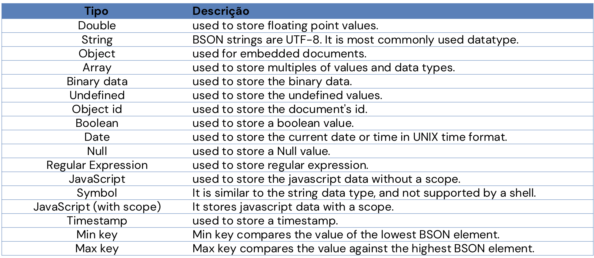

### 7.1 RDBMS vs MongoDB
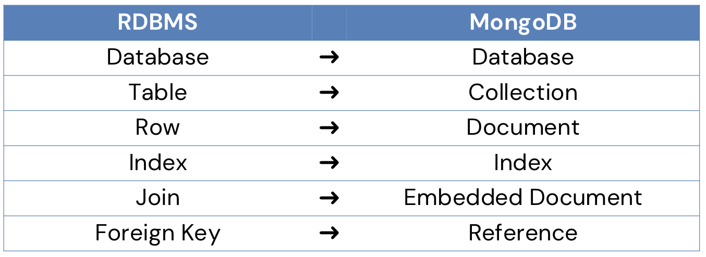

---
## 8. Key-Value Store Database
- \+ Simples
- \+ Rápidas
- Ideias para caching, sessões e dados temporários.
- É uma base de dados que armazena dados como pares chave-valor
- As chaves são unicas
- Utiliza hash tables para armazenar os dados
- Útil para escalabilidade e eficiência


### 8.1 Em que situações usamos Key-Value Store Databases?
- Quando temos um grande volume de dados e os dados são consultados frequentemente (read + write)
- Para guardar informações básicas
- Dados volateis

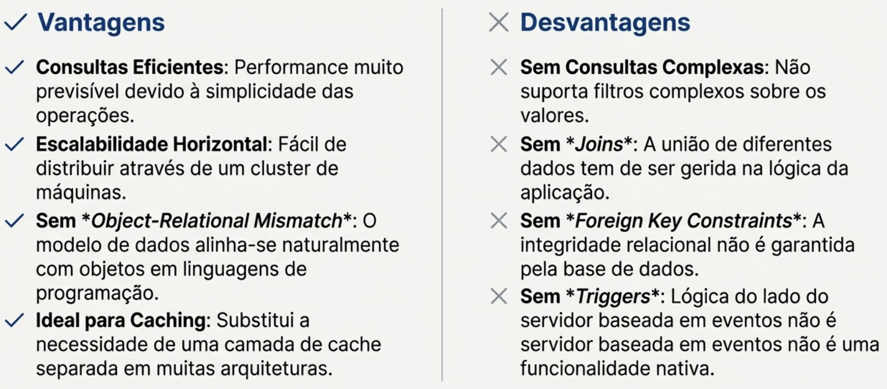

**Qual é a principal vantagem de uma base de dados Chave-Valor em relação à utilização do espaço?**
Evita o desperdício de espaço com colunas nulas

**Que caso de uso de 'Networking / Data Maintenance' é mencionado para bases de dados Chave-Valor?**
Tabelas de encaminhamento IP

### 8.2 Use cases
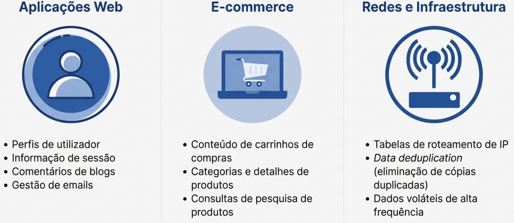

### Comparação das Performances
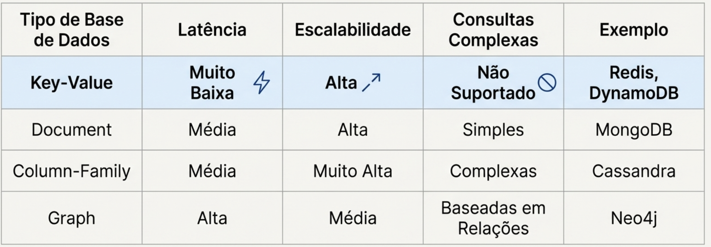

---
## 9. Redis
- Exemplo de Key-Value Store Database
- Armazenamento em memória (in-memory) => velocidade excecional
- Suporta diferentes tipos de dados (strings, hashes, listas, conjuntos, conjuntos ordenados, bitmaps, hyperloglogs e índices geoespaciais)
- Suporta CRUD (Create, Read, Update, Delete)
- Suporta scripts Lua
- Utilizado para caching, filas de mensagens, contadores em tempo real, sessões de utilizadores, etc.
- Tamanho máximo da chave: 512 MB
- Capacidade: Pode gerir até $2^{32}$ chaves por instância (testado com mais de 250 milhões de chaves).

### 9.1 Mecanismos de Persistência
- **RDB (Redis Database)**: Cria snapshots dos dados em intervalos regulares
- **AOF (Append Only File)**: Regista cada operação de escrita recebida pelo servidor Redis num ficheiro de log contínuo.

### 9.2 Mecanismos de Replicação e Alta Disponibilidade
- **Replicação Mestre-Escravo**: Permite a criação de réplicas de leitura para distribuir a carga de leitura e aumentar a disponibilidade dos dados, garantindo redundância.
- **Sentinel**: Sistema de monitorização e failover automático que garante a alta disponibilidade do Redis.
- **Cluster Redis**: Permite a partilha automática de dados entre múltiplos nós, proporcionando escalabilidade horizontal, alta disponibilidade e tolerância a falhas.

### 9.3 Operações
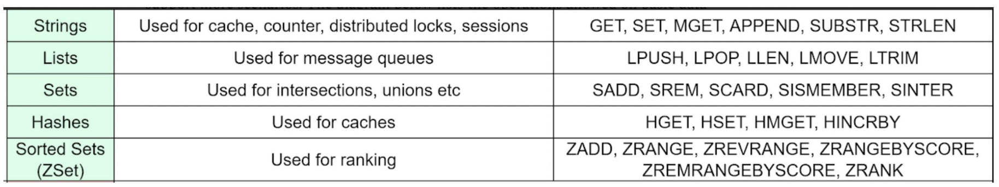

### 9.4 Melhores Práticas
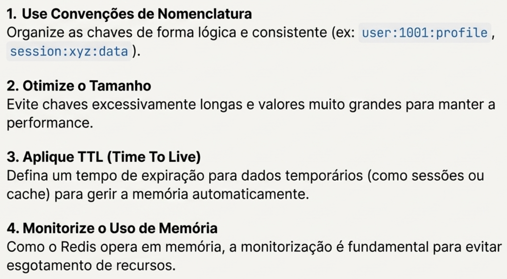

---


## 10. Database as a Service (DBaaS)
Database-as-a-Service (DBaaS) é um serviço de computação em nuvem onde a gestão da base de dados -
desde a configuração do hardware à instalação do software - é totalmente tratada pelo fornecedor.

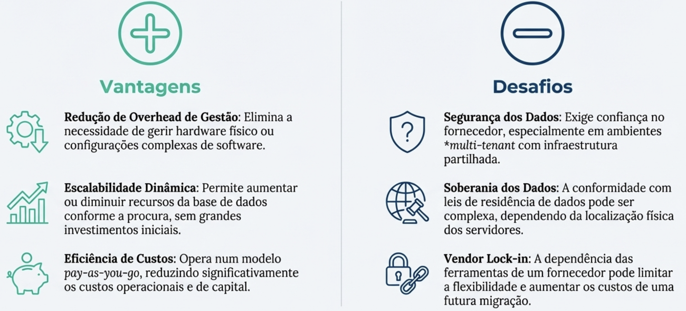

**Key features**:
- **Backups automáticos:** Garante que os dados são salvaguardados regularmente e podem ser rapidamente restaurados em caso de perda, assegurando a continuidade do negócio.
- **Monitoramento e alertas:** Ferramentas e dashboards que fornecem insights sobre métricas de desempenho, ajudando a otimizar as operações da base de dados em tempo real.
- **Segurança integrada:** Inclui funcionalidades de segurança robustas por defeito, como encriptação de dados (em trânsito e em repouso), controlo de acessos e registos de auditoria.

### 10.1 Use cases
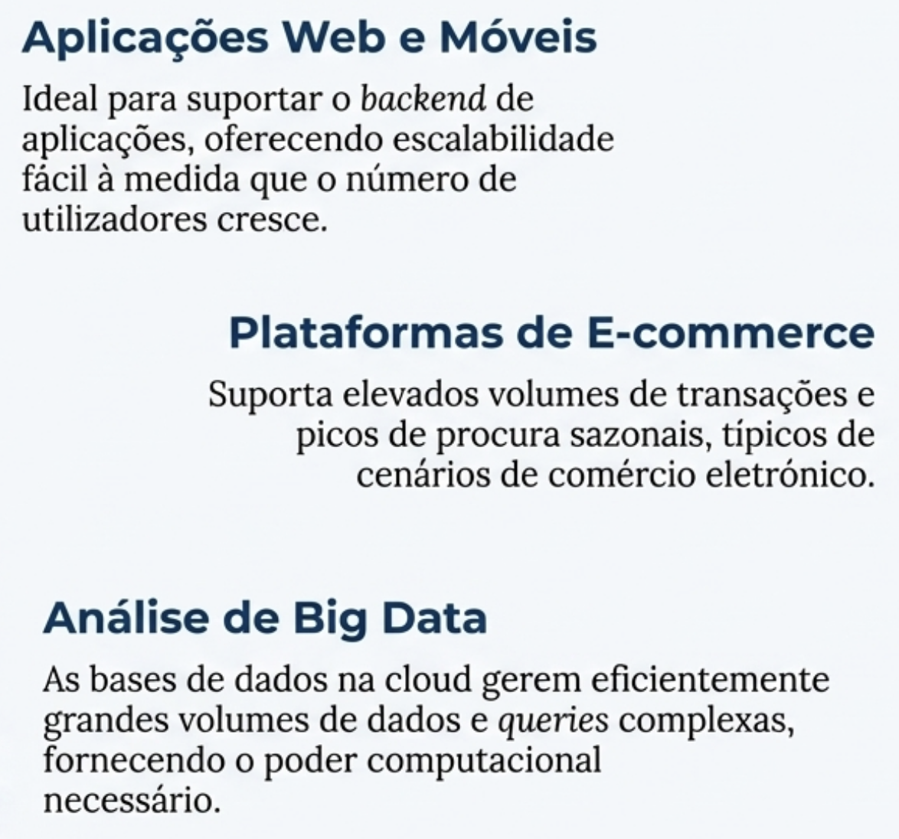

Exemplos de provedores de DBaaS:
- **Amazon RDS (Relational Database Service)**
- **Google Cloud SQL**
- **MongoDB Atlas:** é um serviço de base de dados multi-cloud gerido pelos criadores do MongoDB. Foi desenhado para permitir que os programadores se concentrem no código, automatizando a implementação, gestão e recuperação de dados. O MongoDB Compass é utilizado como uma forma de monitorizar e explorar visualmente os dados num cluster MongoDB Atlas
- **Oracle Cloud Database**

---

## 11. MongoDB Atlas

### 11.1 Primeiro cluster
- Criar conta
- Criar cluster
- Escolher provedor e região
- Configurar cluster (M0 gratuito)
- Dar nome ao cluster

### 11.2 Aceder ao cluster
- MongoDB URI: mongodb+srv://<username>:<password>@cluster0.abcde.mongodb.net/myFirstDatabase?retryWrites=true&w=majority

---

## 12. Grafos
- Bases de dados de grafos são projetadas para **armazenar** e **gerir** dados que são representados como grafos, compostos por nós (entidades) e arestas (relacionamentos entre entidades).
- Permitem consultas complexas sobre relacionamentos, tornando-as ideais para aplicações que envolvem redes sociais, recomendações, análise de fraudes, entre outros.
- **As relações são tão importantes quanto os próprios dados.**
- Maior parte das bases de dados de grafos são sistemas NoSQL, mas alguns sistemas oferecem suporte a consultas SQL. A mais comum linguagem de consulta para bases de dados de grafos é a **Cypher** (utilizada pelo Neo4j).

### 12.1 Exemplo de queries em Cypher
```cypher
// Criar nós
CREATE (a:Person {name: 'Alice', age: 30})
CREATE (b:Person {name: 'Bob', age: 25})
CREATE (c:Person {name: 'Charlie', age: 35})
// Criar relações
CREATE (a)-[:FRIEND]->(b)
CREATE (b)-[:FRIEND]->(c)
CREATE (a)-[:FRIEND]->(c)
// Consultar amigos de Alice
MATCH (a:Person {name: 'Alice'})-[:FRIEND]->(friend)
RETURN friend.name
// Encontrar caminhos entre Alice e Charlie
MATCH p=shortestPath((a:Person {name: 'Alice'})-[:FRIEND*]-(c:Person {name: 'Charlie'}))
RETURN p
```

### 12.2 Vantagens
- **Performance:** Num grafo, as ligações entre nodos são armazenadas fisicamente. Para navegar de um nodo para outro, a base de dados segue diretamente um ponteiro. As consultas são localizadas. O tempo de execução é proporcional ao tamanho da porção do grafo que é percorrida, não ao tamanho total da base de dados. Isto torna a travessia de relações (mesmo as recursivas e profundas) extremamente rápida, independentemente da escala
- **Flexibilidade:** não existe um esquema predefinido. A estrutura evolui (evolução contínua) à medida que novos dados e tipos de relações são adicionados. Adição de novos nós ou relações não interrompe queries.

### 12.3 Desafios
1. **Dificuldades com Sharding:** A natureza altamente interligada dos dados torna o particionamento
('sharding') de um grafo por múltiplas máquinas um desafio complexo. Tentar evitar "cortar" relações é crucial e difícil.
2. **Desafios de Escalabilidade Vertical:** Embora escalem bem, podem enfrentar limitações em cargas de trabalho de altíssimo débito ('throughput) em comparação com outras bases de dados NoSQL mais simples (e.g., key-value).
3. **Curva de Aprendizagem:** Adotar bases de dados de grafos requer uma mudança de mentalidade. É preciso aprender a modelar e a consultar os dados de uma forma orientada a grafos, o que pode ser um desafio inicial.

### 12.4 Use cases
- Deteção de fraudes
- Sistemas de Recomendação
- Redes Sociais
- Gestão de Identidade e Acesso
- Monitorização de Redes e Infraestruturas

---

### 13. Column Store Database
- Armazenam dados em colunas em vez de linhas.
- Otimizadas para consultas analíticas e operações de leitura intensiva.
- Permitem compressão eficiente e melhor desempenho em consultas que envolvem agregações e análises
- Exemplos: Apache Cassandra, HBase

---

### 14. Casssandra
- Exemplo de Column Store Database
- Cassandra é um sistema de armazenamento open- source, distribuído e descentralizado, projetado
para gerir enormes volumes de dados estruturados.
- Os valores de cada coluna são armazenados de forma contigua no disco, em vez de agrupar os valores de cada linha juntos.
- Escalável horizontalmente, altamente disponível, consistente e tolerante a falhas.
- **Origens Híbridas:** Combina o modelo de replicação distribuída do Dynamo (Amazon) com o modelo de dados de famílias de colunas do Bigtable (Google).
- **Atributos Fundamentais:** Escalável, tolerante a falhas e consistente. 
- **Dupla Natureza:** Funciona simultaneamente como uma base de dados chave-valor e orientada a colunas.
- Elimina pontos únicos de falha através de uma arquitetura peer-to-peer, onde todos os nós são iguais.
- Estrutura de dados em Cassandra é hierárquica, começando com um contentor lógico.
- **Keyspace:** contentor de mais alto nível, análogo a um schema no modelo relacional. Contém uma ou mais
famílias de colunas.
- **Família de Colunas:** semelhante a uma tabela numa base de dados relacional. Contém linhas e colunas.
- **Esquema Dinâmico:** Apenas a família de colunas é definida. Pode adicionar livremente qualquer coluna a qualquer linha, a qualquer momento.
- Cada linha pode ter um número diferente de colunas. 
- As colunas não precisam de coincidir com as de outras linhas. 
- Cada coluna existe apenas no contexto da sua linha.
- Cada coluna é composta por um **nome**, um **valor** e um carimbo temporal (**timestamp**).

### 14.1 Vantagens


---

### 15. Time Series Database
- Bases de dados de séries temporais são otimizadas para armazenar e gerir dados que são associados a carimbos temporais.
- São projetadas para lidar com grandes volumes de dados que são gerados em intervalos regulares ao longo do tempo.
- influxDB, graphite, OpenTSDB, Prometheus, kx

### O que são dados de séries temporais?
1. Uma sequência de pontos de dados, tipicamente medições sucessivas da mesma fonte ao longo de um intervalo de tempo. 
2. Cada ponto de dados está associado a um timestamp, tornando o tempo um componente crucial do dataset. 
3. Numa representação grafica, um dos eixos será sempre o tempo.

### Medição de séries temporais
- Regular: medições feitas em intervalos consistentes (e.g., temperatura a cada hora).
- Irregular: medições feitas em intervalos irregulares (e.g., eventos de log).

### 15.1 Características principais
- **Otimização para dados temporais:** Estruturas de dados e algoritmos são projetados para armazenar e consultar eficientemente grandes volumes de dados temporais.
- **Alta taxa de ingestão:** Capacidade de lidar com fluxos contínuos de dados em tempo real.
- **Consultas temporais avançadas:** Suporte para consultas específicas de séries temporais, como agregações, janelas deslizantes e downsampling. Algoritmos de sliding window.
- **Compressão de dados:** Técnicas avançadas de compressão para reduzir o espaço de armazenamento necessário para grandes volumes de dados temporais. **Downsampling**.
- **Retenção de dados configurável:** Políticas para definir quanto tempo os dados devem ser mantidos antes de serem automaticamente excluídos ou arquivados.

### 15.2 Use cases
- Monitorização de infraestruturas de TI
- Internet das Coisas (IoT)
- Análise financeira
- Monitorização de saúde
- Análise de desempenho de aplicações

### Porquê escolher influxDB?
- **Desempenho:** Otimizado para alta taxa de ingestão e consultas rápidas
- **Linguagem de consulta poderosa:** Flux
- **Escalabilidade:** Suporta desde implementações locais até soluções em nuvem distribuídas
- **Ecossistema rico:** Integração com várias ferramentas de visualização e monitorização open-source

- Fácil de começar, com uma sintaxe de query familiar.
- Sem dependências externas. 
- Permite séries temporais regulares e irregulares.
- Escalável horizontalmente. 
- Membro de uma plataforma coesa de time series.

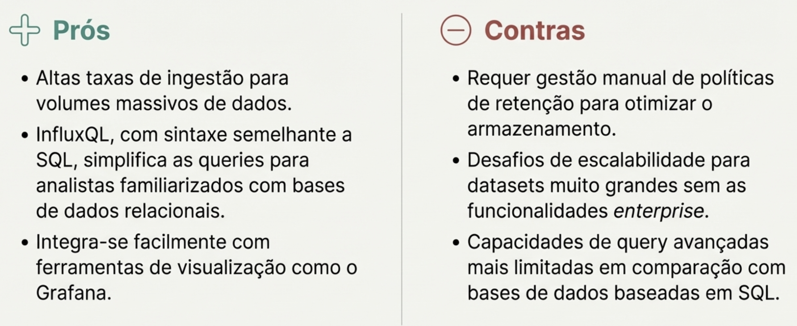

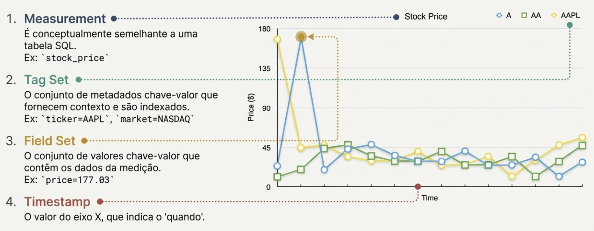

### 15.3 Serie
- Uma série é uma **coleção de pontos de dados relacionados** que partilham a mesma measurement (medição) e conjunto de tags (tagset).
- Cada série é identificada por um conjunto único de **tags** (pares chave-valor) que descrevem as características da série.
- As tags são usadas para organizar e filtrar séries durante consultas.
- measurement + tagset + timestamp = um ponto único

---

## 16. Oracle vs MySQL
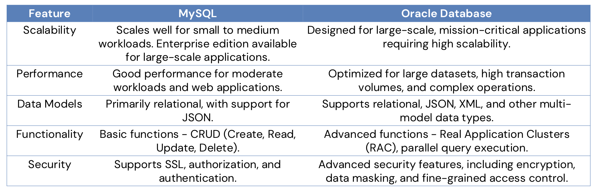
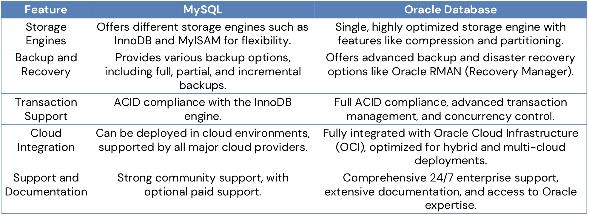