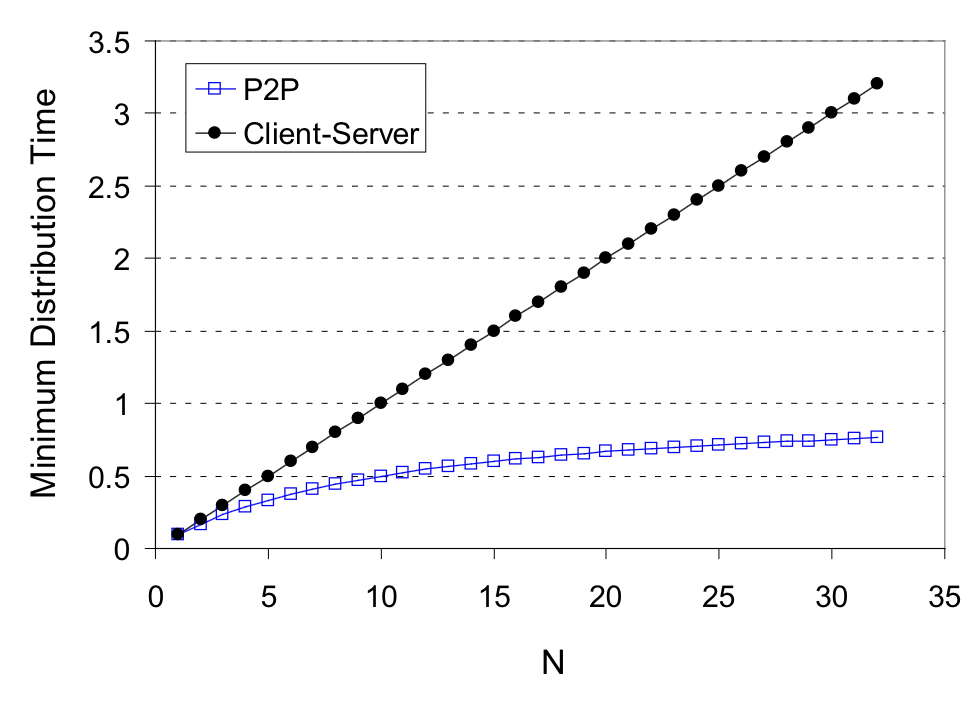
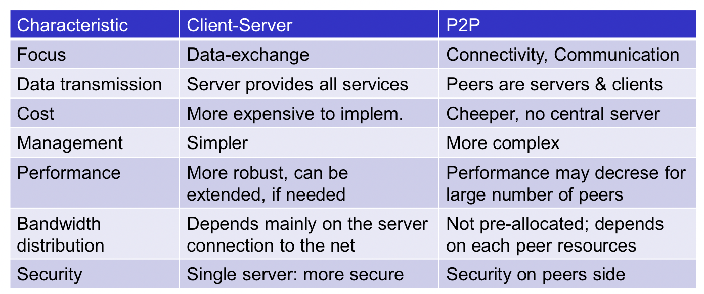

# Engenharia de Serviços em Rede
---

## Índice
1. [Application Layer](#application-layer)
   - [Arquiteturas de aplicações](#arquiteturas-de-aplicações)
   - [Processos e Sockets](#processos-e-sockets)
   - [Sockets programming](#sockets-programming)
   - [Transporte](#transporte)

---

## 1. Application Layer

A Application Layer representa a interface mais próxima do utilizador no modelo de redes, onde aplicações reais comunicam através da rede. O foco está em compreender conceitos e implementações de protocolos de aplicação, modelos de serviço de transporte e paradigmas arquiteturais fundamentais.

A internet suporta uma grande variedade de aplicações e serviços com características distintas e qualidade.

Serviços:
- Email (SMTP, IMAP, POP3)
- Transferência de ficheiros (FTP, SFTP, SCP)
- Web (HTTP, HTTPS)
- remote login (Telnet, SSH)
- real-time communication (RTP, RTSP)
- text messaging (XMPP, SIP)

**Criação de uma aplicação**
Escrever programas que:
- Corram em diferentes sistemas
- Comuniquem através da rede

O princípio **end-to-end** determina que dispositivos de core de rede não executam aplicações de utilizador - apenas sistemas terminais o fazem, permitindo desenvolvimento e propagação rápida de aplicações

### 1.1. Arquiteturas de aplicações
**Client-server**: cliente inicia comunicação, servidor espera pedidos. Ex.: web, email

Server:
- Sempre ligado
- IP fixo

Cliente:
- Comunica com o servidor
- IP dinâmico
- Não comunica diretamente com outros clientes

**Peer-to-peer**: pares comunicam diretamente, sem servidor central. Ex.: file sharing, VoIP. Cada par atua como cliente e servidor. Peers requisitam e fornecem serviços. Tem a sua própria escalabilidade no sentido em que novos peers aumentam a capacidade do sistema. Os peers estão intermitentemente ligados e mudam o seu IP.

Característica  |  Client-Server                           |  Peer-to-Peer (P2P)                           
-----------------|-----------------------------------------|-------------------
Servidor        |  Always-on, IP permanente, data centers  |  Sem servidor central                         
Escalabilidade  |  Limitada pelo servidor                  |  Self-scalable - novos peers trazem capacidade
Gestão          |  Mais simples                            |  Mais complexa                                
Custos          |  Mais caro (infraestrutura central)      |  Mais barato (distribuído)                    
Segurança       |  Centralizada, mais controlada           |  Distribuída nos peers                        
Exemplos        |  HTTP, Email, FTP                        |  BitTorrent, Skype, Bitcoin                   

**Tempo de distribuição Cliente-Servidor**:
```math
D_{c-s} ≥ max\{NF/us, F/dmin\}
```

**Tempo de Distribuição P2P**:
```math
D_{P2P} ≥ max\{F/u_s, F/d_{min}, NF/(u_s + Σu_i)\}
```

Onde:

F = tamanho do ficheiro

N = número de peers

u_s = capacidade upload do servidor

u_i = capacidade upload do peer i

d_min = mínima capacidade download


### 1.2. Processos e Sockets
Processo: programa em execução num host (ex.: browser, email client, web server)

Com o mesmo host, dois processos comunicam utilizando **Inter-process Communication (IPC)**, definidos pelo sistema operativo. Processos em diferentes hosts comunicam através de **sockets**, trocando mensagens entre si.

Aplicações com uma arquitetura P2P têm tanto processos de clientes como de servidores.

**Socket**: ponto final de comunicação entre dois processos. Identificado por:
- Endereço IP do host
- Número de porta do processo

Sockets normalmente são associados a portas.

Para receber mensagens, um processo deve ter um identificador único. O identificador inclui tanto o IP como o número da porta.

### 1.3. Sockets programming
Usa protocolos de transporte (TCP, UDP) para comunicação entre processos.

**Protocolos**
Os protocolos definem:
- O tipo da mensagem (request, response, etc..)
- A sintaxe da mensagem (quais e como os campos são estabelecidos)
- A semântica da mensagem (significado dos campos, etc..)
- Regras para lidar com erros
- Regras para iniciar e terminar a comunicação

### 1.4. Transporte
O transporte deve garantir:
- Integridade dos dados
- Timing: ou seja, entrega atempada, com pouco delay (latência)
- Throughput (velocidade)
- Segurança: encriptação, autenticação

Aplicação              |  Data Loss      |  Throughput                             |  Time Sensitive
-----------------------|-----------------|-----------------------------------------|----------------
File Transfer          |  No loss        |  Elastic                                |  No            
Email                  |  No loss        |  Elastic                                |  No            
Web Documents          |  No loss        |  Elastic                                |  No            
Real-time Audio/Video  |  Loss-tolerant  |  Audio: kbps-1Mbps; Video: 10kbps-5Mbps  |  Yes, 10's msec
Stored Audio/Video     |  Loss-tolerant  |  Same as above                          |  Yes, few secs 
Interactive Games      |  Loss-tolerant  |  Few kbps up                            |  Yes, 10's msec
Messaging              |  No loss        |  Elastic                                |  Yes and no    

### 1.5. TCP vs UDP
| Characteristic            | TCP                       | UDP                       |
|---------------------------|---------------------------|---------------------------|
| Reliable transport        | ✓       | ✗      |
| Flow control              | ✓             | ✗          |
| Congestion control        | ✓       | ✗    |
| Connection                | ✓      | ✓          |
| Timing guarantees         | ✗    | ✗     |
| Throughput guarantee      | ✗  | ✗  |
| Security                  | ✗    | ✗             |

**Por que UDP existe?**
- Simplicidade e velocidade

- Controlo total pela aplicação

- Sem overhead de estabelecimento de ligação

- Ideal para aplicações tempo-real

### 1.6. Mapeamento de Aplicação-Transporte
Aplicação           |  Protocolo Aplicação  |  Transporte  
--------------------|-----------------------|--------------
Email               |  SMTP [RFC 5321]      |  TCP         
Terminal remoto     |  Telnet [RFC 854]     |  TCP         
Web                 |  HTTP/1.1 [RFC 7320]  |  TCP         
Web (moderna)       |  HTTP/3 [RFC 9114]    |  QUIC/UDP    
File Transfer       |  FTP [RFC 959]        |  TCP         
Streaming           |  DASH                 |  TCP         
Telefonia Internet  |  SIP, RTP             |  UDP (ou TCP)

## 2. TLS - Transport Layer Security
TCP e UDP por si só não oferecem encriptação - passwords e dados trafegam em texto plano pela Internet!

TLS é um protocolo que fornece segurança nas comunicações pela Internet, garantindo:
- **Confidencialidade**: encriptação dos dados
- **Integridade**: verificação de que os dados não foram alterados
- **Autenticação**: verificação da identidade das partes envolvidas

TLS é frequentemente utilizado em conjunto com protocolos de aplicação, como HTTPS (HTTP sobre TLS), para proteger a comunicação web. Situa-se entre a camada de aplicação e a camada de transporte, funcionando sobre TCP.

## 3. Arquiteturas
### 3.1. Client-Server
Na arquitetura client-server, o cliente inicia a comunicação enviando um pedido ao servidor. O servidor, que está sempre ativo e possui um endereço IP fixo, processa o pedido e envia a resposta de volta ao cliente. Esta arquitetura é comum em aplicações web, email e FTP.

### 3.2. Peer-to-Peer (P2P)
Na arquitetura peer-to-peer, os pares comunicam diretamente entre si sem a necessidade de um servidor central. Cada par pode atuar tanto como cliente quanto como servidor, requisitando e fornecendo serviços. Esta arquitetura é utilizada em aplicações de compartilhamento de arquivos, VoIP e criptomoedas.

### 3.3. Client-Server vs P2P
- Em Client-Server, o tempo p/ distribuir ficheiro cresce linearmente com N utilizadores.
- Em P2P, cada novo cliente contribui com envio: crescimento de capacidade acompanha o crescimento de utilizadores.
Exemplo: BitTorrent — cada peer descarrega e envia partes a outros, tornando downloads massivos mais rápidos e económicos.

**Gráfico do crescimento do tempo de distribuição**


**Tabela de comparação entre Client-Server e P2P**


### 3.4. File Sharing com BitTorrent
BitTorrent é um protocolo P2P para compartilhamento de arquivos que divide os arquivos em pequenos pedaços chamados "chunks". Cada peer faz o download e envia chunks para outros peers, aumentando a eficiência do compartilhamento. Os chunks são todos do mesmo tamanho (normalmente 256 KBytes).

Após um peer completar o download completo do arquivo, ele pode continuar a enviar chunks para outros peers, ajudando a distribuir o arquivo na rede ou apenas sair do ***torrent***.

Num ***torrent***, existe um tracker que ajuda os peers a encontrarem uns aos outros, mas não participa na transferência de dados. Para além disso, quando um peer entra no torrent, faz o seu registo com ele e, periodicamente, envia-lhe atualizações sobre os chunks que possui informando-o também que ainda se encontra no ***torrent***.

Imaginemos que a Alice entra no ***torrent***. O tracker envia-lhe X IPs de peers que pertencem também a esse ***torrent***. A Alice conecta-se a esses peers via TCP e pede-lhes os chunks que lhe faltam - **rarest first**. Para a Alice enviar chunks, é utilizado um algoritmo inteligente. Basicamente a Alice envia chunks para aqueles que lhe suplicam mais dados. A cada Y segundos ela envia chunks para um outro peer fora do seu top (chamado de **optimistic unchoking**), para descobrir novos peers que possam ser bons parceiros de troca - **Algoritmo Tit-for-Tat**.

## 4. Video Streaming and CDNs
O streaming de vídeo é uma aplicação comum que se beneficia de CDNs (Content Delivery Networks). As CDNs são redes de servidores distribuídos que armazenam cópias de conteúdo em locais geográficos próximos aos usuários finais. Isso reduz a latência e melhora a experiência do usuário.

**Problemas comuns no streaming:**
1. **Escala**: Como atingir mil milhões de utilizadores?

2. **Heterogeneidade**: Utilizadores com capacidades distintas

3. **Variabilidade de bandwidth**: Congestionamento variável

### 4.1. Como funciona o streaming de vídeo?
1. O utilizador solicita um vídeo.
2. A CDN identifica o servidor mais próximo e entrega o vídeo a partir desse servidor.
3. O vídeo é transmitido em pequenos chunks, permitindo que o utilizador comece a assistir antes que o download completo seja concluído.

### 4.2. Vantagens das CDNs para streaming de vídeo
- **Redução de Latência**: Servidores próximos ao utilizador reduzem o tempo de carregamento.
- **Escalabilidade**: CDNs podem lidar com picos de tráfego, distribuindo a carga entre vários servidores.
- **Resiliência**: Se um servidor falhar, outros servidores podem assumir, garantindo continuidade no serviço.

### 4.3. Multicast
Multicast é uma técnica de transmissão de dados onde uma única fonte envia dados para múltiplos destinatários simultaneamente. Em vez de enviar cópias separadas dos dados para cada destinatário (**unicast**), o remetente envia uma única cópia que é replicada pela rede apenas quando necessário.

**Multicast Group Membership Discovery Protocols**
- **IGMP (Internet Group Management Protocol)**: Utilizado em redes IPv4 para gerenciar a associação de hosts a grupos multicast.
- **MLD (Multicast Listener Discovery)**: Utilizado em redes IPv6 para o mesmo propósito.

#### 4.3.1. IGMP
1. Os hosts desejam entrar no grupo enviando um IGMP report;
2. Os routers locais analisam esse report utilizando o multicast routing protocol (ex.: PIM) para garantir que os pacotes multicast sejam encaminhados para a rede local;
3. Periodicamente, os routers enviam IGMP queries para verificar se ainda existem membros no grupo;
4. Se um host desejar sair do grupo, ele envia um IGMP leave message.