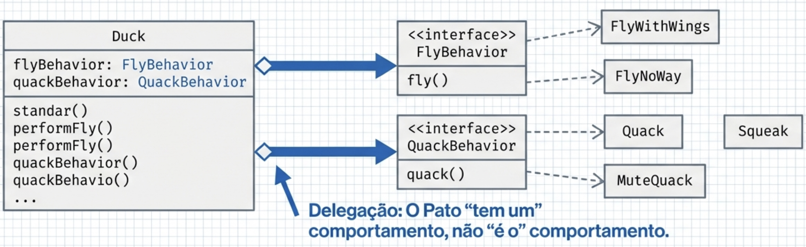
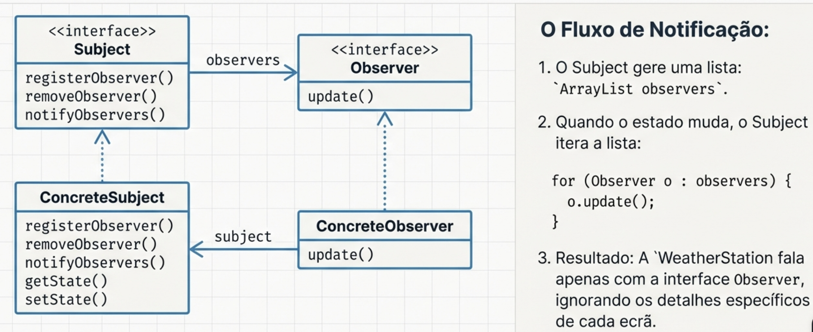
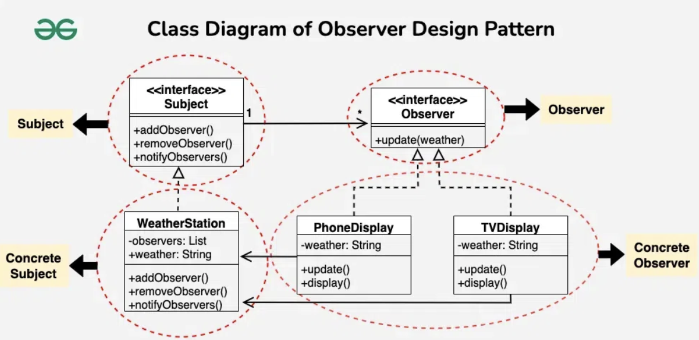
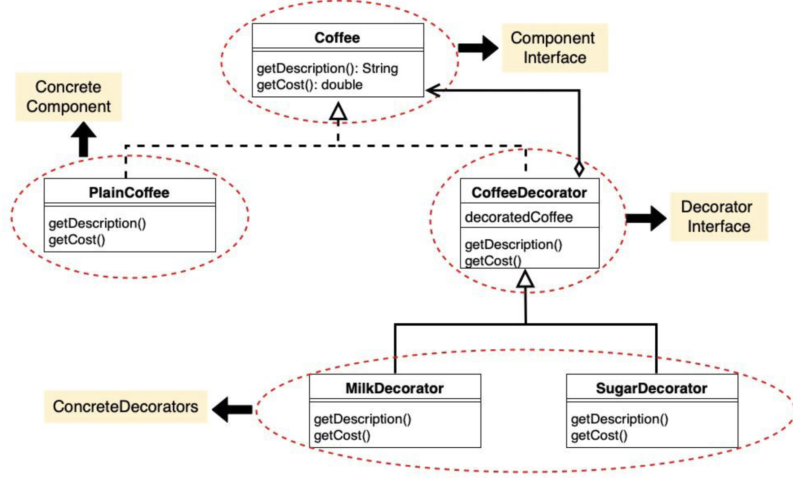

# Padrões de Desenho de Software

Na engenharia de software de alto nível, a maturidade de um arquiteto é medida pela sua transição da simples "reutilização de código" para a **reutilização de experiência**.
Isto implica a aplicação de **padrões de design** que são soluções para problemas recorrentes em contextos específicos.

Os padrões operam em três níveis distintos de abstração:
1. **Padrões de Sistema:** Estilos arquiteturais globais.
2. **Padrões de Desenho (Design Patterns):** Foco na composição de objetos e classes.
3. **Padrões de Código:** Idiomas e convenções específicas de implementação.

Estes padrões de desenho são tradicionalmente classificados em **Criacionais**, **Estruturais** e **Comportamentais**. Contudo, é vital notar que, dependendo da taxonomia técnica adotada (como na nossa fundamentação), o padrão **Strategy** é classificado como Estrutural, enquanto o **Observer** é estritamente Comportamental.

---

## Strategy
**Categoria:**
Estrutural

**Problema:** 
Imagine que tem uma classe Duck (pato) e diferentes tipos de patos (Mallard, Redhead, RubberDuck, DecoyDuck). Se usar herança para adicionar comportamentos como voar (_fly()_) e graznir (_quack()_), terá problemas:
- Patos de borracha não voam e não grazinam realmente

- Patos de madeira também não voam nem grazinam

- Quando um comportamento muda, precisa modificar várias subclasses

- Há duplicação de código (vários patos têm métodos iguais só para fazer nada)


**Solução**: 
**Separar os comportamentos variáveis em interfaces** (ex: _FlyBehavior_, _QuackBehavior_) e permitir que sejam compostos dinamicamente. **Em vez de usar herança** para comportamentos variáveis, separe os comportamentos que mudam em classes separadas e use composição (o pato usa um objeto de comportamento em vez de herdar).

````
O que permanece igual:
- swim() (todos ducks nadam)
- display() (cada duck implementa)

O que VARIA:
- fly() (alguns voam, alguns não)
- quack() (quack real vs squeak vs silêncio)

Solução: Separar fly() e quack()!
````

**Como funciona**:
1. Cria interfaces (FlyBehavior, QuackBehavior) para comportamentos variáveis
2. Cada comportamento tem implementações concretas:
    - _FlyWithWings_ 
    - _FlyNoWay_
    - _Quack_
    - _Squeak_
    - _MuteQuack_
3. A classe Duck tem referências a objetos de comportamento (não herda deles)
4. Quando precisa realizar um comportamento, delega a responsabilidade ao objeto de comportamento

**Benefício:** 
Pode mudar comportamentos em tempo de execução e adicionar novos comportamentos sem modificar as classes existentes.

### Diagrama de classes:




```java
// Interfaces
public interface FlyBehavior {
    void fly();
}

public interface QuackBehavior {
    void quack();
}

// Comportamentos de voo
public class FlyWithWings implements FlyBehavior {
    public void fly() {
        System.out.println("I'm flying with my wings!");
    }
}

public class FlyNoWay implements FlyBehavior {
    public void fly() {
        System.out.println("I can't fly");
    }
}

// Comportamentos de quack
public class Quack implements QuackBehavior {
    public void quack() {
        System.out.println("Quack!");
    }
}

public class Squeak implements QuackBehavior {
    public void quack() {
        System.out.println("Squeak!");
    }
}

public class MuteQuack implements QuackBehavior {
    public void quack() {
        System.out.println("...silence...");
    }
}

// Duck base (composition)
public abstract class Duck {
    protected FlyBehavior flyBehavior;      // HAS-A!
    protected QuackBehavior quackBehavior;  // HAS-A!
    
    public Duck() {}
    
    public abstract void display();
    
    public void performFly() {
        flyBehavior.fly();  // DELEGAÇÃO!
    }
    
    public void performQuack() {
        quackBehavior.quack();  // DELEGAÇÃO!
    }
    
    public void swim() {
        System.out.println("All ducks float, even decoys!");
    }
    
    // Permite mudar comportamentos em runtime
    public void setFlyBehavior(FlyBehavior fb) {
        flyBehavior = fb;
    }
    
    public void setQuackBehavior(QuackBehavior qb) {
        quackBehavior = qb;
    }
}

// Subclasses - setam behaviors no constructor
public class MallardDuck extends Duck {
    public MallardDuck() {
        quackBehavior = new Quack();
        flyBehavior = new FlyWithWings();
    }
    
    public void display() {
        System.out.println("I'm a real Mallard duck");
    }
}

public class RubberDuck extends Duck {
    public RubberDuck() {
        quackBehavior = new Squeak();
        flyBehavior = new FlyNoWay();
    }
    
    public void display() {
        System.out.println("I'm a rubber duck");
    }
}

public class DecoyDuck extends Duck {
    public DecoyDuck() {
        quackBehavior = new MuteQuack();
        flyBehavior = new FlyNoWay();
    }
    
    public void display() {
        System.out.println("I'm a decoy duck");
    }
}

// Uso
public class DuckSimulator {
    public static void main(String[] args) {
        Duck mallard = new MallardDuck();
        mallard.display();
        mallard.performQuack();
        mallard.performFly();
        
        Duck rubber = new RubberDuck();
        rubber.display();
        rubber.performQuack();
        rubber.performFly();
        
        // Dinâmico! Mudar comportamento em runtime
        Duck decoy = new DecoyDuck();
        decoy.performFly();
        decoy.setFlyBehavior(new FlyWithWings());  // Agora consegue voar!
        decoy.performFly();
    }
}

```

---
## Observer

**Categoria:** 
Comportamental

**Problema:**
 Tem um objeto (sujeito) que precisa notificar vários outros objetos (observadores) quando o seu estado muda. Se usar acoplamento rígido, o sujeito precisa conhecer todos os observadores, o que dificulta a manutenção e a escalabilidade. ´

**Exemplo:**
Tem uma aplicação de monitoramento de tempo com sensores (temperatura, humidade, pressão) e múltiplos displays (painel de condições atuais, estatísticas, previsão). O objeto WeatherData precisa notificar todos os displays quando os dados mudam. Se adicionar novos displays, precisa modificar o WeatherData.

**Solução:** 
Este padrão define uma dependência "**um-para-muitos**". Quando o objeto que detém o estado (**Subject**) muda, todos os seus dependentes (**Observers**) são notificados automaticamente.

**Como funciona:**
1. Subject (objeto observado):
    - Mantém uma lista de observers registados

    - Fornece métodos para registar e remover observers

    - Notifica todos os observers quando o estado muda
2. Observer (observador):
    - Implementa a interface Observer com método **_update()_**
    - Registam-se voluntariamente no Subject para receber notificações
    - Recebem atualizações quando o Subject muda

3. Fluxo:
    - Um display chama **_registerObserver()_** para se registar
    - Quando os dados mudam, **_setMeasurements()_** é chamado
    - O Subject chama **_notifyObservers()_**
    - Cada observer é notificado chamando seu método **_update()_**

**Benefício:** 
**Acoplamento fraco** entre o Subject e os Observers. Pode adicionar novos displays sem modificar o WeatherData => pouca dependência entre componentes.

**Diagrama de classes:**



```java
// Subject (Publisher)
public class WeatherData implements Subject {
    private ArrayList observers;
    private float temperature;
    private float humidity;
    private float pressure;
    
    public WeatherData() {
        observers = new ArrayList();
    }
    
    // Register observer
    public void registerObserver(Observer o) {
        observers.add(o);
    }
    
    // Remove observer
    public void removeObserver(Observer o) {
        int i = observers.indexOf(o);
        if (i >= 0) {
            observers.remove(i);
        }
    }
    
    // Notifiy all observers
    public void notifyObservers() {
        for (int i = 0; i < observers.size(); i++) {
            Observer observer = (Observer) observers.get(i);
            observer.update(temperature, humidity, pressure);
        }
    }
    
    // Called when measurements change
    public void measurementsChanged() {
        notifyObservers();  // Notificar todos!
    }
    
    // Setters
    public void setMeasurements(float temperature, float humidity, float pressure) {
        this.temperature = temperature;
        this.humidity = humidity;
        this.pressure = pressure;
        measurementsChanged();
    }
    
    // Getters
    public float getTemperature() {
        return temperature;
    }
    
    public float getHumidity() {
        return humidity;
    }
    
    public float getPressure() {
        return pressure;
    }
}

// Concrete Observer - Current Conditions Display
public class CurrentConditionsDisplay implements Observer, DisplayElement {
    private float temperature;
    private float humidity;
    private Subject weatherData;
    
    // Register com subject no constructor
    public CurrentConditionsDisplay(Subject weatherData) {
        this.weatherData = weatherData;
        weatherData.registerObserver(this);  // "Register me!"
    }
    
    // Called by subject quando muda
    public void update(float temperature, float humidity, float pressure) {
        this.temperature = temperature;
        this.humidity = humidity;
        display();
    }
    
    public void display() {
        System.out.println("Current conditions: " + temperature + 
                         "F degrees and " + humidity + "% humidity");
    }
}

// Concrete Observer - Statistics Display
public class StatisticsDisplay implements Observer, DisplayElement {
    private float minTemperature = Float.MAX_VALUE;
    private float maxTemperature = -Float.MAX_VALUE;
    private float tempSum = 0.0f;
    private int numReadings = 0;
    private Subject weatherData;
    
    public StatisticsDisplay(Subject weatherData) {
        this.weatherData = weatherData;
        weatherData.registerObserver(this);
    }
    
    public void update(float temperature, float humidity, float pressure) {
        tempSum += temperature;
        numReadings++;
        
        if (temperature > maxTemperature) {
            maxTemperature = temperature;
        }
        if (temperature < minTemperature) {
            minTemperature = temperature;
        }
        
        display();
    }
    
    public void display() {
        System.out.println("Avg/Max/Min temperature = " + 
                         (tempSum / numReadings) + "/" + 
                         maxTemperature + "/" + minTemperature);
    }
}

// Concrete Observer - Forecast Display
public class ForecastDisplay implements Observer, DisplayElement {
    private float lastPressure = 0.0f;
    private Subject weatherData;
    
    public ForecastDisplay(Subject weatherData) {
        this.weatherData = weatherData;
        weatherData.registerObserver(this);
    }
    
    public void update(float temperature, float humidity, float pressure) {
        lastPressure = pressure;
        display();
    }
    
    public void display() {
        System.out.println("Forecast: More of the same");
    }
}

// Uso
public class WeatherStation {
    public static void main(String[] args) {
        // Create subject
        WeatherData weatherData = new WeatherData();
        
        // Create observers (automatically register)
        CurrentConditionsDisplay currentDisplay = 
            new CurrentConditionsDisplay(weatherData);
        StatisticsDisplay statisticsDisplay = 
            new StatisticsDisplay(weatherData);
        ForecastDisplay forecastDisplay = 
            new ForecastDisplay(weatherData);
        
        // Simulate new measurements
        System.out.println("=== First measurement ===");
        weatherData.setMeasurements(80, 65, 30.4f);
        
        System.out.println("\n=== Second measurement ===");
        weatherData.setMeasurements(82, 70, 29.2f);
        
        System.out.println("\n=== Third measurement ===");
        weatherData.setMeasurements(78, 90, 29.2f);
    }
}
```

---

### 3. Decorator Pattern (Padrão Decorador)
**Categoria:** 
Estrutural

**Problema:** 
Tem uma aplicação de café com diferentes tipos de bebidas (_HouseBlend_, _DarkRoast_, _Espresso_, _Decaf_) e vários condimentos (leite, chocolate, chantilly, soja). Se usar herança para combinar bebidas com condimentos, cria-se uma explosão de subclasses (ex: _HouseBlendWithSteamedMilkAndMocha_, etc.). Além disso:
- Mudanças de preço de condimentos requerem modificações no código existente
- Novos condimentos exigem novos métodos
- Se um novo tipo de bebida (chá gelado) não aceita condimentos, herda métodos desnecessários
- Um cliente quer mocha dupla? Complica tudo

**Solução:** 
Use decoradores que envolvem um objeto original e adicionam responsabilidades dinamicamente, sem modificar a classe original.

**Como funciona:**

1. Cria uma classe abstrata Beverage com método cost()

2. Classes concretas estendem Beverage (HouseBlend, DarkRoast, Espresso, Decaf)

3. Cria uma classe abstrata CondimentDecorator que também estende Beverage

4. Cada condimento (Milk, Mocha, Whip, Soy) estende CondimentDecorator e tem:
    - Uma referência a um Beverage (que pode ser a bebida original ou outro decorador)

    - Um método **_cost()_** que chama o **_cost()_** do objeto decorado e adiciona o seu próprio custo

    - Um método **_getDescription()_** que adiciona a descrição do condimento

Exemplo de uso:
```java
DarkRoast drink = novo DarkRoast();  // $1.99
drink = new Mocha(drink);             // +$0.20
drink = new Mocha(drink);             // +$0.20
drink = new Whip(drink);              // +$0.10
// Total: $2.49
System.out.println(drink.getDescription() + " $" + drink.cost());
```

Quando chama _cost()_ no decorador mais externo (Whip), ele chama _cost()_ do Mocha, que chama cost() do outro Mocha, que chama _cost()_ do DarkRoast.

**Benefício:** 
Pode criar qualquer combinação de bebidas e condimentos em tempo de execução e adicionar novos condimentos sem modificar as classes existentes.

### Diagrama de classes:



```java
// Componente abstrato
public abstract class Beverage {
    protected String description = "Unknown Beverage";
    
    public String getDescription() {
        return description;
    }
    
    public abstract double cost();
}

// Componentes concretos
public class Espresso extends Beverage {
    public Espresso() {
        description = "Espresso";
    }
    
    public double cost() {
        return 1.99;
    }
}

public class HouseBlend extends Beverage {
    public HouseBlend() {
        description = "House Blend Coffee";
    }
    
    public double cost() {
        return 0.89;
    }
}

// Decorator abstrato
public abstract class CondimentDecorator extends Beverage {
    public abstract String getDescription();  // Força subclasses implementar
}

// Decoradores concretos
public class Milk extends CondimentDecorator {
    private Beverage beverage;  // O objeto sendo decorado
    
    public Milk(Beverage beverage) {
        this.beverage = beverage;
    }
    
    @Override
    public String getDescription() {
        return beverage.getDescription() + ", Milk";
    }
    
    @Override
    public double cost() {
        return 0.10 + beverage.cost();  // Delegação!
    }
}

public class Mocha extends CondimentDecorator {
    private Beverage beverage;
    
    public Mocha(Beverage beverage) {
        this.beverage = beverage;
    }
    
    @Override
    public String getDescription() {
        return beverage.getDescription() + ", Mocha";
    }
    
    @Override
    public double cost() {
        return 0.20 + beverage.cost();
    }
}

public class Soy extends CondimentDecorator {
    private Beverage beverage;
    
    public Soy(Beverage beverage) {
        this.beverage = beverage;
    }
    
    @Override
    public String getDescription() {
        return beverage.getDescription() + ", Soy";
    }
    
    @Override
    public double cost() {
        return 0.15 + beverage.cost();
    }
}

public class Whip extends CondimentDecorator {
    private Beverage beverage;
    
    public Whip(Beverage beverage) {
        this.beverage = beverage;
    }
    
    @Override
    public String getDescription() {
        return beverage.getDescription() + ", Whip";
    }
    
    @Override
    public double cost() {
        return 0.10 + beverage.cost();
    }
}

// Uso
public class CoffeeShop {
    public static void main(String[] args) {
        // Espresso simples
        Beverage beverage = new Espresso();
        System.out.println(beverage.getDescription() + " $" + beverage.cost());
        // Output: Espresso $1.99
        
        // DarkRoast com dois Mochas e um Whip
        Beverage beverage2 = new DarkRoast();
        beverage2 = new Mocha(beverage2);      // Wrap 1
        beverage2 = new Mocha(beverage2);      // Wrap 2
        beverage2 = new Whip(beverage2);       // Wrap 3
        System.out.println(beverage2.getDescription() + " $" + beverage2.cost());
        // Output: Dark Roast, Mocha, Mocha, Whip $2.49
        
        // HouseBlend com Soy, Mocha, Whip
        Beverage beverage3 = new HouseBlend();
        beverage3 = new Soy(beverage3);
        beverage3 = new Mocha(beverage3);
        beverage3 = new Whip(beverage3);
        System.out.println(beverage3.getDescription() + " $" + beverage3.cost());
        // Output: House Blend Coffee, Soy, Mocha, Whip $1.29
    }
}
```

---
## Circuit Breaker Pattern
### Características da integração:
- Os utilizadores podem selecionar filtros premium que dependem da API externa.
- A API externa é um serviço de terceiros (fora do controlo da equipa PictuRAS).
- A API pode ficar temporariamente indisponível devido a:
  - Manutenção programada
  - Sobrecarga de pedidos
  - Falhas de rede
  - Problemas no fornecedor do serviço
- Quando a API falha, os pedidos podem demorar muito tempo (timeouts) ou retornar erros.

### Problema:
Sem um mecanismo de proteção, a aplicação PictuRAS sofre de:
- **Cascading failures**: falhas na API externa propagam-se para toda a aplicação.
- **Resource exhaustion**: threads e conexões ficam bloqueadas aguardando respostas que nunca chegam.
- **Degradação da experiência**: utilizadores ficam sem resposta e a aplicação parece "travada".
- **Desperdício de recursos**: continuar a tentar chamar uma API que está em baixo é ineficiente.

### Solução: Circuit Breaker Pattern
O padrão Circuit Breaker atua como um disjuntor elétrico:
- Monitoriza chamadas à API externa.
- Quando detecta falhas excessivas, "abre o circuito" e impede novas chamadas.
- Retorna rapidamente respostas alternativas (fallback) sem sobrecarregar a API.
- Periodicamente tenta recuperar ("half-open") para verificar se a API voltou.

### 1. Compreender o Padrão Circuit Breaker

Estuda o padrão e identifica os **três estados principais**:

- **CLOSED (Fechado)**:
  - Estado normal de operação.
  - As chamadas à API são executadas normalmente.
  - Falhas são contabilizadas.
  - Se o número de falhas exceder um limiar, transita para OPEN.

- **OPEN (Aberto)**:
  - Circuito aberto — chamadas à API são bloqueadas.
  - Retorna imediatamente um resultado alternativo (fallback).
  - Após um timeout configurável, transita para HALF_OPEN.

- **HALF_OPEN (Semi-aberto)**:
  - Estado de teste — permite um número limitado de chamadas.
  - Se as chamadas tiverem sucesso, volta para CLOSED.
  - Se falharem, volta para OPEN.

### 2. Modelar a Solução com UML

Cria um **Diagrama de Classes UML** representando:

- **Interface `FilterAPI`**: representa a API externa de filtros.
- **Classe `CircuitBreaker`**: implementa a lógica do padrão.
  - Atributos:
    - `state`: estado atual (CLOSED, OPEN, HALF_OPEN)
    - `failureCount`: contador de falhas
    - `failureThreshold`: limiar de falhas para abrir o circuito
    - `timeout`: tempo para tentar recuperar
    - `lastFailureTime`: timestamp da última falha
  - Métodos:
    - `call(operation)`: executa operação com proteção
    - `recordSuccess()`: regista sucesso
    - `recordFailure()`: regista falha
    - `reset()`: reinicia o circuito
    - `transitionToOpen()`: abre o circuito
    - `transitionToHalfOpen()`: passa para semi-aberto
    - `transitionToClosed()`: fecha o circuito

- **Classe `ExternalFilterService`**: cliente que usa o CircuitBreaker.
- **Classe `FallbackStrategy`**: define estratégias de fallback quando a API está indisponível.

### 3. Definir Cenários de Uso

Modela o fluxo de interação usando **Diagramas de Sequência UML** para:

**Cenário 1: Operação Normal (Estado CLOSED)**
1. Utilizador solicita aplicação de filtro premium.
2. `ExternalFilterService` chama `CircuitBreaker.call()`.
3. CircuitBreaker está em estado CLOSED.
4. Chama a API externa.
5. API responde com sucesso.
6. Resultado é retornado ao utilizador.

**Cenário 2: Falhas Recorrentes (Transição CLOSED → OPEN)**
1. Utilizador solicita filtro.
2. CircuitBreaker tenta chamar API.
3. API falha (timeout ou erro).
4. CircuitBreaker incrementa `failureCount`.
5. Após várias falhas consecutivas (threshold atingido), CircuitBreaker transita para OPEN.
6. Próximas chamadas retornam fallback imediatamente sem chamar a API.

**Cenário 3: Recuperação (Transição OPEN → HALF_OPEN → CLOSED)**
1. Após timeout, CircuitBreaker transita para HALF_OPEN.
2. Permite uma chamada de teste à API.
3. API responde com sucesso.
4. CircuitBreaker transita para CLOSED.
5. Operação normal é restaurada.

### 📘 Exemplo Simplificado de Implementação

```java
// Enum para estados
enum CircuitState {
    CLOSED, OPEN, HALF_OPEN
}

// Classe Circuit Breaker
public class CircuitBreaker {
    private CircuitState state = CircuitState.CLOSED;
    private int failureCount = 0;
    private final int failureThreshold;
    private final long timeout;
    private long lastFailureTime = 0;

    public CircuitBreaker(int failureThreshold, long timeout) {
        this.failureThreshold = failureThreshold;
        this.timeout = timeout;
    }

    public <T> T call(Callable<T> operation, Supplier<T> fallback) throws Exception {
        // Verifica se deve transitar de OPEN para HALF_OPEN
        if (state == CircuitState.OPEN) {
            if (System.currentTimeMillis() - lastFailureTime >= timeout) {
                state = CircuitState.HALF_OPEN;
                System.out.println("Circuit transitioning to HALF_OPEN");
            } else {
                System.out.println("Circuit is OPEN - returning fallback");
                return fallback.get();
            }
        }

        try {
            T result = operation.call();
            recordSuccess();
            return result;
        } catch (Exception e) {
            recordFailure();
            System.out.println("Operation failed: " + e.getMessage());
            return fallback.get();
        }
    }

    private void recordSuccess() {
        failureCount = 0;
        if (state == CircuitState.HALF_OPEN) {
            state = CircuitState.CLOSED;
            System.out.println("Circuit CLOSED - service recovered");
        }
    }

    private void recordFailure() {
        failureCount++;
        lastFailureTime = System.currentTimeMillis();

        if (failureCount >= failureThreshold) {
            if (state != CircuitState.OPEN) {
                state = CircuitState.OPEN;
                System.out.println("Circuit OPEN - too many failures");
            }
        }
    }

    public CircuitState getState() {
        return state;
    }
}

// Serviço que usa o Circuit Breaker
public class ExternalFilterService {
    private CircuitBreaker circuitBreaker;
    private FilterAPI filterAPI;

    public ExternalFilterService(FilterAPI filterAPI) {
        this.filterAPI = filterAPI;
        this.circuitBreaker = new CircuitBreaker(3, 10000); // 3 falhas, 10s timeout
    }

    public Image applyPremiumFilter(Image image, String filterType) {
        try {
            return circuitBreaker.call(
                // Operação principal
                () -> filterAPI.applyFilter(image, filterType),
                // Fallback
                () -> {
                    System.out.println("Using fallback: returning original image");
                    return image; // Retorna imagem original
                }
            );
        } catch (Exception e) {
            System.err.println("Unexpected error: " + e.getMessage());
            return image;
        }
    }
}

// Interface da API externa
interface FilterAPI {
    Image applyFilter(Image image, String filterType) throws Exception;
}
```

### Exemplo de Uso:

```java
// Simula API externa com falhas
class UnreliableFilterAPI implements FilterAPI {
    private int callCount = 0;

    @Override
    public Image applyFilter(Image image, String filterType) throws Exception {
        callCount++;

        // Simula falhas nas primeiras 5 chamadas
        if (callCount <= 5) {
            throw new Exception("API temporarily unavailable");
        }

        // Simula sucesso após recuperação
        System.out.println("Filter applied successfully!");
        return image.applyFilter(filterType);
    }
}

// Teste
public class Main {
    public static void main(String[] args) throws InterruptedException {
        FilterAPI api = new UnreliableFilterAPI();
        ExternalFilterService service = new ExternalFilterService(api);
        Image testImage = new Image("test.jpg");

        // Tenta aplicar filtro várias vezes
        for (int i = 1; i <= 10; i++) {
            System.out.println("\n--- Attempt " + i + " ---");
            service.applyPremiumFilter(testImage, "vintage");
            Thread.sleep(2000); // Espera 2 segundos entre chamadas
        }
    }
}
```