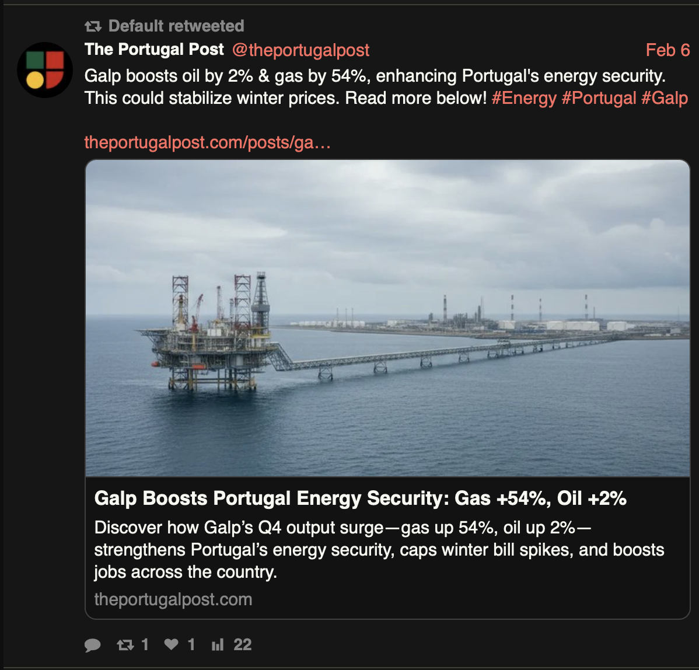

# Worksheet 1

---

## Parte 1

### Exercise 1 - Reconhecimento de Infraestrutura GALP

```
Utilizando WHOIS, analise o domínio galp.com e galp.pt e determine:
- Data de registo do domínio
- Informações de registante (se disponíveis)
- Nameservers e histórico

Interpretação: O domínio é antigo? O que é que isso significa? A empresa garante resiliência? Como?
```

Output para galp.com:
```sh
❯ whois galp.com

% IANA WHOIS server
% for more information on IANA, visit http://www.iana.org
% This query returned 1 object

refer:        whois.verisign-grs.com

domain:       COM

organisation: VeriSign Global Registry Services
address:      12061 Bluemont Way
address:      Reston VA 20190
address:      United States of America (the)

contact:      administrative
name:         Registry Customer Service
organisation: VeriSign Global Registry Services
address:      12061 Bluemont Way
address:      Reston VA 20190
address:      United States of America (the)
phone:        +1 703 925-6999
fax-no:       +1 703 948 3978
e-mail:       info@verisign-grs.com

contact:      technical
name:         Registry Customer Service
organisation: VeriSign Global Registry Services
address:      12061 Bluemont Way
address:      Reston VA 20190
address:      United States of America (the)
phone:        +1 703 925-6999
fax-no:       +1 703 948 3978
e-mail:       info@verisign-grs.com

nserver:      A.GTLD-SERVERS.NET 192.5.6.30 2001:503:a83e:0:0:0:2:30
nserver:      B.GTLD-SERVERS.NET 192.33.14.30 2001:503:231d:0:0:0:2:30
nserver:      C.GTLD-SERVERS.NET 192.26.92.30 2001:503:83eb:0:0:0:0:30
nserver:      D.GTLD-SERVERS.NET 192.31.80.30 2001:500:856e:0:0:0:0:30
nserver:      E.GTLD-SERVERS.NET 192.12.94.30 2001:502:1ca1:0:0:0:0:30
nserver:      F.GTLD-SERVERS.NET 192.35.51.30 2001:503:d414:0:0:0:0:30
nserver:      G.GTLD-SERVERS.NET 192.42.93.30 2001:503:eea3:0:0:0:0:30
nserver:      H.GTLD-SERVERS.NET 192.54.112.30 2001:502:8cc:0:0:0:0:30
nserver:      I.GTLD-SERVERS.NET 192.43.172.30 2001:503:39c1:0:0:0:0:30
nserver:      J.GTLD-SERVERS.NET 192.48.79.30 2001:502:7094:0:0:0:0:30
nserver:      K.GTLD-SERVERS.NET 192.52.178.30 2001:503:d2d:0:0:0:0:30
nserver:      L.GTLD-SERVERS.NET 192.41.162.30 2001:500:d937:0:0:0:0:30
nserver:      M.GTLD-SERVERS.NET 192.55.83.30 2001:501:b1f9:0:0:0:0:30
ds-rdata:     19718 13 2 8acbb0cd28f41250a80a491389424d341522d946b0da0c0291f2d3d771d7805a

whois:        whois.verisign-grs.com

status:       ACTIVE
remarks:      Registration information: http://www.verisigninc.com

created:      1985-01-01
changed:      2023-12-07
source:       IANA

# whois.verisign-grs.com

   Domain Name: GALP.COM
   Registry Domain ID: 544858_DOMAIN_COM-VRSN
   Registrar WHOIS Server: whois.networksolutions.com
   Registrar URL: http://networksolutions.com
   Updated Date: 2025-11-04T18:54:08Z
   Creation Date: 1997-07-24T04:00:00Z
   Registry Expiry Date: 2026-07-23T04:00:00Z
   Registrar: Network Solutions, LLC
   Registrar IANA ID: 2
   Registrar Abuse Contact Email: domain.operations@web.com
   Registrar Abuse Contact Phone: +1.8777228662
   Domain Status: clientTransferProhibited https://icann.org/epp#clientTransferProhibited
   Name Server: A1-125.AKAM.NET
   Name Server: A16-64.AKAM.NET
   Name Server: A18-64.AKAM.NET
   Name Server: A24-66.AKAM.NET
   Name Server: A3-65.AKAM.NET
   Name Server: A7-64.AKAM.NET
   DNSSEC: unsigned
   URL of the ICANN Whois Inaccuracy Complaint Form: https://www.icann.org/wicf/
>>> Last update of whois database: 2026-02-09T14:37:49Z <<<
```

Data de registo do domínio: 1997-07-24T04:00:00Z
Informações de registante:
- Nome: Galp Energia, S.A.
- Organização: Galp Energia, S.A.
- País: Portugal

Nameservers:
   - Name Server: A1-125.AKAM.NET
   - Name Server: A16-64.AKAM.NET
   - Name Server: A18-64.AKAM.NET
   - Name Server: A24-66.AKAM.NET
   - Name Server: A3-65.AKAM.NET
   - Name Server: A7-64.AKAM.NET

Histórico: 
- O domínio galp.com foi registado em 1997, o que indica que é um domínio antigo. Isso pode significar que a empresa tem uma presença online estabelecida há bastante tempo, o que pode ser um indicativo de estabilidade e resiliência no mercado digital.
- A utilização de múltiplos nameservers, especialmente através de um provedor de serviços de DNS como a Akamai, sugere que a empresa está investindo em infraestrutura para garantir a disponibilidade e resiliência do seu site. Isso pode ajudar a proteger contra ataques DDoS e garantir que o site permaneça acessível mesmo em caso de falhas em um ou mais servidores.

Output para galp.pt:
```sh
❯ whois galp.pt
% IANA WHOIS server
% for more information on IANA, visit http://www.iana.org
% This query returned 1 object

refer:        whois.dns.pt

domain:       PT

organisation: Associação DNS.PT
address:      Rua Eça de Queiroz, 29
address:      Lisboa 1050-095
address:      Portugal

contact:      administrative
name:         Luisa Ribeiro Lopes
organisation: Associação DNS.PT
address:      Rua Eça de Queiroz, 29
address:      Lisboa 1050-095
address:      Portugal
phone:        (+351) 211308200
fax-no:       (+351) 211312720
e-mail:       luisa@dns.pt

contact:      technical
name:         Assis Guerreiro
organisation: Associação DNS.PT
address:      Rua Eça de Queiroz, 29
address:      Lisboa 1050-095
address:      Portugal
phone:        (+351) 211308200
fax-no:       (+351) 211312720
e-mail:       assis.guerreiro@dns.pt

nserver:      A.DNS.PT 185.39.208.1 2a04:6d80:0:0:0:0:0:1
nserver:      B.DNS.PT 194.0.25.23 2001:678:20:0:0:0:0:23
nserver:      C.DNS.PT 2001:500:14:6105:ad:0:0:1 204.61.216.105
nserver:      D.DNS.PT 185.39.210.1 2a04:6d82:0:0:0:0:0:1
nserver:      E.DNS.PT 193.136.192.64 2001:690:a00:4001:0:0:0:64
nserver:      G.DNS.PT 193.136.2.226 2001:690:a80:4001:0:0:0:100
nserver:      H.DNS.PT 194.146.106.138 2001:67c:1010:35:0:0:0:53
nserver:      NS.DNS.BR 200.160.0.5 2001:12ff:0:a20:0:0:0:5
nserver:      NS2.NIC.FR 192.93.0.4 2001:660:3005:1:0:0:1:2
ds-rdata:     40155 13 2 b0ed28b7255e9880e7ce4665b75ae7271f7837899057f0d4b897ece2eb1eb494

whois:        whois.dns.pt

status:       ACTIVE
remarks:      Registration information: http://www.dns.pt/

created:      1988-06-30
changed:      2023-08-02
source:       IANA

# whois.dns.pt

Domain: galp.pt
Domain Status: Registered
Creation Date: 08/09/1999 00:00:00
Expiration Date: 01/07/2026 23:59:00
Owner Name: PETROGAL, S.A.
Owner Address: Rua Tomas da Fonseca, Edif. Galp - 14ºAndar
Owner Locality: Lisboa
Owner ZipCode: 1600-208
Owner Locality ZipCode: Lisboa
Owner Country Code: PT
Owner Email: rui.lourenco@petrogal.pt
Admin Name: J. Pereira da Cruz S.A.
Admin Address: Rua Vitor Cordon  10-A
Admin Locality: Lisboa
Admin ZipCode: 1249-103
Admin Locality ZipCode: Lisboa
Admin Country Code: PT
Admin Email: jpc.domains@jpcruz.pt,info@jpcruz.pt
Name Server: ns10.galpenergia.com | IPv4:  and IPv6: 
Name Server: ns20.galpenergia.com | IPv4:  and IPv6: 
```

Data de registo do domínio: 08/09/1999
Informações de registante:
- Nome: PETROGAL, S.A.
- Endereço: Rua Tomas da Fonseca, Edif. Galp - 14ºAndar, Lisboa, 1600-208, Portugal
- Email: rui.lourenco@petrogal.pt

Nameservers:
- ns10.galpenergia.com
- ns20.galpenergia.com

Histórico:
- O domínio galp.pt foi registado em 1999, o que também indica queé um domínio antigo. Isso sugere que a empresa tem uma presença online estabelecida há bastante tempo, o que pode ser um indicativo de estabilidade e resiliência no mercado digital.
- A utilização de nameservers próprios (ns10.galpenergia.com e ns20.galpenergia.com) sugere que a empresa tem controle total sobre sua infraestrutura de DNS, o que pode ser um indicativo de que a empresa está investindo em sua própria infraestrutura para garantir a disponibilidade e resiliência do seu site. Isso pode ajudar a proteger contra ataques DDoS e garantir que o site permaneça acessível mesmo em caso de falhas em um ou mais servidores.


### Exercise 2

```
Com recurso a Amass ou theHarvester, execute enumeração de:
- Subdomínios (ex: *.galp.pt, *.galp.com)
- Endereços de email corporativos
```

Utilizando o theHarvester para enumeração de subdomínios e endereços de email corporativos para os domínios galp.com e galp.pt:

```sh
❯ theharvester -d galp.com -b all
```

**Alguns subdomínios encontrados:**
- webconf.galp.com
- webconf.galp.com:83.240.208.178
- webconf5.galp.com
- webgis-portal9.galp.com
- webgisqld-portal.galp.com
- webgisqld-portal.galp.com:83.240.208.184
- webmail.galp.com
- webmailo.galp.com
- webvc.vc.galp.com
- wed+x.galp.com
- weq.galp.com
- wifi.galp.com
- wm-card+]n.galp.com
- wm-card.galp.com:83.240.208.184
- women.galp.com
- wp-apim-galpid.galp.com
- wslyncpool$d.galp.com
- wspcorp+`g.galp.com
- wspcorp.galp.com
- www5.flotas.galp.com
- www9.empresas.galp.com

**Alguns endereços de email corporativos encontrados:**
- linhagalpgas@galp.com
- sustainability@galp.com

## Parte 2 - Análise de Presença Digital e Social

Mapear a presença online da GALP em plataformas portuguesas e internacionais.

### Exercise 1

```
 Utilize Sherlock ou WhatsMyName para procurar por perfis oficiais:
- @galp_energia, @galp, etc.
```

Utilizando o Sherlock para procurar por perfis oficiais da GALP em plataformas portuguesas e internacionais:

```sh
❯ sherlock galp_energia
```

**Plataformas onde o perfil @galp_energia foi encontrado:**
- Twitter: https://twitter.com/galp_energia
- LinkedIn: https://www.linkedin.com/company/galp/
- mundo.galp.com
- www.galp.com
- instagram.com/galpenergia
- [pt.wikipedia.org/wiki/Galp_Energia](https://pt.wikipedia.org/wiki/Galp)
- https://play.google.com/store/apps/details?id=com.galp.mundogalp.release&hl=pt_PT
- https://gitlab.archlinux.org/%40galp

**Plataformas onde o perfil @galp foi encontrado:**
- https://stackoverflow.com/users/filter?search=%40galp

### Exercise 2

```
 Utilize Twint (Twitter Intelligence Tool) para:
- Analisar atividade recente nos perfis oficiais
- Identificar menções relevantes no contexto português
- Extrair metadados de publicações (likes, retweets, etc.)
```

Utilizando o Nitter como alternativa ao Twint para analisar a atividade recente nos perfis oficiais da GALP no Twitter:




### Exercise 3

```
Aplique ExifTool em:
- Imagens do site corporativo
- Fotos de projetos divulgados
- Material de comunicação social
```

## Parte 3 - Documentos Públicos e Compliance
Investigação de documentos públicos da GALP em fontes portuguesas.

### Exercise 1

```
Usando Google Dorks, executa no mínimo 6 pesquisas avançadas, usando operadores:
- site:cmvm.pt galp
- site:galp.com filetype:pdf
- site:galp.com sustentabilidade
- site:portaldocidadao.pt "GALP"
```

**Documentos encontrados:**
- https://www.google.com/url?sa=t&source=web&rct=j&opi=89978449&url=https://web3.cmvm.pt/sdi/emitentes/docs/PCT77279.pdf&ved=2ahUKEwimncG23cySAxUaygIHHQzkGvgQFnoECBEQAQ&usg=AOvVaw1-wGaVEuaGRHbX76vIaUY_
- https://www.google.com/url?sa=t&source=web&rct=j&opi=89978449&url=https://web3.cmvm.pt/sdi2004/emitentes/docs/CONV49232.pdf&ved=2ahUKEwimncG23cySAxUaygIHHQzkGvgQFnoECBoQAQ&usg=AOvVaw1FSuSabG0O6kHUeFTNzLNN
- https://www.google.com/url?sa=t&source=web&rct=j&opi=89978449&url=https://web3.cmvm.pt/sdi/emitentes/docs/DIVI75607.pdf&ved=2ahUKEwimncG23cySAxUaygIHHQzkGvgQFnoECBsQAQ&usg=AOvVaw25DNE_xv3vbsmp3lOrm3s0
- https://www.google.com/url?sa=t&source=web&rct=j&opi=89978449&url=https://cartoes.galp.com/files/terms_and_conditions.pdf&ved=2ahUKEwiYgOHS3cySAxW71wIHHXsxPCwQFnoECBAQAQ&usg=AOvVaw3zqKjN9CweUHjN_vWGHCDW
- Politica de proteção de dados: https://www.google.com/url?sa=t&source=web&rct=j&opi=89978449&url=https://gstatic.galp.com/Frotas2025/PoliticadePrivacidade_APPGalpFrota.pdf&ved=2ahUKEwiYgOHS3cySAxW71wIHHXsxPCwQFnoECB8QAQ&usg=AOvVaw3EixQBpnM2CalmUkWUjkiG
- Politica de cookies: https://www.google.com/url?sa=t&source=web&rct=j&opi=89978449&url=https://gpl.galp.com/BalcaoDigitalGPL/docs/Politica_Cookies_PT_BalcaoDigitalGPL.pdf&ved=2ahUKEwiYgOHS3cySAxW71wIHHXsxPCwQFnoECCAQAQ&usg=AOvVaw3DHRyYIOe0k48Tn5bw-zmF
- Sustentabilidade: https://www.google.com/url?sa=t&source=web&rct=j&opi=89978449&url=https://www.galp.com/corp/pt/sustentabilidade&ved=2ahUKEwjM8pHm3cySAxU7wQIHHZJ0My8QFnoECBcQAQ&usg=AOvVaw1bIkAEJMGzzkQRy1LkxCr6
- Comissão de sustentabilidade: https://www.google.com/url?sa=t&source=web&rct=j&opi=89978449&url=https://www.galp.com/corp/pt/governo-societario/modelo-e-orgaos-de-governo/comissoes/comissao-de-sustentabilidade&ved=2ahUKEwjM8pHm3cySAxU7wQIHHZJ0My8QFnoECBIQAQ&usg=AOvVaw1j6Z2kGc_s9dM5hspvEY6h

### Exercise 2

```
Utilize Wayback Machine para analisar versões do site da Galp em anos diferentes
- Estratégia
- Sustentabilidade
```

- Jornada da sustentabilidade parte 2: https://www.galp.com/corp/Portals/0/Recursos/Investidores/IMR2023/PT/JornadadeSustentabilidade.pdf
- Estratégia: https://www.galp.com/sobre-nos/a-galp/estrategia